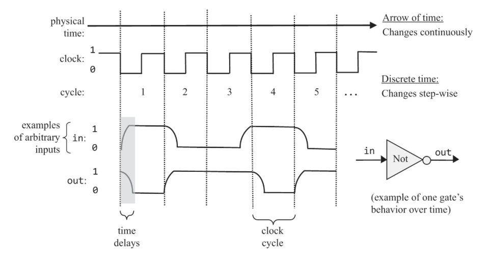
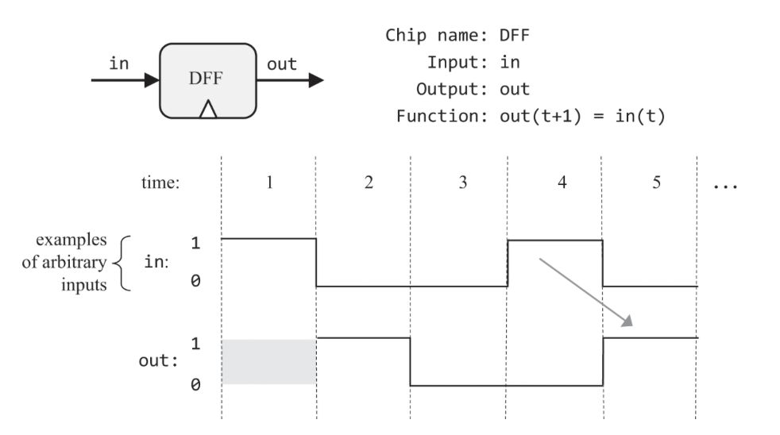
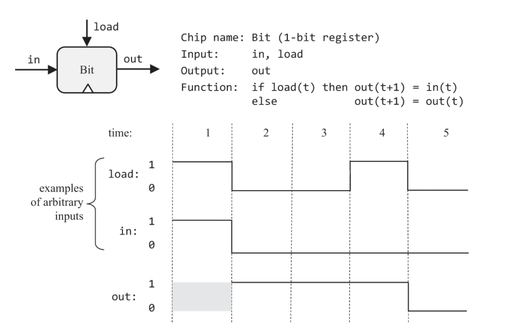
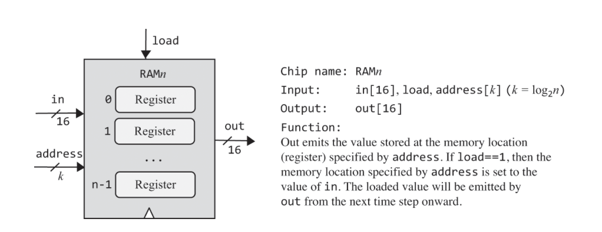
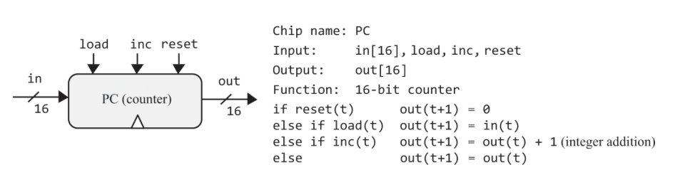

# Memory - 메모리

## 읽기 전에

책 [61.p에 번역 오류](https://github.com/chijoon-study/cs-study/issues/8#issuecomment-1945267243) 있음. independent를 의존성 이라고 번역함. 독립적인, 독립성 등의 의미가 더 알맞다.

여러 칩을 같은 의미로 설명하는데, 찾아보니까 약간은 의미가 다르거나 어떤 걸 중요하게 생각하느냐에 따라 차이가 있는 듯 하다. 단 핵심적인 부분(시간 독립적인가?)은 같음.

책에서 DFF를 구현하지 않고 내부 구조도 말하지 않는데, Hack HDL 툴의 한계 때문이라고 한다.   
궁금하면 추가적으로 찾아보고 정리해야 할 듯.
> (생략)... 조합 게이트 사이에 피드백 루프를 만들어야 하기 때문에 이 책의 하드웨어 시뮬레이터로는 모델링하기 불가능하다.

## 칩의 종류

#### 조합 칩(combinational chip) or 시간 독립 칩(time-independent chip)

$out[t] = function(in[t])$

현재 클록 주기(사이클)에 발생한 변화에만 응답하는 칩을 말한다.

책 1,2장에서 개발한 칩들이 여기 해당된다.

#### 순차 칩(sequential chip) or 클록 칩(clocked chip)

$out[t] = function(in[t-1])$

이전 시간 단위에서 발생한 변화와 현재 시간 단위의 변화에 응답하도록 설계된 칩을 말한다.

이러한 칩을 구현하기 위해서 하나의 비트를 저장하고, 비트를 t-1에서 t로 옯길 수 있는 무언가가 필요한데, 이 기능을 구현한 것을 플립 플롭이라고 한다.   
(여러 플립플롭이 있지만, 책에서는 Clocked Data Flip Flop을 기준으로 설명한다.)

모든 순차 칩은 플립플롭을 사용해서 만들어진다.

## 컴퓨터의 시간

#### 시간의 필요성

컴퓨터가 더 반복적인, 큰 규모의 작업을 하기 위해서 중간 작업 같은 무언가를 기억해야만 한다.   

이를 위해서 컴퓨터에는 "시간" 개념이 필요하고, 시간에 따라 "상태"(State)를 기억하는 도구가 필요하다.

#### 컴퓨터에서 시간의 의미
실제 물리적인(physical) 시간은 연속적(continuous)이다.  
시간은 무한하게 나눌 수 있다. 

하지만 컴퓨터의 자원은 제한적이므로, 컴퓨터는 이산적인 시간(Discrete time)을 가진다. ('이산적인'의 의미는 아래에서 다룬다.)

##### 이산적 시간 개념의 특성

- 통신이나 계산중에 발생하는 시간 지연과 무적위성을 줄일 수 있다.
- 시스템 전체에서 여러 칩들의 연산을 동기화하는데 그 개념을 활용할 수 있다.

##### 시간의 논리적인 개념

클럭은 일종의 발전기(Oscillator)이다.  
일정한 속도로 0과 1 상태로 번갈아 가진다. (tic-toc이라고 표현하기도 한다.)  

tic의 시작과 toc의 종료 사이의 시간을 사이클(cycle)이라고 한다.

**사이클은 디지털의 최소 시간 단위로 취급한다.**

개념적으로 사이클이 시간의 최소 단위이므로, 사이클 사이에는 아무것도 변하지 않는다. 

이처럼 컴퓨터에선 시간이 단절되어 구분하기 때문에, 이산적인 시간을 가진다고 말한다.

##### 물리적인 구현

그러나 실제로(물리적으로) 클럭/사이클 개념을 어떻게 구현하는가?

물리적으로 input(전압)은 천천히 변한다.   
하지만 한 사이클 내에 중간 변화를 마무리 할 수 있다면, 이러한 중간 변화(불일치)는 사이클이 마무리 된 시점의 결과에 영향을 주지 않는다.
따라서 사이클 내의 변화는 무시된다.

이러한 점 때문에 사이클은 칩의 최대 지연 시간보다 더 길게 설정된다.

## 칩(논리게이트) 명세

- #### 데이터 플립-플롭(data flip-flop, DFF)
    - 1비트 입력을 받아 DFF의 상태를 이 값으로 설정, 다음 주기에서 이 값을 출력한다. ($out(t) = in(t-1)$)
    - (책에서 다루는) 순차 칩 중 가장 기초적인 칩이다.
    - 
- #### 레지스터(register)
    - 새로운 값을 불러오라고(load를 1로) 지시하기 전까지, 값을 저장하고 출력한다.
    - load 비트가 설정되지 않으면 레지스터가 잠금 상태가 되며, 입력(input)값과 상관없이 현재 상태를 유지한다.
    - 책에선 1비트 레지스터, 16비트 레지스터를 구현한다.
    - 1비트 레시스터 그림
- #### RAM(random access memory)
    - n개의 레지스터 칩으로 구성된다.
    - 각 레지스터 칩에 특정 주소를 할당하고, 이 주소를 사용해 특정 레지스터를 선택하고 읽기/쓰기 작업을 수행한다.
    - 랜덤 접근 시간이 즉각적이고 RAM의 크기나 레지스터의 주소에 영향을 받지 않는다. (그렇게 구현해야 한다.)
    - load 비트가 0이면 읽기, 1이면 쓰기 연산을 수행한다.
    - 
- #### 카운터(counter)
    - 매 시간 단위마다 값을 1씩 증가시키는 칩이다.
    - 컴퓨터 아키텍처에서 PC(program counter)로 사용된다.
    - 

## 실습 메모
실습 중 메모한 것들 올림.

나중에 복습할 때 기억하기 좋으라고 적은거라 딱히 볼 필요는 없다.

