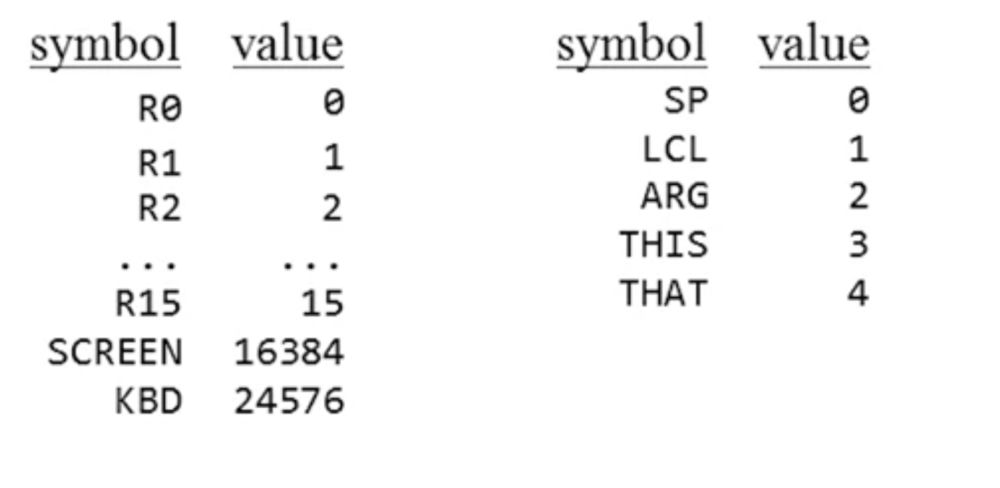

## machine language
지금까지 만든 부품들을 조합해 실제 컴퓨터를 만들기 전에  
기계어에 대해 알고 가는 것이 먼저이다.  
왜냐하면 기계어는 칩(하드웨어)에 따라 영향을 받고 칩또한 기계어에 의해 영향을 받기 때문이다.  

지금까지 만든 칩들은 인풋이 주어지면 그에따른 역할을 했다.  
그리고 그러한 인풋들을 우리가 각 칩마다 직접 입력해주었다.(테스트 스크립트)  
이제 이 칩들을 조작하는 코드에 대해 알아 볼 것이다.  

기계어는 언어 그대로 기계가 이해할 수 있는 언어, 즉 이진수이다.  
여기서 한단계 추상화해 조금더 인간이 보고 이해할 수 있게끔 한 언어가 대표적으로 assembly language이다.  
어셈블리어는 각 기계가 이해하는 이진수 명령을 인간이 이해할 수 있는 텍스트로 매핑 시켰다 생각해도 될 거같다.  
그리고 그 매핑된 거를 다시 기계가 이해할 수 있는 이진수로 바꾸는 작업을 컴파일이라 한다.  
이러한 컴파일은 지금은 시뮬레이터에서 알아서 해주지만 그러한 컴파일 작업도 필요하단 것만 알고 이번챕터에선 넘어가자.

## input / output
컴퓨터에서 가장 기초적이자 대표적인 입력과 출력은 모니터와 키보드이다.  

출력, 즉 모니터의 경우 메모리에 화면을 담당하는 영역이 있고 해당 메모리 공간에 화면 각 픽셀 값의 정보가 담겨있다.  
모니터에선 매 새로고침마다 해당 메모리 영역의 값을 가져와 그에 맞는 화면을 보여준다.  

입력의 경우도 비슷하다 키보드에 매핑 돼있는 메모리 영역이 있고 키보드에서 어떤 입력이 일어날 경우 해당 메모리 공간에 값이 채워진다.

## HACK API 
먼저 HACK API에 대해 알아보기 전에 일반적인 어셈블리어와 다르게 HACK machine language는 좀 이상하게 생겼다.  
일반적인 어셈블리어에서 두 레지스터의 값을 더한다면 
> ADD src, dst

이런식으로 작성할텐데 HACK에선
> @src  
> D=M  
> @dst  
> D=D+M  

위 처럼 작성한다.  
그 이유는 다른 어셈블리어는 보통 32, 64bit 컴퓨터에서 돌아가기에 해당 명령어를 한 레지스터에 담을 수 있지만,  
HACK은 16bit 컴퓨터 아키텍처를 기반으로 설계 됐기에 좀더 불편하게 작성해야한다.  

명령어의 2진수 테이블을 보면 명령어의 길이가 16인것을 확인할 수 있다.  

본격적으로 HACK API에 대해 알아보면  
HACK은 A명령어와 C명령어가 있다.  
A명령어는 위에서 본 '@'로 시작하는 명령어 이다.  
역할은 총3가지이다.  
데이터 레지스터로서 값을 저장하고, RAM과 ROM의 주소역할을 한다.  
@17 을 할경우 A레지스터에 17이란 값이 담기며 M이 17번째 레지스터를 바라보게 되고 JMP시에 17번째 명령어로 이동한다.  

C명령어는 그 외 모든 작업을 수행한다.  
값 할당, alu 연산, 분기  
C명령어의 예시를 들기 전에 레이블과 변수에 대해 먼저 알아보자  

레이블과 변수는 문자를 상수에 매핑해준다 해도 생각하면 편하다.  
변수의 경우 @{name}으로 할당할 수 있는데,  
각 변수마다 16번 메모리 공간부터 시작해 17, 18번 순차적으로 메모리 공간을 할당받는다.  
16번 부터 시작하는 이유는 0~15는 R0~R15로 이미 할당 돼있다.

변수가 RAM의 공간을 할당하는 거였다면 레이블은 ROM의 공간을 할당한다.(정확한 표현은 아닐 수도 있다.)  
위와 같이 똑같이 @{name}을하고 다른 줄에 ({name})을 할 경우  @{name}은 ({name})을 바라보게 된다.  
C명령어와 함께 예시를 통해 알아보면
> (LOOP)  
> @x  
> M=M+1  
> D=M  
> @LOOP  
> D;JGT

위의 코드는 @x, 즉 RAM[16]에 있는 값이 양수가 될 때까지 1씩 더하는 코드이다.  
@LOOP쪽을 좀더 자세히 설명하면 @LOOP를 했으므로 A레지스터의 값은 LOOP에 매핑돼있는 어떤 상수 값이 될 것이다.  
그리고 LOOP에 매핑돼있는 상수는 (LOOP)의 위치이므로  
D;JGT에서 jump하게 될 경우 A레지스터의 값의 위치로 jump하는데 해당 값이 (LOOP)의 위치이므로 위 같은 반복문이 완성되는 것이다.  

명령어의 수가 많지 않은만큼 문법자체는 위가 끝이고  
반복문, 입출력 조작 등의 경우 개발자가 알아서 짜면 된다.  
아 참고로 //를 통해 주석도 달 수 있다.
아래는 미리 매핑된 변수들의 값이다.  
