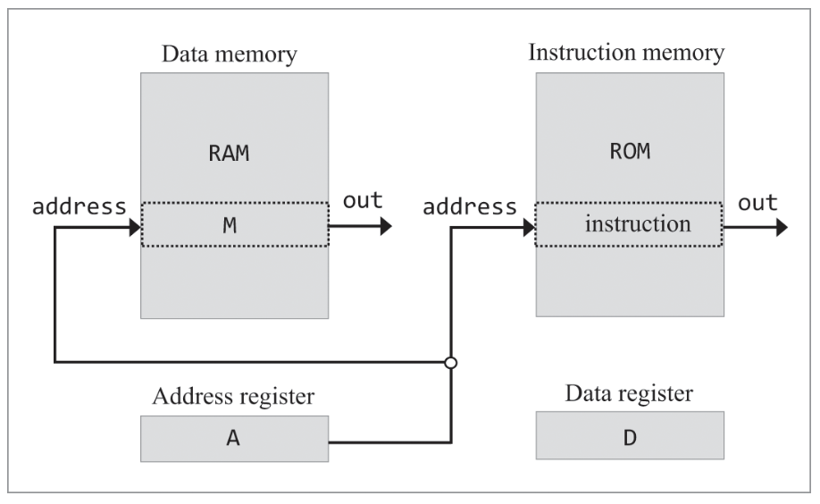
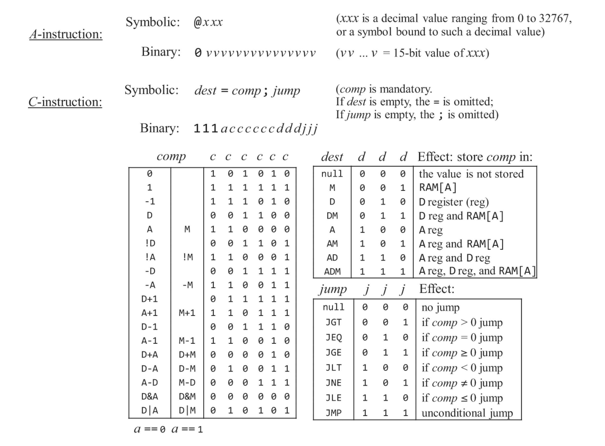

# Machine Language - 기계어

## 개념

### 하드웨어 요소
기계 언어에 중점을 두므로 하드웨어 영역은 추상화하여 설명한다.

- 메모리: 컴퓨터에서 데이터와 명령어를 저장하는 장치. 고유한 주소를 가진다.
- 프로세서: 보통 중앙처리장치(CPU, Central Processing Unit)라고 부른다. 산술 및 논리 연산, 메모리 접근 연산, 제어(분기, Branching) 등 기초 연산을 수행하는 장치다.
- 레지스터: 프로세서와 메모리 사이에 존재하며, 프로세스가 데이터와 명령어를 빠르게 조작할 수 있게 한다.
    - 일반적으로 데이터를 저장하는 '데이터(data) 레지스터', 메모리 주소로 해석되는 값을 저장하는 '주소(address) 레지스터' 2가지로 나뉜다.

### 언어

#### 발전 과정

초기에는 0과 1로 된 기계어를 직접 작성하였다.

이후 기계어를 특정 문자(기호)로 변환하여 사람이 더 보기 쉽게 하는 기호 기계어. 즉, 어셈블리어(assembly language)가 탄생하였다.

어셈블리어를 기계어로 변환하는 번역 프로그램을 어셈블러(assembler)라고 한다.

#### 명령어

어셈블리어는 고수준 언어와 달리 하드웨어와 밀접한 연관이 있다.

특정 CPU 군에 특화된 기계어가 있고, 서로 문법이 통하지 않는다.

다만 이론적으로 모두 같고, 수행하는 작업 역시 비슷하다.

- 산술 및 논리 연산
    - 기본적인 산술 연산 논리 연산을 위한 명령어 제공
    - 산술 연산 예시: 덧셈, 뺄셈
    - 논리 연산 예시: And, Or, Not
- 메모리 접근
    - 기계어에서 수행되는 모든 작업은 특정 메모리에 접근해서 메모리를 접근하는 것과 관련이 있다.
    - 보통 주소 레지스터를 통해 이루어진다.
- 흐름 제어
    - 기계어는 조건(+무조건) goto 분기 명령어와 goto의 목적지를 설정하는 레이블 선언문을 지원한다.
- 기호
    - 어셈블리어는 물리적 주소, 기호 주소 두가지 종류가 있다.
    - 기호 주소를 사용하는 코드를 재배치 가능한(relocatable)이라고 한다.
        - 여러 앱을 동시에 실행하는 컴퓨터 시스템에서는 필수적인 기능이다.

## Hack 기계어

Hack은 Nand2Tetris 프로젝트에서 만드는 컴퓨터의 이름이다.

이 부분은 사실상 Hack 컴퓨터에 종속되는 기계어를 설명하는 거라서 정리할 필요성을 느끼지 못했다. (실제 어셈블리어 언어와는 조금 차이가 있어 보인다.)

어려웠던 부분들 요약해서 나중에 읽기 쉽게 하는 정도로만 정리했다.

### Hack 언어 구조

#### 레지스터 종류
- D(데이터 레지스터): 16비트 값을 저장한다. 
- A(주소 레지스터): 주소, 데이터, 명령어 레지스터의 역할을 한다.
- M(선택 된 메모리 레지스터): A의 값인 RAM의 주소를 가리키고 있다. `M=n` 같은 식으로 값을 설정할 수 있다.

#### instructuon(명령어)
ROM에는 프로그램이 실행하는 명령어(프로그래밍 된 기계어)가 담긴다.  
A를 통해서 제어 가능하다.

#### A 레지스터의 특징 (왜 저렇게 생겼나)

A 레지스터는 세가지 역할을 한다. 
데이터 레지스터로서 값을 저장하고,
RAM과 ROM의 주소를 지정하는 주소 레지스터로서 동시에 동작하기 때문이다.

RAM은 데이터를 저장하고, ROM은 실행 할 명령어를 저장한다.

- 데이터 레지스터
    - 특정 주소의 RAM(메모리) 값을 설정할 수 있다. 
    - `RAM[100]=17`: `@17, D=A, @100, M=D`
- 주소 레지스터
    - 특정 주소의 ROM(명령어)으로 조건 분기 할 수 있다.
    - `ROM[29]`로 무조건 점프: `@29, 0:JMP`

### Hack 언어 명세

2가지 명령어로 구현된다.
- A-명령어: A레지스터에 15비트 값을 설정한다.
    - 표현
        - 기호: $@xxx$
        - 2진: $0vvvvvvvvvvvvvvv$
    - 사용 목적
        - 상수 입력
        - 다음 C-명령어가 A를 읽고 명령을 수행
        - 다음 C-명령어가 A주소로 점프
- C-명령어
    - 표현
        - 기호: $dest = comp: jump$
        - 2진: $111accccccdddjjj$
    - 사용 목적
        - C-명령어와 함께 컴퓨터의 모든 연산을 수행

(그 외 구체적인 명세, 기호, 프로그래밍, 입출력 관련 설명은 생략하였다.)

### Hack 기계어에 관해서 알면 좋을 내용

#### 연산 코드의 의미

연산 코드의 문자는 ALU 연산과 매핑되는 것일 뿐 어떠한 세부 의미를 담고 있지 않다.    
ex: 'D+M'은 111**000010**dddjjj와 매핑되는 것일 뿐, '+'나 'D', 'M'은 아무 의미 없다.

#### hack은 1/2 주소 기계어

기계어를 구분하는 주요 특성 중 하나는 한 개의 명령어에서 허용할 수 있는 메모리 주소의 개수다.  

Hack 기계어는 이런 면에서 1/2 주소 기계어이다. 

핵의 16비트 명령어 하나로는 명령어 코드와 15비트 주소를 동시에 사용할 수 없으므로, 주소를 접근하는 A-명령어와 연산을 수행하는 C-명령어를 함께 사용해야 한다.

이와 달리 실제 대부분의 기계어는 명령어마다 적어도 하나 이상의 주소에 대한 연산을 지정할 수 있다.   
(이런 점을 모르면 Hack을 배울 때 약간 왜 이렇게 사용하는지 이해할 수 없다.)

#### A 레지스터 사용 시 주의점

위에서 말한 레지스터의 특징 때문에, 하나의 역할만 수행해야 한다.

M 참조를 포함하는 C-명령어는 점프를 사용하지 않고, 점프를 사용하는 C-명령어는 M을 참조하지 않아야 한다.

### Hack 프로그래밍 예제 분석