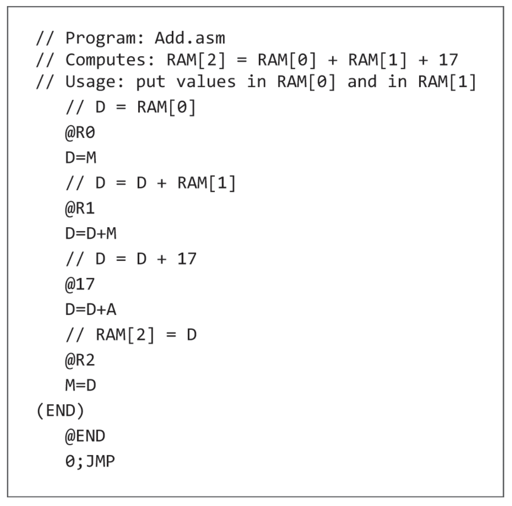
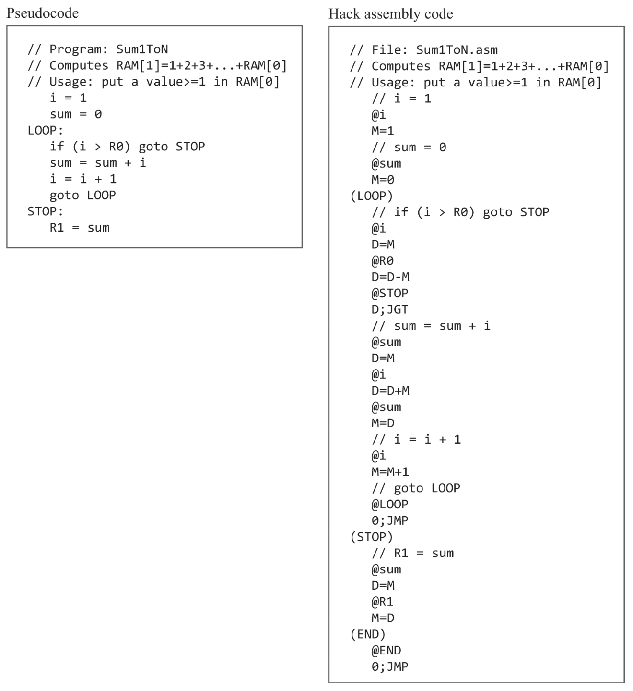
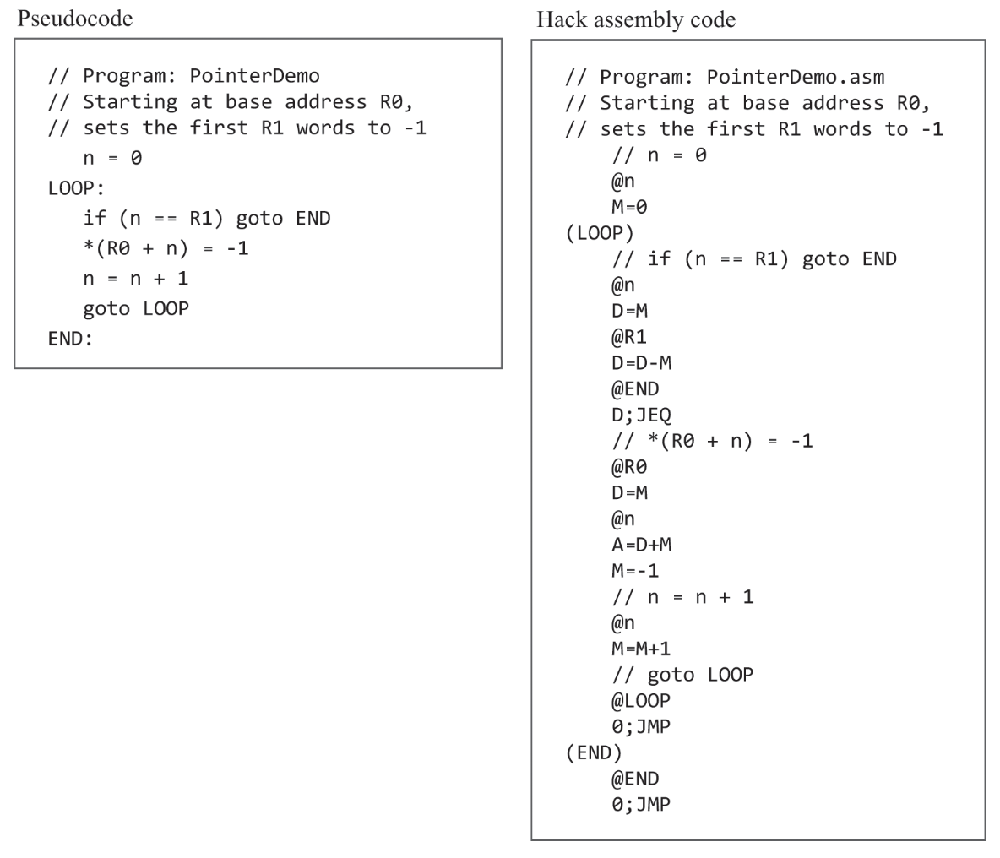

# Machine Language - 기계어

## 개념

### 하드웨어 요소
기계 언어에 중점을 두므로 하드웨어 영역은 추상화하여 설명한다.

- 메모리: 컴퓨터에서 데이터와 명령어를 저장하는 장치. 고유한 주소를 가진다.
- 프로세서: 보통 중앙처리장치(CPU, Central Processing Unit)라고 부른다. 산술 및 논리 연산, 메모리 접근 연산, 제어(분기, Branching) 등 기초 연산을 수행하는 장치다.
- 레지스터: 프로세서와 메모리 사이에 존재하며, 프로세스가 데이터와 명령어를 빠르게 조작할 수 있게 한다.
    - 일반적으로 데이터를 저장하는 '데이터(data) 레지스터', 메모리 주소로 해석되는 값을 저장하는 '주소(address) 레지스터' 2가지로 나뉜다.

### 기계어

#### 발전 과정

초기에는 0과 1로 된 기계어를 직접 작성하였다.

이후 기계어를 특정 문자(기호)로 변환하여 사람이 더 보기 쉽게 하는 기호 표현하였다.
이후 이런 기호를 사용해서 사람이 기계어를 작성할 수 있는 언어인 어셈블리어(assembly language)가 탄생하였다.

어셈블리어를 기계어로 변환하는 번역 프로그램을 어셈블러(assembler)라고 한다.

#### 기계어 개요 

기계어는 전체 시스템 컴퓨팅 중에서 가장 기본이 되는 인터페이스로, 하드웨어외 소프트웨어가 만나는 지점이다.

어셈블리어는 고수준 언어와 달리 하드웨어와 밀접한 연관이 있다.

어셈블리어(기계어)는 하드웨어를 효율적이고 명확하게 제어할 수 있도록 하기 위해 만들어졌다.   

따라서 고수준 언어처럼 사용하기 편리하지 않다. 어느정도 편의성을 위한 문법이 제공할 수도 있지만, 하드웨어 제어를 우선으로 한다.

특정 CPU 군에 특화된 기계어가 있고, 서로 문법이 통하지 않는다.

다만 이론적으로 모두 같고, 수행하는 작업 역시 비슷하다.

#### 수행 작업

- 산술 및 논리 연산
    - 기본적인 산술 연산 논리 연산을 위한 명령어 제공
    - 산술 연산 예시: 덧셈, 뺄셈
    - 논리 연산 예시: And, Or, Not
- 메모리 접근
    - 기계어에서 수행되는 모든 작업은 특정 메모리에 접근해서 메모리를 접근하는 것과 관련이 있다.
    - 보통 주소 레지스터를 통해 이루어진다.
- 흐름 제어
    - 기계어는 조건(+무조건) goto 분기 명령어와 goto의 목적지를 설정하는 레이블 선언문을 지원한다.
- 기호
    - 어셈블리어는 물리적 주소, 기호 주소 두가지 종류가 있다.
    - 기호 주소를 사용하는 코드를 재배치 가능한(relocatable)이라고 한다.
        - 여러 앱을 동시에 실행하는 컴퓨터 시스템에서는 필수적인 기능이다.

#### Symbol
어셈블리어에서 사용자가 주소를 지정하여 데이터를 저장, 읽기 및 수정할 때, 메모리 위치에 대한 직접적인 관심은 일반적으로 없다.

따라서 메모리 주소를 직접 지정하지 않고, 심볼(symbol)을 사용하여 사용자가 물리적인 메모리를 신경쓰지 않을 수 있게 추상화를 제공한다.  
심볼에는 변수. 레이블(Label) 등이 있다.

##### 

## Hack 기계어

Hack은 Nand2Tetris 프로젝트에서 만드는 컴퓨터의 이름이다.

이 부분은 사실상 Hack 컴퓨터에 종속되는 기계어를 설명하는 거라서 정리할 필요성을 느끼지 못했다. (실제 어셈블리어 언어와는 조금 차이가 있어 보인다.)

어려웠던 부분들 요약해서 나중에 읽기 쉽게 하는 정도로만 정리했다.

### Hack 언어 구조


#### 레지스터 종류
- D(데이터 레지스터): 16비트 값을 저장한다. 
- A(주소 레지스터): 주소, 데이터, 명령어 레지스터의 역할을 한다.
- M(선택 된 메모리 레지스터): A의 값인 RAM의 주소를 가리키고 있다. `M=n` 같은 식으로 값을 설정할 수 있다.

#### instructuon(명령어)
ROM에는 프로그램이 실행하는 명령어(프로그래밍 된 기계어)가 담긴다.  
A를 통해서 제어 가능하다.

#### A 레지스터의 특징 (왜 저렇게 생겼나)

A 레지스터는 세가지 역할을 한다. 
데이터 레지스터로서 값을 저장하고,
RAM과 ROM의 주소를 지정하는 주소 레지스터로서 동시에 동작하기 때문이다.

RAM은 데이터를 저장하고, ROM은 실행 할 명령어를 저장한다.

- 데이터 레지스터
    - 특정 주소의 RAM(메모리) 값을 설정할 수 있다. 
    - `RAM[100]=17`: `@17, D=A, @100, M=D`
- 주소 레지스터
    - 특정 주소의 ROM(명령어)으로 조건 분기 할 수 있다.
    - `ROM[29]`로 무조건 점프: `@29, 0:JMP`

### Hack 언어 명세


#### 명령어

2가지 명령어로 구현된다.
- A-명령어: A레지스터에 15비트 값을 설정한다.
    - 표현
        - 기호: $@xxx$
        - 2진: $0vvvvvvvvvvvvvvv$
    - 사용 목적
        - 상수 입력
        - 다음 C-명령어가 A를 읽고 명령을 수행
        - 다음 C-명령어가 A주소로 점프
- C-명령어
    - 표현
        - 기호: $dest = comp: jump$
        - 2진: $111accccccdddjjj$
    - 사용 목적
        - C-명령어와 함께 컴퓨터의 모든 연산을 수행

#### 문법

(그 외 구체적인 명세, 기호, 프로그래밍, 입출력 등에 대한 설명은 생략하였다.)

##### 변수
`@xxx`에 문자를 입력하여 변수로 다를 수 있다.   
변수만을 사용하면, 물리적인 메모리를 사용하지 않는다.  
(물리적인 메모리로 변환하는건 어셈블러가 한다.)   

##### 레이블
`(xxx)`를 사용해 goto문의 위치를 지정할 수 있다.    
`(xxx)`는 다음 줄의 명령어 주소에 바인딩한다.  
`(END)`로 선언하고 `@END, 0:JMP` 처럼 사용한다.

##### I/O

Hack 컴퓨터는 메모리 맵을 통해 키보드와 스크린 I/O를 제공한다.  

주기적으로 계속 갱신되는 루프를 통해 외부 기기와 메모리 맵을 동기화한다.


### Hack 기계어에 관해서 알면 좋을 내용

#### 연산 코드의 의미

연산 코드의 문자는 ALU 연산과 매핑되는 것일 뿐 어떠한 세부 의미를 담고 있지 않다.    
ex: 'D+M'은 111**000010**dddjjj와 매핑되는 것일 뿐, '+'나 'D', 'M'은 아무 의미 없다.

#### hack은 1/2 주소 기계어

기계어를 구분하는 주요 특성 중 하나는 한 개의 명령어에서 허용할 수 있는 메모리 주소의 개수다.  

Hack 기계어는 이런 면에서 1/2 주소 기계어이다. 

핵의 16비트 명령어 하나로는 명령어 코드와 15비트 주소를 동시에 사용할 수 없으므로, 주소를 접근하는 A-명령어와 연산을 수행하는 C-명령어를 함께 사용해야 한다.

이와 달리 실제 대부분의 기계어는 명령어마다 적어도 하나 이상의 주소에 대한 연산을 지정할 수 있다. (ex: ADD 1 0x313)   
(이런 점을 모르면 Hack을 배울 때 약간 왜 이렇게 사용하는지 이해할 수 없다.)

#### A 레지스터 사용 시 주의점

위에서 말한 레지스터의 특징 때문에, 하나의 역할만 수행해야 한다.

M 참조를 포함하는 C-명령어는 점프를 사용하지 않고, 점프를 사용하는 C-명령어는 M을 참조하지 않아야 한다.


### Hack 프로그래밍 예제 분석

모든 프로그램은 마지막에 무한루프가 있어야 한다.  
CPU의 불러오기-실행하기(fetch-execute)논리에 따라서 다음 명령어를 계속 실행하기 때문이다.  
(실제로 어떤지는 모르겠는데 일단 이 책의 실습 시에는 이렇게 작성해야 함)

편의를 위해 인간의 사고에 더 가까운 의사코드(pseudocode)를 통해서 미리 계획하고 실제 코드로 옮긴다.

##### 예제 1



간단한 산술 표현식을 계산하는 프로그램

가상 레지스터(R0, R1)를 사용한다.  
(내부적으론 그냥 숫자인데, 주소 레지스터 용도로 사용한다는 의미를 부여하기 위해 사용)

##### 예제 2



$1 + 2 + 3 + ... + n$ 의 값을 구하는 프로그램

`@i`, `@sum`을 사용한 반복문을 어떻게 구현하였는지를 중점으로 보자.

##### 예제 3



배열 처리 예제, 포인터 기반으로 배열 원소에 접근한다.

R0에서부터 R1만큼의 메모리 위치에 -1 값이 쓰여진다.   
R0:100, R1:10일 때, `RAM[100~109]`까지 `-1`로 쓰여진다.

"`A=...`, M에서 연산하는 C-명령어"의 조합으로 기본 포인터를 구현하는 것에 집중하자.  
(그냥 `A=?`로 참고한다고 생각하면 될 듯)

몇 가지 코드 설명

`D;JEQ` - D가 0이면 A 주소로 명령어 주소(ROM) 점프

`A=D+M` 시점에 D는 `R0`의 주소, M은 `n`의 데이터(loop 횟수) 이다.  
즉, A(주소)는 `R0`의 주소 + loop 횟수가 된다.  
(포인터 기능)

다음 주소로 이동한 상황에서 `M=-1`를 사용해 값을 -1로 바꾼다.


### 실습

실습 때 메모한 것들 옮긴 거.

나중에 다시 실습 풀 때 참고할 용도라서, 정리한 글 읽으려는 목적이면 안 봐도 됨

#### mult.asm
Hack은 덧셈이 없으니까 반복문으로 풀어야 함.

모든 결과는 2^15를 넘지 않는다고 제한함(오버플로우 생각 X)

음수 양수의 곱셈은 어떻게 하는가?

`rsign`, `lsign` 변수를 만들고 음수면 -1로 설정.  
`rsign`, `lsign`의 합이 0이면 음수로 처리하고 아니면 양수로 처리  

절대값이 필요할 거 같은데 어떻게 구하지?

`-변수` 같은게 가능한가?
-> `0-변수` 하면 될 듯?

R음수, L음수 여부 구해서 sign 설정하는 과정에서 음수면, 절대값(양수)으로 번경.  
이후 결과가 음수여야 하면 `0-총함` 하면 될 듯.

근데 하나로 음수 여부 확인 할 수 있지 않나?  
-> 구한다 쳐도 절대값을 못구함

##### 풀이

별로 효율적인건 아닌듯...
0들어가도 루프문 돌기도 하고

i대신 l이나 r을 빼면서 0 되면 리턴하는 식으로 구현하는게 더 낫긴 했을 듯

그리고 .asm 구현에서 음수 양수 반전하는거 복잡하게 했는데, `-D` 처럼 한 줄로 가능했음

```
i = 0 // for 문의 i 역할
rs = 0 // 중간 결과 & 최종 결과 저장
r = R0 // 1번쨰 수
l = R1 // 2번째 수
rsign = 1 // 1번째 수가 양수면 1, 음수면 0. 기본값 1
lsign = 1 // 2번째 수가 양수면 1, 음수면 0. 기본값 1

START: // rsign, lsign 값 유효하게 바꾸기
    if r이 음수면 goto R
    if l이 음수면 goto L
LOOP: // 2번째 수 만큼 반복해서 1번째 수를 rs에 더함
    if i == l goto SIGN
    rs = rs + r
    i = i + 1
    goto LOOP
SIGN: // 음수면 결과를 -결과 로 바꾸기
    if rsign+lsign != 0 이면 goto END
    // 결과가 음수라면 아래 코드가 실행됨
    rs = 0-rs
    goto END
R: // 1번째 수를 음수에서 절대깂(음수)로 바꾸고. rsign을 -1로
    r = 0-r
    rsign = -1
    goto START
L: // 2번째 수를 음수에서 절대깂(음수)로 바꾸고. rsign을 -1로
    l = 0-l
    lsign = -1
    goto START
END: // 끝나면 무한반복
    goto END
```


#### Fill.asm
키보드 입력은 24576(0x6000)에서 받음

스크린 출력은 16384(0x4000)부터 512(row) x 256(col) 만큼 받음.    
범위는 16384 ~ 24575. 8192개.

`SCREEN`으로 시작 위치 참조 가능

검은색으로 출력이라 다 1로 16자리 수 만들어서 채우는거 반복하면 됨

키보드 입력 없으면 지우기

구현하는데, 자꾸 과제 제출에서 실패함
메모리 범위를 넘는데, 코세라 강의에서 예시로 준 addr 쓰는거 말고

idx 사용해서 직접 매번 구하는 식으로 풀어야겠음
-> 이게 더 쉽고 가독성도 좋음

```
i = 0

LOOP
    if RAM[KBD] != 0 goto FILL else goto CLEAR
FILL:
    *RAM[SCREEN + i] = 1111111111111111
    if i >= 8191 goto FILLSKIP
    i = i + 1
    FILLSKIP:
    goto LOOP
CLEAR:
    *RAM[SCREEN + i] = 0000000000000000
    if i <= 0 goto CLEARSKIP
    i = i - 1
    CLEARSKIP:
    goto LOOP
```

이미 무한반복이라 END 반복 없어도 됨
