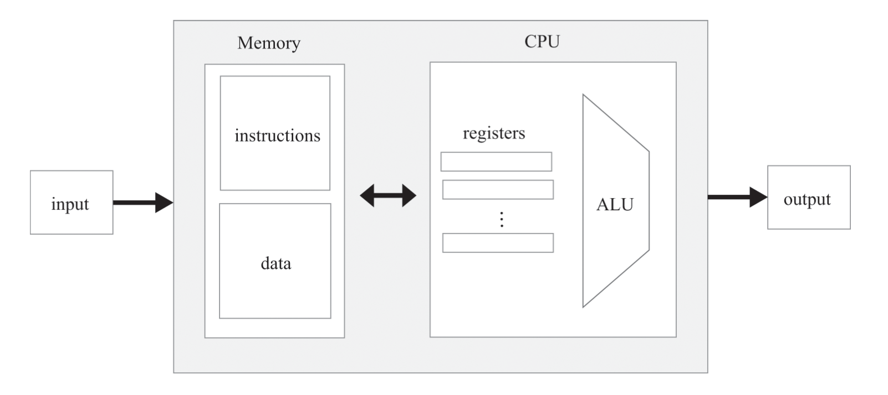
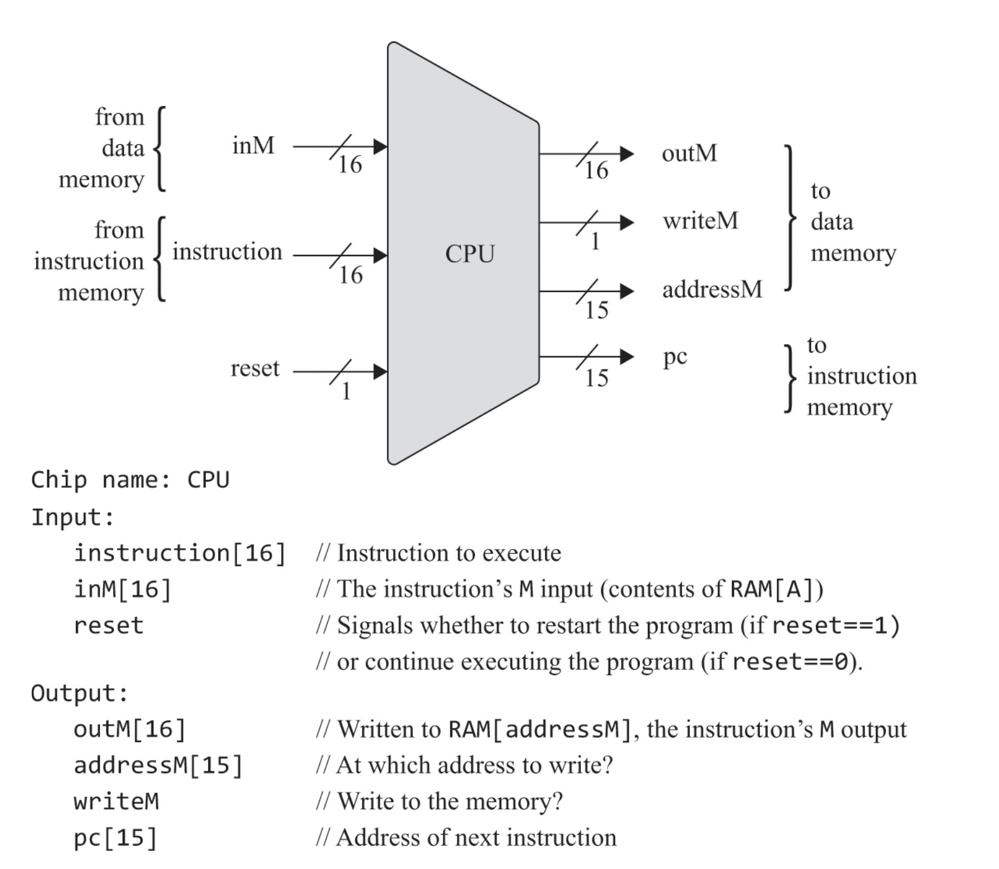
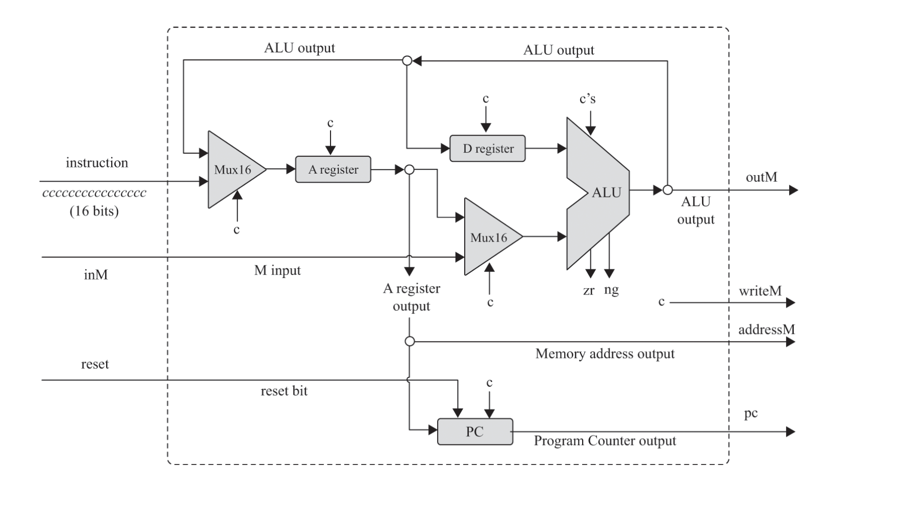

## computer architecture

튜링머신은 컴퓨터 구조를 설명하는 추상모델이고 폰노이만 구조는 현대 대부분의 컴퓨터가 채택한 실용적인 컴퓨터 구조이다.

몇몇 폰노이만 아키텍처의 변형 구조에서 데이터 메모리 구역과 명령어 메모리 구역이 유연하게 할당되고 관리되는 경우도 있고 딱 두 공간으로 물리적으로 분리되 관리 도니느 경우도 있음  
각각은 장단점이 존재함

## program load
프로그램을 어떻게 메모리로 읽어들일지는 외부의 이슈이다.  
cpu가 프로그램을 실행하도록 호출되었을때엔 이미 메모리에 명령어들이 준비 돼있을거다

## implementation on hard/soft ware
여러 기능을 하드웨어에서 구현하면 효율적이지만 비싸고 소프트웨어에선 덜효율적이지만 쌈

## register in cpu
cpu와 mem사이의 거리는 멈 근데 cpu는 임시적으로 값을 가지고 있어야하는 경우가 정말 많기에  
항상 메모리에 값을 잠시 보관해두기엔 alu가 기아상태에 빠짐  
기아 상태라는건 alu는 combinational 칩이기에 정말 수퍼 울트라 빠름 근데 메모리에서 값을 가지고 오는건 정말 느리기에 alu는 계속 돌아가는데, 더 일하고 싶은데 데이터가 안들어옴  
그래서 cpu에는 레지스터 공간이있음  
보통 cpu에는 이 레지스터가 여러개있음 a few dozens이라는 표현을 쓴거 보면 12*n 개정도 있는건가

## input/output
인풋/아웃풋에서 키보드와 스크린만 신경썼는데 실제로는 정말많은 입출력 장치가 있음 스피커, 여러 센서 등등  
그럼에도 스크린과 키보드만 신경쓰는 이유는 이 부분을 또 똑똑한 사람들이 일반화 했기 때문임  
스크린과 키보드의 경우처럼 만약 새로운 장치가 연결되면 우린 그냥 메모리에 특정 공간을 할당해주면   
이 작업은(메모리에 공간을 할당해주는 작업) installer와 driver라는 이름의 프로그램으로 보통 수행됨

## HACK CPU api

HACK 컴퓨터의 cpu에는 하나의 alu와 3개의 레지스터가 들어감(data, address, pc)

alu의 출력은 {A,D,M}의 부분집합으로 연결되는데 만약 그중 M이 있으면 cpu의 출력인 outM은 alu의 출력값이 되고 writeM은 1이됨  
만약 M으로 보내지지않으면 outM은 쓰레기값이 되고 writeM은 1이됨

PC의 출력은 insturction memory의 입력인 address로 연결된다.  
만약 reset == 1이면 pc는 항상 0을 출력한다.

pc의 출력은 기본적으로 항상 pc++ 이지만 c instruction에 jump조건이 충족되면 특정 값이 load된다.  
그리고 jump조건이 충족하는지는 alu구현에서 만들었던 zr, ng와 c insturction의 lsb3개를 잘 조합하면 된다.  

## note
일반적인 컴퓨터가아닌 HACK 컴퓨터에 대해 설명하는게 많아서 내용정리를 많이 하지는 않았다.  
또 입출력, 레지스터 등등 다른 내용도 이전에 이미 설명했던 내용들이라 많이 적을게 없었음.  
이 글을 다른 누군가 읽는다 생각하면 좀더 정리해서 적긴해야하는데, 현재로선 내 생각정리용일 뿐이라. 시간이 없기도 하고  
다음장부턴 그래도 조금더 잘 정리해볼까

