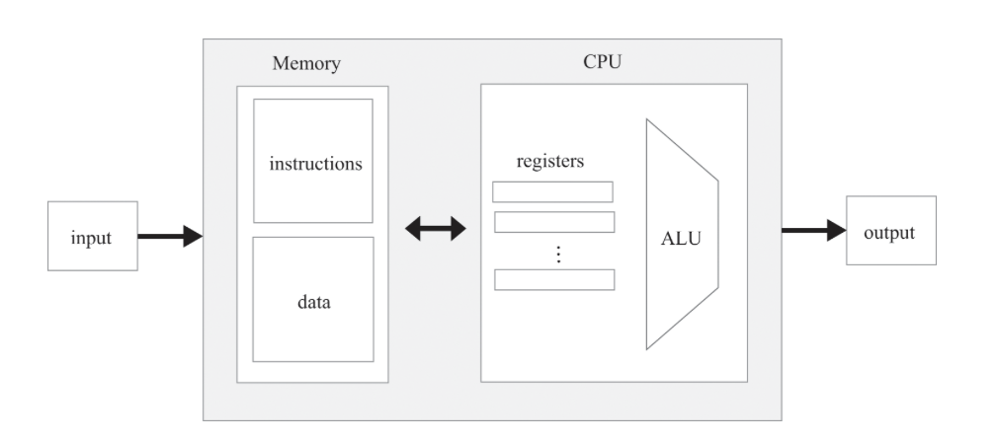

# Computer Architecture - 컴퓨터 구조

## 컴퓨터 시스템
(이 부분은 책 5.5 정리에 있다.)

#### 범용/전용 컴퓨터

- 범용 컴퓨터(general-purpose computer)
    - ex: PC, 휴대폰 등
    - 여러 종류의 프로그램을 실행하며, 다른 프로그램으로 쉽게 바꿔서 실행할 수 있게 설계된다.
- 전용 컴퓨터(single-purpose computer)
    - ex: 자동차, 카메라, 의학 기기, 산업용 기기 등에 들어가는 컴퓨터
        - 예전 콘솔 게임기는 ROM이 들어있는 외부 카트리지에 저장하고 다른 게임을 할 때 교체할 수 있도록 한다.
    - 특수한 활용 방식에 맞는 프로그램이 ROM(Read-Only Memory)에 내장되어 있다.

#### 하버드 구조
폰 노이만 구조(아래에서 서술함)에서 프로그램(명령어 메모리)과 데이터 메모리를 분리한 형태

구현하기 쉽고, 단일 주소 공간보다 빠를 수 있고, 명령어 메모리 크기를 최적화 할 수 있다.   
(한 사이클에서 명령어와 주소 레지스터를 병렬로 각각 접근할 수 있기 때문)

이러한 특징으로 인해 전용 컴퓨터나 임베디드 컴퓨터에서 자주 사용된다.

#### 단일 주소 공간의 명령어 실행

명령어와 데이터를 저장하는데 동일한 주소 공간을 사용한다.   

따라서 명령어와 데이터 주소를 한 cycle에 보낼 수 없다.

이런 문제를 해결하기 위해 일반적으로 cycle을 두 cycle로 바꾼다.
- 인출(fetch) 주기: 명령어 주소를 통해 명령어 레지스터에 명령어를 넣는다.
- 실행(excute) 주기: 명령어가 적용될 데이터 주소를 메모리 주소 입력에 전달한다.

(Hack은 이와 달리 여러 레지스터를 사용하여 인출과 실행을 한 주기에 수행한다.)

#### I/O

네트워크, 스피커, 모니터, 네트워크 장치 등 여러 I/O 장치에 연결된다.

일반적인 스크린은 색상 정보를 표현하기 위해 한 픽셀에 8비트를 사용한다.

대부분의 컴퓨터는 픽셀을 메모리 비트에 매핑하지 않고,   
CPU의 전용 그래픽 칩이나 GPU라는 독립적인 그래픽 처리 장치에 고수준 그래픽 명령어를 전송한다.

이러한 전용 장치와 저수준 소프트웨어는 그래픽, 비디오 렌더링 등에 최적화되어 있다.

#### 최적화 

하드웨어의 성능을 높이기 위해 캐칭, 데이터 구조, 장치 접근 최적화, 여러 기법(병렬화, 명령어 예비 인출(prefetch), 파이프라인)을 적용한다.

CPU 성능을 위한 설계 방법
- CISC(Complex Instruction Set Computer, 복합 명령어 집합 컴퓨터) 분파
    - 더 정교한 명령어들을 제공하는 강력한 프로세스를 만들어 성능 게선
- RISC(Reduced Instruction Set Computer, 축소 명령어 집합 컴퓨터) 분파
    - 명령어 집합을 제한한 간단한 프로세스를 만들어 성능 개선

#### 컴퓨터 부트
(출처 정확하지 않음, 책에서 짦게 다루는데 내가 알고있는거 추가로 적음)

컴퓨터는 reset 기능을 가진다.

reset 기능을 사용하면 현재 메모리에 있는 프로그램을 처음부터 실행하는데(PC 레지스터가 0부터 시작),  
요즘 컴퓨터는 메인보드의 ROM([BIOS](http://forensic-proof.com/archives/181),[UEFI](https://maternalgrandfather.tistory.com/entry/UEFI-BIOS%EC%99%80-%EA%B8%B0%EC%A1%B4%EC%9D%98-BIOS%EC%99%80%EC%9D%98-%EC%B0%A8%EC%9D%B4%EC%A0%90))을 읽어서 하드웨어(전원, 상태 점검)을 확인하고 OS 프로그램을 찾고 실행시킨다.

이를 부트스트랩(긴 부츠의 뒷부분에 달린 고리를 뜻했다)이라고 부른다.

## 컴퓨터 구조 기초

#### 내장식 프로그램(stored program)

내장식 프로그램은 1930년도 예전 기계식 컴퓨터처럼 하드웨어에 프로그램을 내장하지 않고, 
프로그램의 코드가 메모리에 데이터처럼 저장되어 실행하자는 개념이다.

이러한 메모리에 올라간 프로그램을 소프트웨어라고 부른다.

현대적인 컴퓨터의 핵심 개념이다.

### 폰 노이만 구조
이러한 내장식 프로그램의 모델 중,
엘런 튜닝 기계는 추상적인 컴퓨터 모델로, 이론 컴퓨팅 과학에서 논리적 기초를 분석하는데 사용된다.
폰 노이만 기계는 거의 모든 현대적 컴퓨터 플랫폼을 구현하는 실제 모델이다.

폰 노이만 구조 이미지

([만화로 나누는 자유/오픈소스 소프트웨어 이야기](https://joone.net/2016/11/15/%EC%95%A8%EB%9F%B0-%ED%8A%9C%EB%A7%81%EA%B3%BC-%ED%8F%B0%EB%85%B8%EC%9D%B4%EB%A7%8C/) 이거 어쩌다 찾아봤는데 나쁘지 않았음.)

#### 메모리

메모리는 주소를 지정한 레지스터를 선형적으로 배치한 것이다.

레지스터는 고유 주소와 값을 가진다.

논리적으로 이 두 값은 명령어 단어(instruction word)와 데이터 단어(data word)로 사용된다.

RAM이라는 이름은 주소 지정(addressing) 작업을 통해서 메모리 크기나 위치와 상관 없이 동일 주기 내에 접근 할 수 있기 때문에 그러한 이름이 붙었다.

데이터를 저장하는 메모리를 데이터 메모리(data memory), 명령어를 저장하는 메모리를 명령어 메모리(instruction memory)라고 부른다.

데이터 메모리(data memory)는 데이터를 2진 값으로 추상화 하여 저장한다. 레지스터를 쓸 때는 기존 데이터를 새로운 값으로 덮어씌운다. (제거 X, 덮어쓰기만 가능)

명령어 메모리(instruction memory)는 순수한 컴퓨터 아키텍처 관점에서 프로그램을 명령어가 어떻게 불러오는지는 외부의 문제로 취급한다.

#### CPU (중앙 처리 장치)

현재 실행중인 프로그램을 실행한다.

- 산술 논리 장치(ALU): 컴퓨터에서 지원하는 저수준 산술 연산 및 논리 연산을 수행한다.
- 레지스터
    - 연산 도중에 중간 값을 임시로 저장한다. 
    - Memory는 별개의 요소이므로 데이터를 쓰고 읽는데 시간이 오래 걸리기 때문에 CPU 내부에 레지스터를 둔다.
        - 이로 인해 CPU가 데이터를 기다리느라 처리하고 못하는 상태를 기아 상태(starvation)라고 한다.
    - PC 레지스터, 주소 레지스터, 데이터 레지스터 등 많은 레지스터를 사용한다.
- 컴퓨터 명령어
    - 컴퓨터 명령어는 미리 정의되고 구조화된 마이크로코드의 집합이다.
    - 명령어는 실행 되지 전 마이크로코드로 디코딩 되어야 한다.
    - 각 마이크로코드는 CPU내의 지정된 하드웨어 장치로 전달되어, 수행할 일을 지정한다.
        - ex: 4장에서 C명령어를 $111accccccdddjjj$ 처럼 표시하는 것처럼 명령어는 여러 마이크로코드로 구성된다. 이러한 instruction input을 여러 마이크로코드로 디코딩한다.
- 인출-실행 주기 (fetch-excute cycle)
    - 프로그램이 실행되는 각 주기마다 반복하는 프로세스를 말한다.
        - CPU는 명령어 메모리에서 명령어를 인출하고, 디코딩하고, 실행한다.
        - 다음에 인출해야 할 명령어가 무엇인지 알아낸다.

#### 입력과 출력

개별적인 하드웨어 기기를 제어하는 건 어려운 일이다. 따라서 이런 복잡성을 추상화한 메모리 매핑 I/O 기법을 사용한다.

메모리 매핑 I/O이란, I/O 장치의 2진 에뮬레이션을 만들어 CPU에게 일반적인 메모리처럼 보이도록 만드는 것이다.

메모리 맵을 주기적으로 동기화하여 사용자에게 즉각적인 응답을 제공하는 것처럼 보인다.

메모리 맵을 사용하기 위해선 I/O 장치를 구동하는 데이터는 메모리 위에 직렬화 되어야 하고,    
프로그램들이 접근 할 수 있도록 미리 정의된 상호작용 규약(protocol)을 지원해야 한다.

메모리 매핑 I/O를 사용하기 위해선 메모리 맵을 할당하고 관리하는 installer 프로그램과,   
운영체제에 추가되어 I/O 장치를 관리하는 device driver 프로그램이 필요하다.

## Hack 컴퓨터 아키텍처
실습 외에는 사용되지 않는 내용이라 더 이상 정리하지 않는다.
3장 까지는 논리적인 부분은 일반적인 구현 방법이랑 비슷하다고 생각했는데, 이제는 너무 Hack에 특화된 구조가 나온다고 판단했기 때문이다.  

## 실습 메모
실습 하면서 한 기록들. 정리 용도가 아니라 나중에 다시 실습할 때 찾아보는 용도로 기록한거라 볼 필요 없음

책에서 보여주는 CPU 내부 구조의 c는 명령어 일부분이고, 어디부터 어디까지인지는 찾아서 처리해야 한다. 

주의점: 버스 비트가 4이고 값이1000(15) 이면 인덱스가 3210이다. 일반적으로 보거나 생각하는거랑 반대임

instruction의 값은 A레지스터, D레지스터의 이후 input 값이나 ALU를 통해 outM으로 제공될 수 있다.

- 메모리 구현
    - 4장 메모리 구현이랑 비슷함
        - DMux 사용해서 주소 배정하고 실행하면 됨, 넘어가면 무시하고
            - load 1일 때면 저장하는 것도 똑같음
        - D16k, Screen, Keyboard로 저장
        - Keyboard는 input 필요없음
        - 테스트가 좀 이상한듯, 주소가 24576 넘으면 스크린 수정 될 수 있게 구현했는데 실패를 안함
- CPU 구현
    - 5.3.1 파트 이미지를 보면 ALU 결과를 A레지스터나 D레지스터로 다시 넣는데, ALU 명령어에 따라서 결과를 A or D 레지스터에 입력함(ex: `D=M+D`, `M=M+1`, `A=D`)
    - 그냥 코드에 주석 쓰면서 해서 그거 다시 보는게 나을듯, 글로 하기는 너무 복잡함.
- 컴퓨터 구현: 그림이랑 API 보고 구현하면 됨

