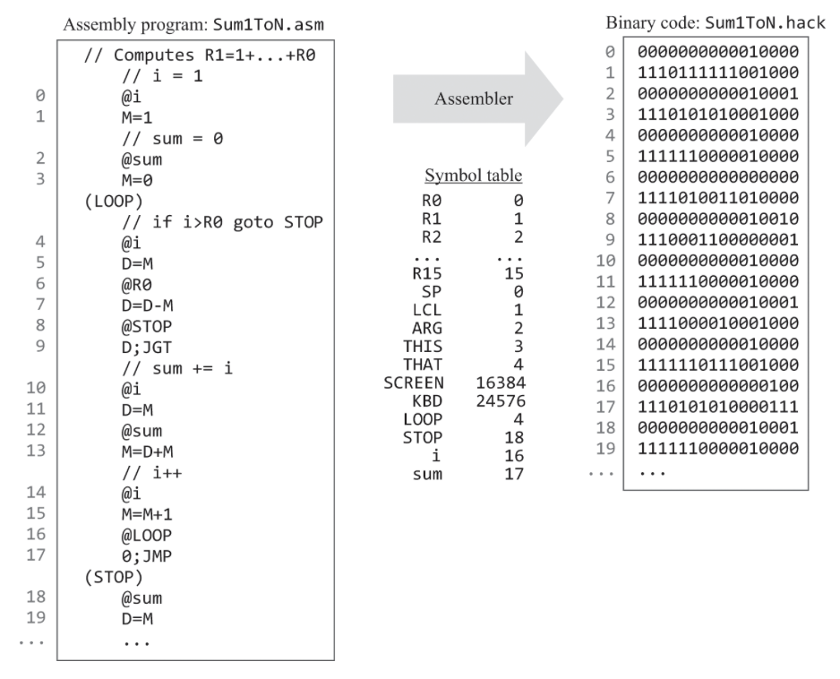

# Assembler - 어셈블러

## 배경
기계어는 기호와 2진 형식으로 정의된다.

$11000010000000110000000000000111$ 2진 명령어를 예시로 들면, 이 명령어는 load(11000010), R3(00000011), 7(0000000000000111)을 의미하는 여러 마이크로코드로 구성된다.

기계어는 이러한 수많은 연산을 제공한다.

이러한 연산을 2진 코드로 정의하고 사용하기 어렵기에, `load R3 7` 같은 약속된 기호로 작성한다.

`load`같은 연산 코드를 연상 기호(mnemonic)라고 부른다.

이러한 기호 언어를 어셈블리(Assembly), 번역기를 어셈블러(Assembler)라고 한다.

## 어셈블러

어셈블러는 사람에게 편리한 기호 코드와 컴퓨터가 이해할 수 있는 2진 코드 사이의 간극을 매워준다.

어셈블리 코드를 분석해서 여러 마이크로코드로 구분하고, 기호를 분석하여 2진 코드(기계)어로 변경할 수 있다.

### 기호
일반적으로 어셈블리어는 다음 세가지 이유로 기호(symbol)를 사용한다.
- 레이블(label): 코드 내 위치를 표시
- 변수(variable): 기호 변수를 정의하고 사용
- 선언기호(predefined symbol): 미리 선언된 기호를 사용해 컴퓨터 메모리 내의 특정 주소에 접근한다.

이러한 기호는 실제 메모리 주소를 몰라도 기계어를 작성할 수 있도록 해준다.  

하지만 [공짜 점심은 없다](https://en.wikipedia.org/wiki/No_such_thing_as_a_free_lunch). 기호는 주소를 가지고 있다.  
어셈블리어는 기호 처리 작업을 통해 기호를 관리해야 한다.

기호(symbol) 테이블은 이러한 기호(symbol)와 해당하는 주소 또는 값에 대한 매핑을 포함하는 데이터 구조이다.

프로그램에서 정의한 상수, 변수, 레이블 및 기타 기호에 대한 정보를 유지하고 추적한다.

### 더 복잡한 기능

- 상수 산술
    - 기호로 정의된 상수를 사용하여 주소나 값 등을 명시적으로 지정하고,연산에 사용할 수도 있다.
- 매크로 명령어
    - 어셈블리어 코드를 재사용하기 쉽도록 만드는 데 사용된다.
    - 특정한 명령어 또는 명령어 집합을 대체할 수 있다.

### 현재

기계어 프로그램을 사람이 작성하는 일은 거의 없다. 

보통 컴파일러가 기계어 프로그램을 생성하는데, 이러한 컴파일러는 2진 코드를 바로 만드는게 편리하기 때문에 굳이 어셈블리 코드를 만들지 않는다.

그러나 효율성과 최적화에 관심이 있는 C/C++ 프로그램 개발자에게는 여전히 유용하다. 

## hack 어셈블러 코드 예시

## 실습 메모
실습 하면서 한 기록들. 정리 용도가 아니라 나중에 다시 실습할 때 찾아보는 용도로 기록한거라 볼 필요 없음

parser가 필요함: 어셈블리 코드를 분석해서 여러 요소로 나눔 - (실제로 어떤 일을 하는지는 몰라도 됨)
마찬가지로 심볼 테이블이 기계어를 이해할 필요는 없다.
그냥 요소를 추가하고 요소의 값을 찾을 수만 있으면 된다.

6장 내용만으로 구현에는 무리가 있다. (특히 심볼 테이블 요소들)   
4장 기계어 명세를 확인해야 한다.

변수는 16부터, 기본 선언 기호 구현해야 함.

### 실제로 어셈블러는 어떻게 만들어지는가?
실습에서는 어셈블러는 고급 언어로 만든다. (손으로 직접 번역할 수도 있긴 하다.)

하지만 실제로는 초기에는 고급 언어가 없고 하드웨어만 있었을 텐데 어떻게 어셈블러를 구현하였는가?

논리적인 어셈블러를 만들고, 그 어셈블러를 한번만 사람이 수작업으로 컴퓨터의 기계어로 번역한다.  
그럼 만들어진 어셈블러를 사용해서 번역 작업을 자동화 할 수 있다.

