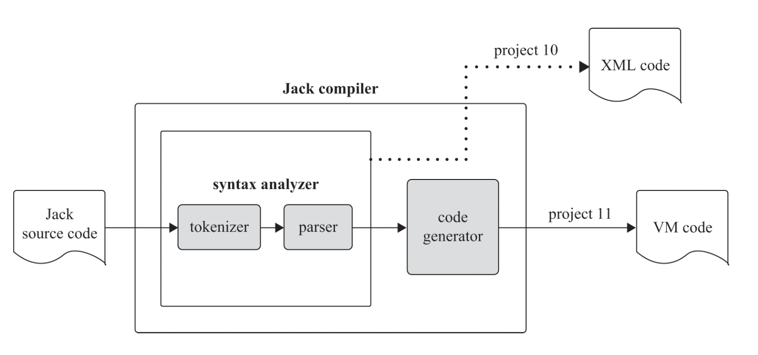
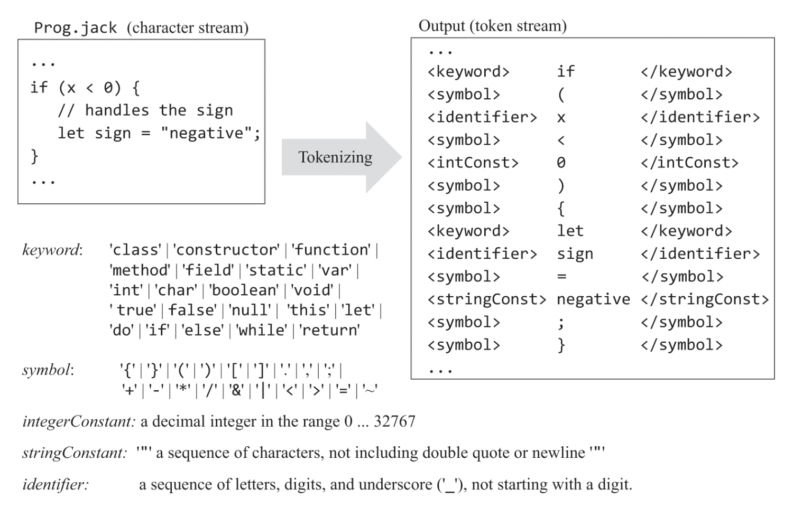
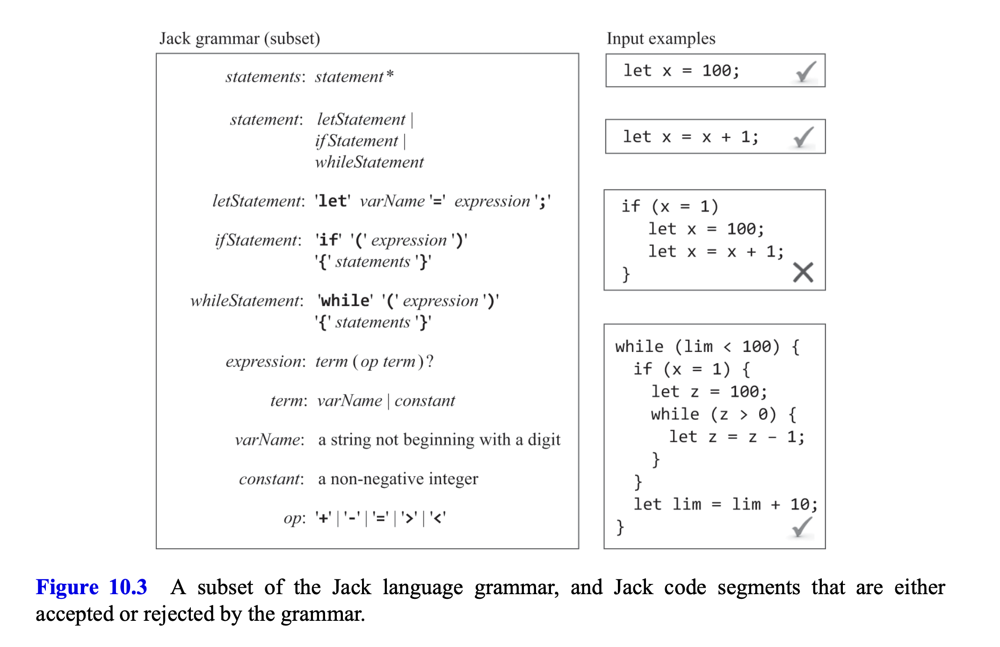
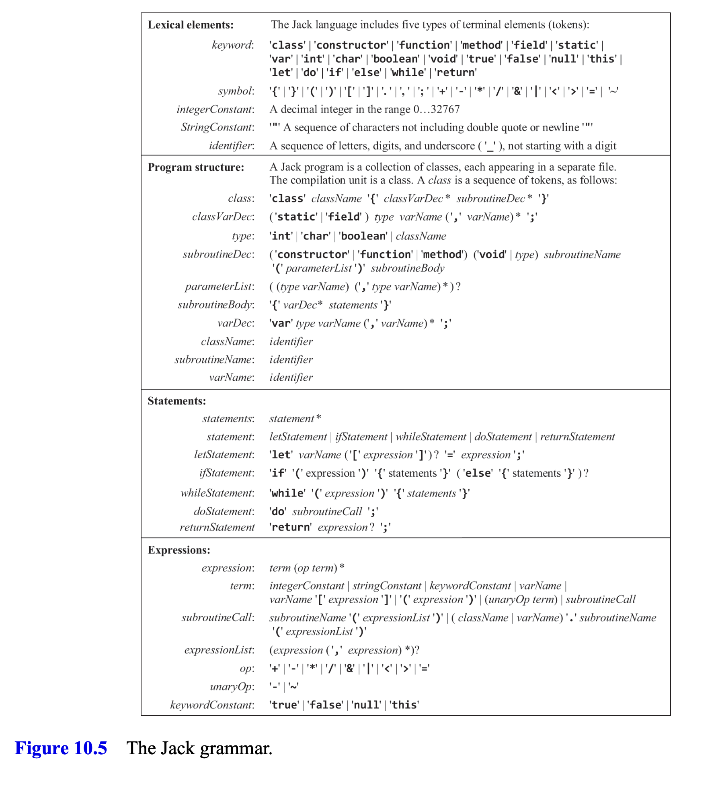
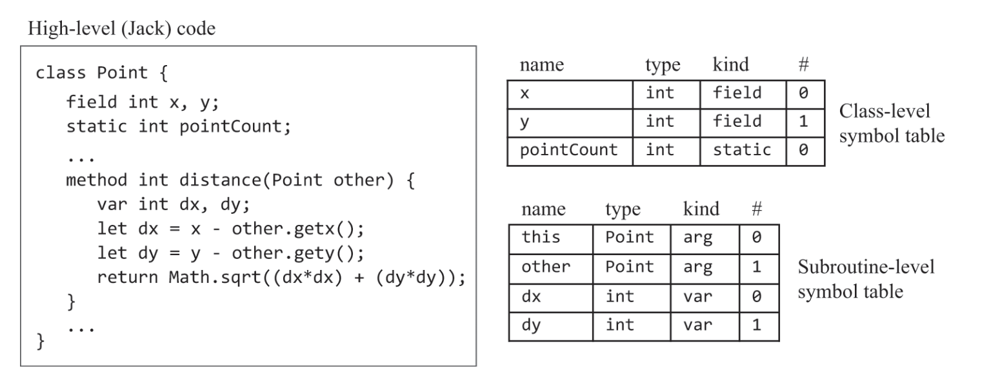
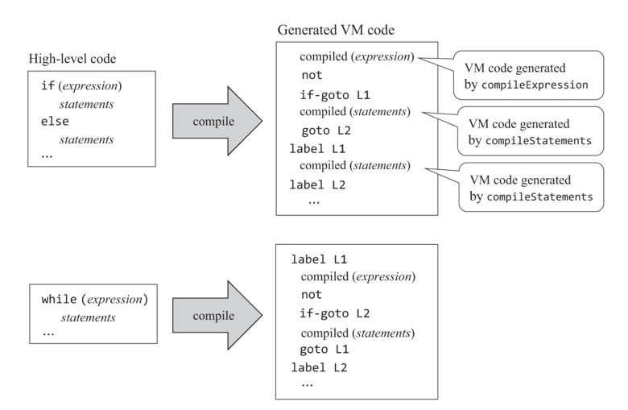

## compile
컴파일은 어떤 언어로 쓰여진 파일을 다른 언어로 번역하는 과정이다.(보통 더 낮은 수준의 언어겠지)  
그리고 그런 작업을 수행하는 프로그램이 컴파일러라고 불린다.  

컴파일은 두가지 단계로 분리되어 수행된다.  
- 구문 분석(syntax analysis)
- 코드 생성(code generation)



## syntax analysis
구문 분석 단계에서는 코드 생성 단계에서 파일의 의도를 이해할 수 있게끔 파일을 미리 처리해둔다.  
주석, 공백 등을 미리 제거하고, 문법에 맞게 각 키워드별로 나눠준다.


Jack 언어에는 그런 키워드에 5가지 종류가 있다. 
- keywords 
- symbols   
- integer constants (17, 314)
- string constants ("FAQ", "Frequently Asked Question", 실제로 파일에 구문결과를 저장할땐 쌍따옴표를 제거한다)
- identifiers (변수, 클래스, 함수 이름)

위 단계를 토크나이징이라 하고 파싱 단계가 또 존재한다.  
파싱에서는 저렇게 분리된 토큰들을 다시 각 구문에 맞게 그룹화해준다.(사실 이렇게 그룹화 하는걸 파싱이라고 하는게 맞는건지는 모르겠다)  

예를 들어 while문이 있으면 while 다음에 (, expression, ), { ,statements, } 가 나온다.  
그러면 이것들을 하나의 whileStatement로 묶어주는 것이다.  
  

그리고 그 과정에서 예상치 못한 토큰이 다음 단계에 나온다면 이는 문법오류라고 볼 수 있다.  

그리고 그 다음토큰을 몇개 봐야하는 지에 따라 LL(k) 파서로 불리는데  
Jack에서는 하나의 예외를 제외하고 바로 다음에 나오는 토큰만 보면되서 LL1 파서이다.  
저 k값이 높아질수록 파서는 복잡하고 정교해져아한다.  

전체 문법은 다음과 같다.  



## code generator
구분 분석을 통해 단순히 직렬화만 했으면 기계입장에서 알 수 없는 문자열 덩어리였던 파일이  
각 문자열마다 어떤 역할을 하는지 이해할 수 있게 됐다.  
이 정보를 바탕으로 vm코드를 작성한다.  

고수준 언어에서 다루는 개념은 아래 것들이 있다.  
### var
고수준 언어에서 변수에는 중요한 개념 두가지가 있다.  
바로 생명 주기와 변수의 범위이다.  

static은 현재 클래스가 살아있을때 까지 다른 클래스의 object는 해당 객체가 필요할 때 까지, local변수는 해당 함수가 실행될 때 까지만 필요하고 이후에는 메모리에서 해제 해줘야하는 것처럼  
이렇듯 생명 주기는 각 객체마다 다르게 유지된다.  
또한 2개의 같은 변수 x가 있더라도 각 x가 속한 클래스나 함수, while, if에 따라 다르게 인지되는 것처럼  
변수는 인지되는 범위를 가진다.

이에 컴파일러는 심볼 테이블을 만든다.  
Jack에서는 변수의 범위가 class-level, subroutine-level밖에 없기에 각 두 범위의 테이블을 선언한다.  
당연히 subroutine table은 함수가 실행될때마다 새로 초기화된다.


변수가 호출되면 먼저 subroutine-level 테이블을 탐색하고 없으면 class-level 테이블을 탐색한다.

### expression
표현식에서는 생각해줘야할 것이 하나 있다.  
바로 infix, postfix 표기법이다.  
사람이 일반적으로 사용하는 표기법은 1 + 7 처럼 중위 표기법이다(연산자가 피연산자 중간에 있음)  
하지만 컴퓨터는 스택 구조를 사용하기에 push 1, push 7, add 처럼 후위 표기법을 사용한다.  

### flow of control
고수준 언어에서는 조건절에 다양한 표현을 넣을 수 있지만, 저수준 언어에선 그렇지 않다.  
non-conditional jump 또는 conditional jump가 전부이다.  



이에 먼저 표현식을 평가해 스택의 최상위에 두고 if-goto를 통해 해당 if, while을 빠져나갈지 다시 continue할지 평가한다.  

### object
- construction

생성자는 객체를 정확히는 객체의 포인터를 반환한다.  
실제 데이터들은 heap영역에 저장되고 그 데이터의 base address를 pointer 0(this)가 가지고있다가 생성자함수가 끝날때 반환해준다.  

또한 heap영역에 데이터를 생성할때 사용가능한 메모리 공간을 찾아야하는데, Memory.alloc 함수가 그렇게 해준다.  
12장에서 실제 구현을 알아보겠지만 현재 챕터에서는 해당 함수를 블랙박스로써 사용한다.  

- manipulation

method를 call할때는 고수준언어에선 보이지 않지만 실제론 this객체를 argument 0으로 넘겨준다.  
그러면 method에서는 argument 0을 pointer 0에 옮기면 this를 통해 객체의 field값에 access할 수 있다.

또한 Jack의 함수는 아무것도 반환할 필요가 없는 함수일지라도 무조건 return을 해야한다.  
이에 만약 void 함수라면 push constant 0, return을 하고 caller측에서 pop temp 0를 해줘야한다.   


### array
array는 array[i]로 접근한다.  
let arr[i] = x; 의 pseudo vm 코드를 작성해보면
```vm
push arr
push i
add
pop pointer 1
push x
pop that 0
```
위 와 같이 작성할 수 있을 것이다.  
pointer 1(MEM[4], that)에 하는 이유는 단순히 컨벤션인 듯?  
객체에 주소는 this에 array의 주소는 that에 저장하는 것이  
하지만 위코드에는 결함이 있다.  
바로 let arr[i] = arr2[j] 같은 상황에는 에러가 난다.  
```
push arr
push i
add
pop pointer 1
push arr2
push j
add
pop pointer 1 # 기존에 있던 arr[i]의 주소가 사라짐!
```

하지만 조금 고쳐주면 정상적으로 작동하게끔 할 수 있다.
```
push arr
push i
add
push arr2
push j
add
pop temp 0
pop pointer 1
push temp 0
pop that 0
```
스택에 arr[i], arr2[j]의 주소를 쌓아둔 상태에서  
arr2[j]를 temp 0에 잠시 저장하고
that에 arr[i]의 주소를 넣는다.  
이후에 that 0에 temp 0에 있는 값을 할당한다.  


## note
과제가 점점 어려워진다..
그나마 10장은 문법보고 parsing만하면 되서 그나마 간단하긴했다.  
term부분이 재귀적인거 고려하느라 좀 어려웠음


