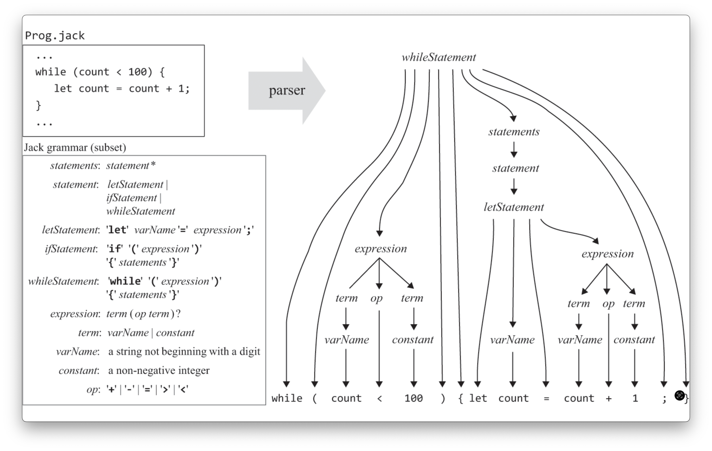

# Compiler

### 시작하기 전에

- 성능을 고려하지 않고 제한적이다.
    - 타입, 형변환, 상속, 접근제어자, 연산자 우선순위 등 여러 기능이 제공되지 않는다.
    - 파싱에서 실제론 중요한 상향식에 대한 설명이나 파싱 알고리즘, 형식언어이론 등을 다루지 않는다.
    - 오류 진단 및 보고에 대한 구현되 생략되었다.
    - 그 외 여러 이론에 대한 설명이 부족하다. (책의 역할을 생각해보면 당연한거긴 함. 상용 프로그램 개발이 아니니까.)
    - 조금 별개의 이야기지만, 성능은 컴파일러 자체의 성능보다 컴파일러가 생성하는 목표 언어가 얼마나 효율적인지가 더 중요하다.
- 이 강의에서 구현하는 컴파일러는 VM컴파일러다. 실제로 매모리를 다루거나 하지 않는 추상화 된 컴파일러이다. 다만 기본적인 구조는 다른 컴파일러와 다르지 않다.

- 실제로 파싱 기능은 여러 컴파일러들도 직접 만들지 않고, LEX나 YACC 같은 구문 분석 프로그램을 통해 구현한다. 

## Compiler

컴파일을 수행하는 프로그램을 컴파일러라고 부른다.

컴파일은 특정 프로그래밍 언어로 쓰여 있는 문서를 다른 프로그래밍 언어로 옮기는 것을 의미한다. (ex: javac는 `.java` -> `.class`)

컴파일은 두 단계로 구성된다.

- 구문 분석(syntax analysis)
- 코드 생성(code generation)

(추가)    
실제 현대 컴파일러는 Frontend, Middleend, Backend로 구분된다. 주로 다음과 같은 일을 수행한다.

- Frontend: 구분 분석
- Middleend: 최적화
- Backend: 코드 생성

하드웨어 독립적인 중간 언어를 사용했을 떄에는 여러 장점이 있다.

- 플랫폼 호환성: 동일한 중간 코드를 여러 플랫폼에서 실행할 수 있다. 상대적으로 저수준에 더 가까운 중간 언어를 기계어로 번역하기는게 쉽다.
- 컴파일러 개발 단순화: 컴파일러가 하드웨어 종속적이지 않으므로 더 빠르게 개발할 수 있다.
- 다양한 언어 지원: 프로그래밍 언어 -> 중간 언어 만 지원하면 다양한 언어를 같은 실행 환경에서 실행할 수 있다. (ex: LLVM, JVM)

### 구문 분석

구문 분석은 두 단계로 나뉘어진다.

- 토큰화(tokenizing)
    - 텍스트 파일에 저장된 문자열을 언어 어휘로서 정의된 "**토큰**"들로 분류하는 것.
        - 불필요한 주석이나 들여쓰기를 제외하고 의미있는 토큰만 남긴다.
        - 이러한 토큰들의 집합을 어휘(lexicon)이라고 부른다.
        - 프로그래밍 언어의 각 문법은 하나 이상의 토큰으로 구성된다. 문법은 메타 언어(meta-language)를 사용해 정의된다.
    - 어휘 분석(lexical analysis), 스캐닝(scanning)으로 불리기도 한다.
- 파싱(parsing)
    - 토큰들을 의미가 있고 구조화된 명령문들로 분석하는 것.
    - 문법을 바탕으로 토큰을 분석힌다. 올바른 토큰의 집합이더라도, 문법에 맞지 않으면 아무 의미도 없다.
        - 영어로 예를 들면 red drive a he는 유효한 토큰의 집합이지만, 문법이 맞지 않고, 아무 의미도 없다.
        - "문법은 본질적으로 재귀적이다." (책에서 나온 문장인데, 좀 보기 좋아서 가져옴)
        - 파싱이 이루어지면 파스 트리(parse tree, 또는 유도(derivation) 트리) 형태로 표한할 수 있다.
    - [LL 파서](https://en.wikipedia.org/wiki/LL_parser)는 좌측유도(Leftmost derivation) 방식으로 동작한다.
        - lookahead에 최대 k개의 토큰(token)을 사용한다면, 그 파서는 LL(k) 파서라고 부른다.
        - 백트레킹 없이 하양식(top-down) 재귀 알고리즘으로 파싱할 수 있는 문법을 LL grammar라고 부른다.
        - (핵심적인 내용은 아닌데, 그냥 내가 정리하고 싶었음)

#### 파싱 추가 설명

> 문법은 본질적으로 재귀적이다.

에 대한 구체적인 설명과 파싱이 재귀적으로 이루어지는 과정 설명

위 이미지를 예시로 들면 if 문은 `if` `(` `expression` 등으로 구성된다.    
이 중 `expression`은 표현식 문으로, `term`, `op` 등을 가진다.   
`term` 또한 여러 토큰을 가진다.

if 문을 해결하기 위해서, `expression`를, `expression`를 위해서 `term`을 ...    
이렇게 재귀가 발생한다.

(문법에서 나오는 `?`, `*`는 메타 언어로 표현한건데, regex 생각하면 편할듯.)

#### Jack 언어의 경우

- Jack 언어는 특정 문법을 제외한 대다수가 LL(1)이다. 이는 구현의 편의를 위해 의도적으로 설계된 것이다.
- 중간 테스트를 위해 XML으로 결과를 출력한다.

### 코드 생성

분석된 의미(semantics)를 기반으로 목적 언어를 생성한다. (시적 언어 -> 목적 언어)

고수준의 현대 프로그래밍 언어를 저수준으로 번역하는 것은 꽤나 어려운 일이다. (그게 상대적으로 더 추상화 묀 가상머신 언어로 번역하는 것이더라도.)

#### 주요 내용

각 언어의 주요 특징:

- 고수준 언어: 객체와 배열을 다룬다. 다양한 연산을 제공한다.
- 중간 언어: 제한된 메모리 세그먼트와 제한된 연산을 다룬다. (if-else, while 등의 기능이 없다.)
- 저수준 언어: 메모리를 직접적으로 다룬다.

우리는 고수준 언어 -> 중간 언어가 목적이다.

고수준의 다양한 연산을 상대적으로 저수준인 제한된 연산으로 처리할 수 있어야 한다. (아래는 진짜 요약 정도고, 실제 구현을 위해선 책이나 강의를 읽을 것)

- 변수 처리
    - 변수 처리의 조건
        - 변수를 실제 메모리에 관리해야 한다.
        - 변수를 식별하고, 변수의 정보(타입, 종류(인수, 지역 변수, 정적 변수 등))를 확인할 수 있어야 한다.
        - 변수마다 메모리 크기와 생명주기가 다르다. (static, local 등)
    - 기호(symbol) 테이블을 사용해서 위 조건을 해결할 수 있다.
        - 범위 수준(or scope)에 따라 별개의 기호 테이블이 존재한다.
        - 변수의 정보를 저장하고 찾을 수 있다.
        - 서브루틴(메서드)의 경우, 심볼 테이블에 임시적으로 this를 꼭 가지고 있다.
        - LinkedList를 사용해서 다양한 범위(scope)의 심볼 테이블을 제공할 수 있다.
- 표현식 처리
    - 일반적인 고주순 언어는 중위표현식을 사용한다. 이를 저수준 언어가 주로 다루는 후위표현식으로 변경해야 한다.
        - 후위표현식은 스택을 사용해서 쉽게 구현할 수 있기 때문이다. 스택 기반의 VM에 친화적이기도 하다.
    - 파스 트리를 분석해서 표현식을 만든다.
        - 트리이므로 dfs를 사용해서 코드를 생성할 수 있으나, 책에서는 Jack에 특회되고 더 단순한 방법을 사용한다.
- 문자열 처리: 많은 프로그램에서 자주 사용되므로 특화된 기능을 제공하기도 한다. 이 책에서는 하나의 사용 방법만 제공한다.
- 명령문 처리
    - if-else: if와 label, goto 기능을 사용해서 분기 기능을 구현할 수 있다. (저수준의 if는 더 제한적이다. 조건의 결과를 만족하면 goto 정도의 기능)
    - while: if-else와 비슷한 방식으로 if, label, goto를 사용해서 구현한다.
    - return: 결과를 스택에 push하고 return VM 코드를 실행한다.
    - let: 기호 테이블에서 변수를 가져와 해당 변수를 수정한다.
    - do: 서브루틴을 호출하고 결과를 사용하지 않고 pop한다.
- 객체 처리
  - Stack 영역에선 객체 변수 or 포인터(이후 포인터로 표현)를 사용하고, 실제 객체는 Heap 영역에 저장된다. 포인터의 값으로 실제 객체의 시작 주소를 가진다.
  - 기호 테이블은 컴파일 시점에 사용되고 그 이후는 사용하지 않는다. 객체는 런타임 시점에 생성된다. 
  - 객체는 THIS 포인터에서 인스턴스 본인의 주소를 참조한다.
  - 생성자 컴파일 과정
    - 호출자 입장에서 호출 자체는 다른 서브루틴과 동일하다.
    - 생성자 수준(범위) 기호 테이블을 생성하고, 새로운 객체를 위한 메모리 공간을 할당받고, 해당 객체를 THAT 포인터에 저장한다.
    - 이후 THIS 포인터(객체의 주소가 저장된)를 스택에 담아 결과(생성된 객체 참조)로서 리턴한다.
  - 메서드 컴파일 과정
    - 호출자 입장에서 사용은 VM에서 기본 연산(add, sub) 등을 수행할떄와 마찬가지로 호출할 수 있다.
    - 그런데 `p1.method(a, b)` 라면, p1이 어떤 타입인지 어떻게 확인할 수 있을까? -> 이를 위해서 심볼 테이블을 사용한다.
    - 피호출자 입장에서 본인이 어떤 인스턴스인지 알아야 한다.
      - 함수 호출 시 호출자가 내부적으로 argument 0으로 객체를 넘겨준다. -> 피호출자는 THIS 포인터로 저장하고 서브루틴 수행
      - 파이썬에서 함수에서 self를 넘기는걸 생각하면 될 듯.
- 배열 처리
    - (다른 언어는 모르겠지만 Jack에선) 객체와 배열은 동일하다. 컴파일러가 내부적으로 조금 특이한 방식으로 사용할 수 있도록 해줄 뿐이다.
      - `Array.new()`를 통해서 생성하는 모습이나, `Array.jack`을 Jack OS에서 제공한다는 점을 생각해보자.
    - THAT 영역을 배열의 값을 저장하는 영역으로 사용한다.
      - VM 코드는 배열의 메모리 주소를 몰라야 하기 때문이다. - VM 코드는 책 302.p 그림 11.11 이나 [해당 강의](https://www.coursera.org/learn/nand2tetris2/lecture/lMcUC/unit-5-8-handling-arrays)에서 볼 수 있다.  
      - `x = arr[2]` 라면, that 0에 arr+2 주소 값을 저장한다.
      - 이후 VM 변환기가 인터프리터를 처리할 때 메모리를 직접 다룬다.

- (객체와 배열 처리 추가 설명)
  - 자꾸 햇갈려서 적는데, SP, LCL, ARG, THIS, THAT은 하나의 주소가 아니라, BASE 주소를 의미한다.
  - 여러 개의 공간을 가진다. 예를 들어, push that 1은 THIS 영역의 1번째 값에 push 연산을 수행하는 것이다. (0부터 시작)
  - (자세한 내용은 책 7~8장 참고)

#### Jack 언어의 경우

- Jack 컴파일러의 목적 언어인 VM 언어는 메모리를 직접적으로 관리하지 않는다. 따라서 변수 관련해서 심볼테이블 관리만 하면 된다.

## 실습

작성일 기준 2일 안으로 끝까지 마무리하고 싶은데, 너무 실습 진도가 느려서, 남들 코드를 많이 참고하였음.    
-> 그러다보니 구현이 꼬이고, 처음부터 다시 만들어야 해서 일단 다음 장으로 넘어갔는데, 기존 코드 참고해서 새로 만들기    
-> 기존 코드는 Seven 테스트까지는 통과하는 상황

## 책 읽고 생각나는거 아무거나 메모

- 자바에서 FE는 javac와 그 외 프로그램이고, BE는 JRE로 볼 수 있을 것 같다.
- Jack에서는 프로그램을 실행하기위해 하나의 .asm으로 변환하는데, 자바는 JVM이 동작하면서 내부 인터프리터가 처리한다.
- Jack이나 자바는 의존하는 클래스가 분리되어 있어도 괜찮음. - 기계어로 변환할 때 즈음에 linking 되기 때문임
    - 외부 의존 파일 없이도 VM언어는 개별적인 파일로 존재하는데, 자바에서는 plain.jar로 사용해서 빠르게 CICD를 하거나 할 때 사용된다.
    - 실제 기계어로 번역할 때 쯤에야 특정 클래스가 의존하는 외부 클래스가 필요하다는거. JVM 관련 글 들을때 이해가 안 갔는데, 이제 어느정도 이해됨
- 자바 바이트드에서 기호 테이블이 필요한 이유는 컴파일이 lazy하게 이루어지기 때문일까?
  - 내부에 인터프리터나 jit 컴파일러가 바이트코드를 런타임 시점에 읽어서 컴파일하기 때문에 바이트코드에서 기호 테이블이 필요함.
    - 클래스 로딩 시점이나 링킹도 그렇고.
  - 그에 반헤 jack은 그냥 바로 변환하는거라 필요없는거고.
- 2단계 컴파일이 확실히 편하긴 한듯
    - 언어 만드는 입장에서 자바나 코틀린 그루비처럼 중간 언어를 사용해서 JVM만 지원하면 다 잘 실행되는게 꽤나 큰 장점일듯.
        - BE를 만들지 않아도 되고, 대신 자유도는 조금 떨어지겠지만.
    - 근데 굳이 가상머신이 필요한 방식은 아닌거 같은데, Jack 언어도 가상머신 없이 동작하고.
        - 그런 점에선 Jack은 LLVM에 더 가까우려나
    - 물론 책에서 구현을 쉽게 할 수 만든거지만, FE 만드는 입장에서 하드웨어 메모리를 관리할 필요 없고, 그 외 여러 면에서 단순하게 구현 가능한게 좋은듯.
- 이런 느낌으로 구현하는거면 나도 JVM을 만들어볼 수 있지 않을까?
    - 물론 진짜 JVM 그 표준이나 테스트에 맞추눈게 아니라, 바이트코드 읽고 처리하는거 정도는 만들 수 있을거 같은데.
    - 파이썬 사용하면 꽤나 쉬울거 같기도 하고...
- Jack에선 객체 생성자 시점에 메모리를 할당한다는데, 자바에서는 그 따로 생성자랑 메모리 할당 시점이 분리된걸로 아는데?
  - JVM의 new instruction 에서 heap에 할당 -> <init>(생성자)를 호출해서 초기화한다고 함. 
  - 참고할만한 곳
    - https://youtu.be/26S4VFUWlJM?si=2xT001oGp6Cs_fYn
    - [토비 링크드인](https://www.linkedin.com/posts/tobyilee_%EC%9E%90%EB%B0%94%EC%97%90%EC%84%9C-%EC%98%A4%EB%B8%8C%EC%A0%9D%ED%8A%B8%EB%A5%BC-%EB%A7%8C%EB%93%9C%EB%8A%94-%EB%B0%A9%EB%B2%95%EC%9D%80-new-%ED%82%A4%EC%9B%8C%EB%93%9C-%EB%92%A4%EC%97%90-%EC%83%9D%EC%84%B1%EC%9E%90-%ED%98%B8%EC%B6%9C-%EC%BD%94%EB%93%9C%EB%A5%BC-activity-7176325428087853058-fib5?utm_source=share&utm_medium=member_desktop)
    - https://eminentstar.tistory.com/72 << 여기서 설명 잘 해주는 듯?