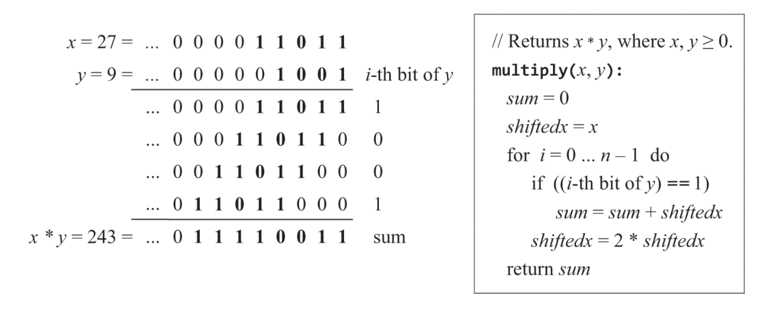
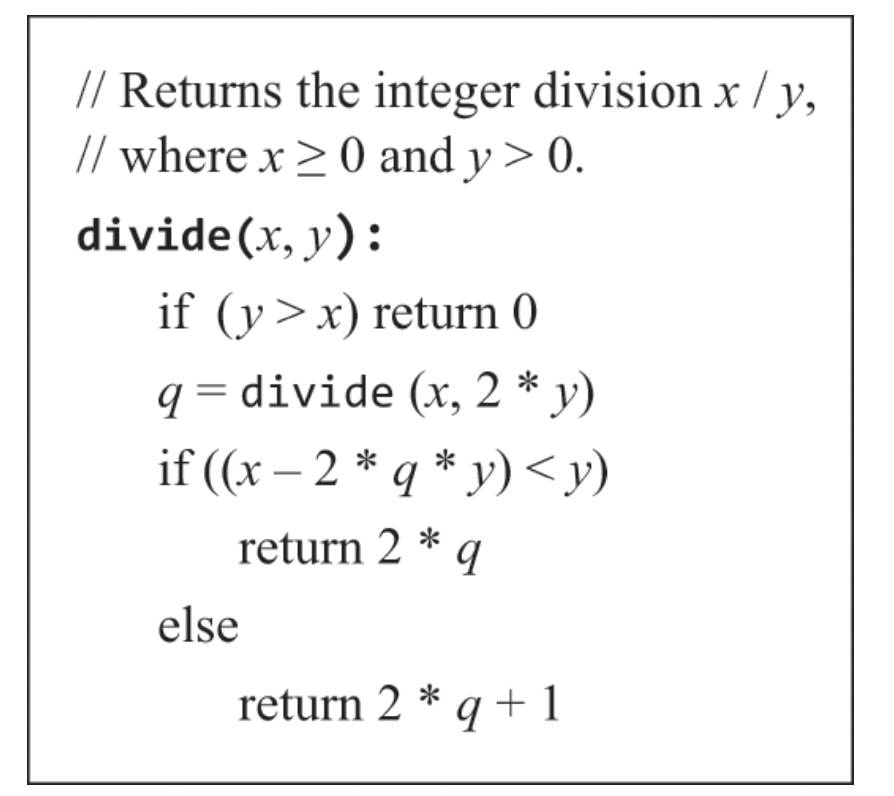
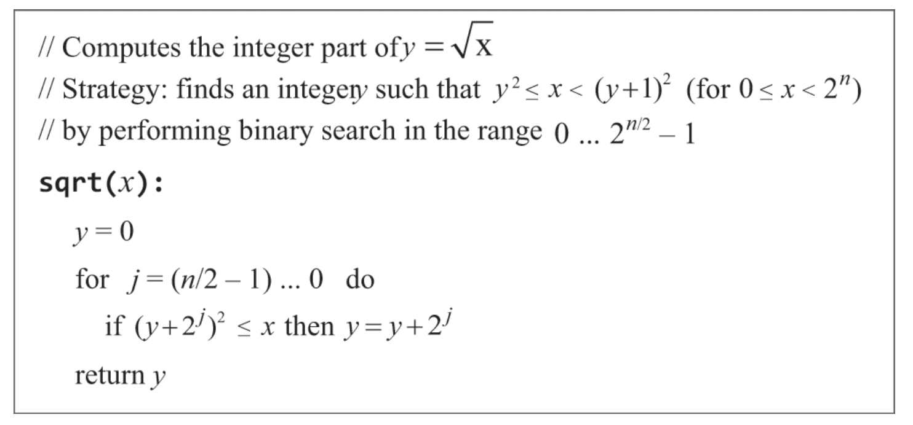
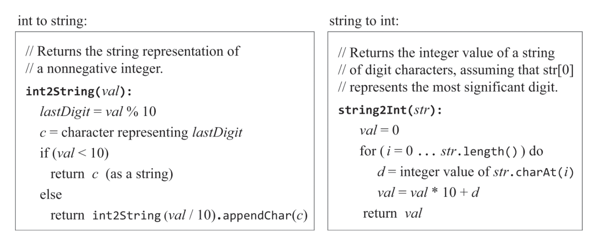
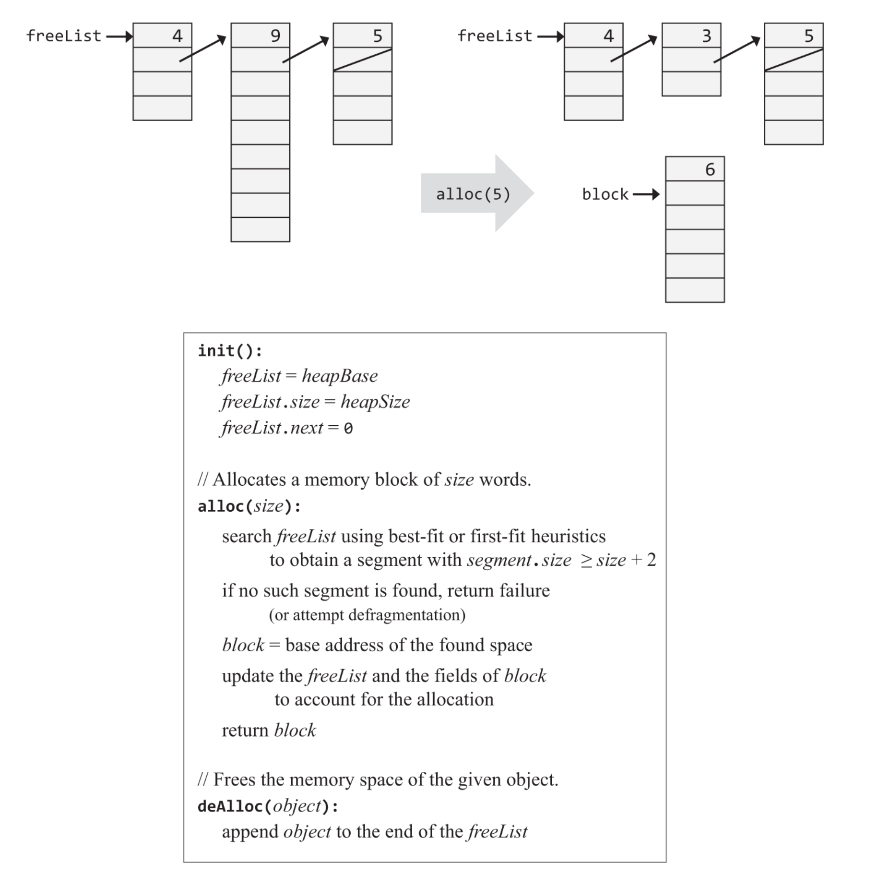
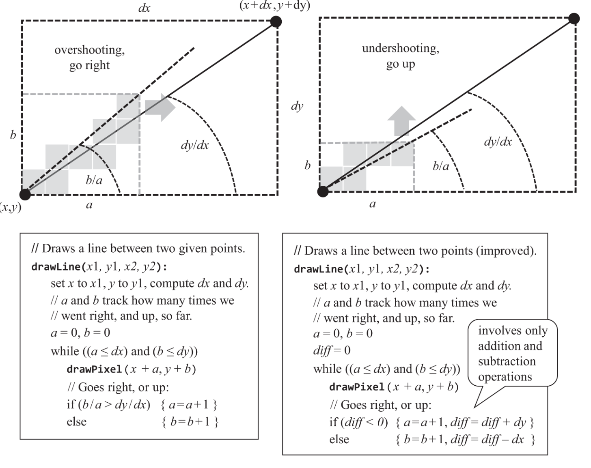
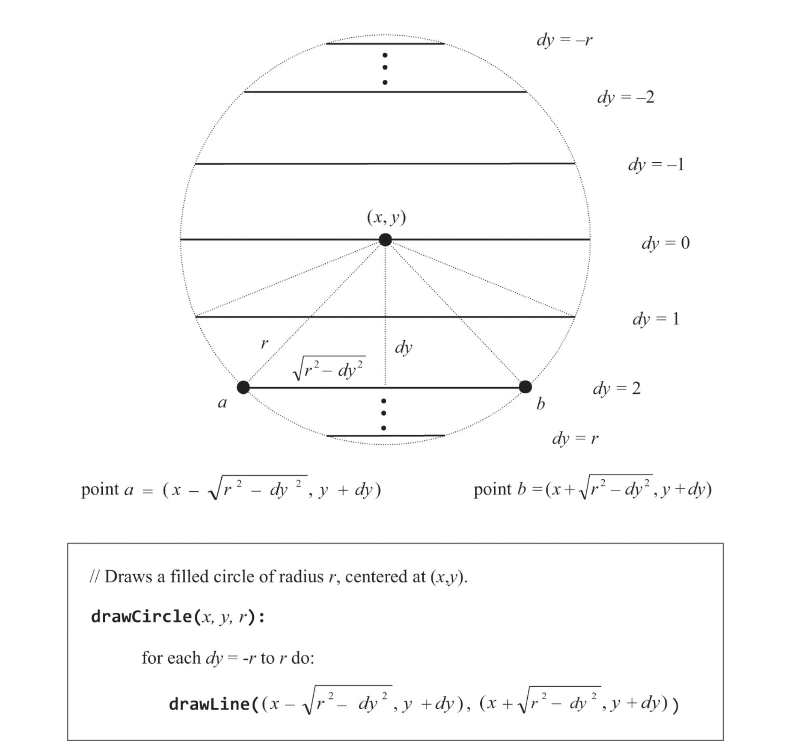
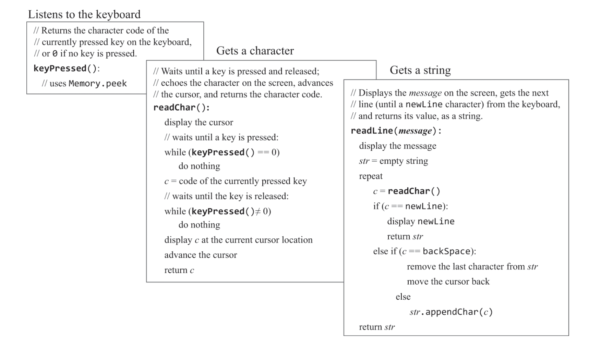

## operating system
내가 기대한 linux, window와 다르게 책에서 os는 단순히 하드웨어에 종송적인 기능들을 추상화 해주어 고수준 언어 프로그래머가 쉽게 사용할 수 있게 해주는 역할이다.  
물론 실제 os도 비슷한 개념이지만 기대한 것과는 많이 다르다.  

그렇게 효율성 부분은 그냥 스킵했던 이 책에서 유일하게 효율성 관련 이야기가 나오는 챕터인데,  
모든 애플리케이션은 그 os구현을 기반으로 돌아가다보니 os구현의 효율성이 정말 정말 중요하다고 한다.  

## Mathematical Operations
덧셈은 alu에서 구현되고, 뺄셈은 2의 보수덕에 공짜로 얻어졌고.  
나머지 연산인 곱셈, 나눗셈, 제곱근 등은 하드웨어에서 처리할 수도 있고 jack처럼 소프트웨어에서 처리할 수도 있다.  
최근엔 곱셈은 대부분 하드웨어에서 처리한다고한다.  
이런 수학 연산의 피연산자는 대부분 16,32,64 .. bit이다.  
그리고 이 n-bit숫자의 값에 따라 연산시간이 정해지는 연산은 사용할 수 가없다.  
64bit만되도 값이 9,000,000,000,000,000,000을 넘을 수 있기 때문이다.  
위 연산은 n-bit의 n으로 big O표기법이 O($2^n$)이지만 O(n)으로 줄일 수 있다.  

초등학교때 352 * 64를
> &nbsp;&nbsp;&nbsp;&nbsp;&nbsp;&nbsp;3 5 2  
> &nbsp;&nbsp;&nbsp;&nbsp;&nbsp;&nbsp;&nbsp;&nbsp; 6 4  
> &nbsp;&nbsp; 1 4 0 8  
> 2 1 1 2  
> 2  2  5  2  8
 
이런식으로 계산했던것과 똑같이 2진수에서 해주면 된다.

오버플로우는 고려안하는건가

나눗셈을 최적화 하는 방법은 생각보다 단순하다.  
원래라면 x/y가 있을때 y에서 x를 몇번뺄 수 있냐가 나머지의 몫인데, 이를 좀 크게크게 빼는 것이다.  
y-x가 아닌 y-x*q를 하는데 q는 처음에(900,800,700..100)처럼 큰 수로 잡았다가 (90, 80, 70..10)으로 10단위로 내려간다.  
하지만 실제론 저 첫 큰수를 몇으로 잡아야할지 알 수 없으니 재귀를 통해 해결한다.  

제곱근의 경우 뉴턴-랩슨법 테일러 급수 확장등 극한으로 최적화된 방법이 있지만  
우리의 목적으론 더 간단한 방법들로도 충분하다.  
두가지 접근 법이 있는데 단조 증가와, 아까 최적화 한 x^2(x*x로 곱셈으로 치환 가능하니까)연산을 통해서다.  

곱셈과 동일하게 나눗셈과 제곱근도 시간복잡도 O(n)이다.  

## string
string에서는 생각할 것이 두가지 있다.  
결국 문자도 컴퓨터에선 숫자로 표현되는데 그게 어떻게 매핑이 되는지,  
jack에서는 ('0',48), ('1',49)이므로 정수형태의 문자가 들어오면 해당 문자 값에 48을 빼줌으로서 실제 정수값을 얻을 수 있다.  

다음은 string, int 변환이다.  

## memory management
객체가 생성될때 메모리의 공간을 할당해줘야하고  
객체가 더 이상 필요 없을떄는 메모리 공간을 해제해줘야한다.  
그리고 데이터들은 heap이라고 불리는 메모리 공간에 생성,삭제 되는데  
jack에서는 시작할때 heapBase라는 포인터를 생성하고 이는 2048이다.  

jack에서는 빈공간을 링크드 리스트로 관리하는 방법을 소개하는데  
처음에는 heap전체 사이즈의 링크드 리스트가 하나 있고 alloc될때마다 요청된 크기보다 큰 리스트중 가장 작은 리스트를 할당해준다.(그러면 맨 처음에는 어떻게 하는 거지?)  
그리고 dealloc될 경우 반환된 리스트를 링크드 리스트 맨 뒤에 연결한다.  

하지만 이는 파편화 문제를 일으키고 이를 해결하기 위한 방법을 고려해줘야한다.  

## graphical output
jack에서 그래픽 처리는 memmory의 특정 area를 통해 이루어진다.  
매개변수로는 x,y가 주어지고(0,0이 top-leftmost) 이를 통해 메모리의 특정 주소에 잘 매핑해주면 된다.  
  

선을 그리는 함수의 알고리즘은 위와 같다.   

원을 그리는 함수는 위와 같다.  
수평선을 아래부터 하나씩 그려가는 방식이다.

## character output
각 문자는 다음 문자와 적어도 1픽셀이상 떨어져있어야하고, 커서를 신경써줘야한다.  
커서는 행, 열의 정보를 포함하고있어 만약 캐릭터를 print하면 col++,하고 한 행의 마지막에 다 다랐다면 col=0, row++을 해준다.

## keyboard input
keyboard 입력은 특정 메모리 구역으로부터 받아오면 된다.  
사용자가 문자를 지우는것과 다시 쓰는것도 고려해줘야한다.   
