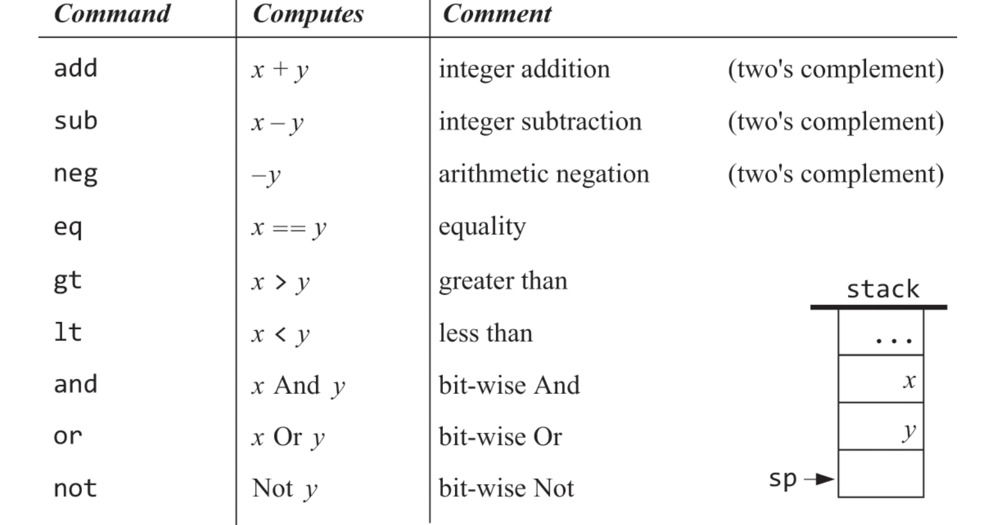
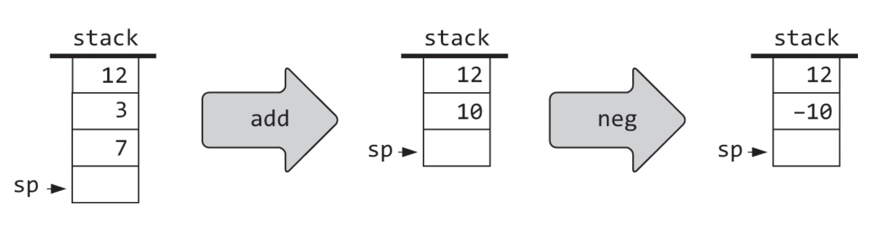
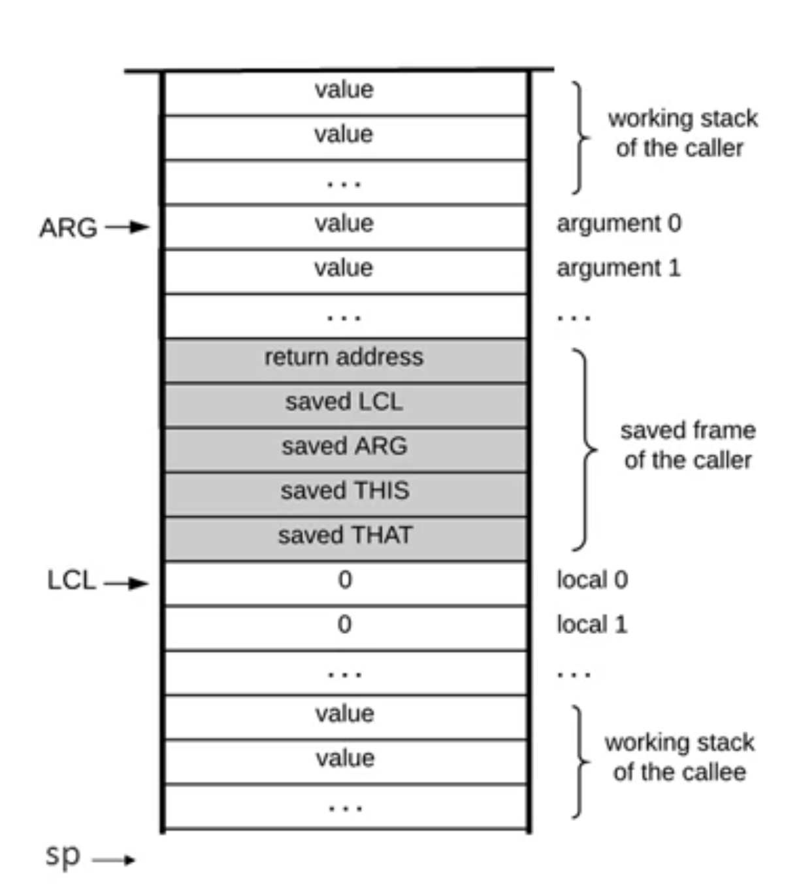

## VM
현재의 고수준 언어들은 중간단계 언어로 컴파일 된 이후 기계어로 번역된다.  
그리고 중간단계 언어는 virtual machine(vm)이라고 불리는 추상적인 컴퓨터 위에서 돌아간다.  

근데 왜 바로 고수준 언어를 기계어로 번역하지 않고 중간단계를 한번 거치는 2-tier 구조를 채택했을까?  
2-tier구조의 장점중 하나는 플랫폼간 호환성이다.  
VM은 비교적 구현하기 쉬우며, VM만 구현된 환경이면 vm코드는 돌아갈 수 있다.  
자바가 모바일 앱 개발 언어의 표준이된 이유중 하나이다.  
모바일 디바이스는 프로세서, os 조합에 따라 매우 천차만별이기에 VM이 없었다면 각 디바이스를 위한 컴파일러를 전부 만들어줬어야한다.  

다음으론 언어와 하드웨어의 종속성 문제때문이다.  
시간이 지남에 따라 많은 고수준언어와 프로세서가 개발되었다.  
하지만 어셈블리를 개발했을때 보았듯이 기계어는 프로세서에 종속적이다.  
이때문에 고수준 언어의 컴파일러도 프로세서에 따라 다 다르게 개발되어야했다. (자바-스냅드래곤, 자바-m1, 자바-intel 전부 다 다른 컴파일러를 필요로함)
이러한 종송석 문제를 해결하기위해 VM이 필요한 것이다.  
자바-VM을 위한 컴파일러를 개발해두고 VM-각 프로세서들에 맞는 컴파일러를 개발하는 것이 좀더 간편했나보다.  
때문에 VM은 고수준과 저수준 그 사이 어디가를 정교하게 맞추는 것이 중요하다.  
한쪽으로 치우쳐질 경우 VM의 의미가 퇴색되기 때문이다.
 
물론 단점도 있다.  
바로 속도가 느려진다는 점이다.  
하지만 이 단점은 각 고수준 언어 개발자, 컴파일러 개발자, 프로세서 개발자가 본인의 업무에만 집중할 수 있게됨에 따라 각 단계에서의 작업들이 극한으로 최적화 되었고 이런 단점은 인지하기 어려울 수준이 되었다.  
물론 그럼에도 single-tier가 동수준의 최적화에서 무조건 더 빠르기에 single-tier를 지원하는 언어들도 있다.  
C++은 2-tier, single-tier모두 지원한다고 한다.  

## stack machine
이 책에서 다루는 VM은 스택을 기반으로 구현 되었다. 

VM에서 사용하는 명령어는 4가지 종류가 있다.  
 
- arithmetic-logical
- push/pop
- branching
- function

### arithmetic logical
먼저 arithmetic-logical엔 9가지 연산이 있다.  

각 연산은 하나 또는 두개의 인자가 필요하고, 손실 연산이다.  
손실 연산이라는 뜻은 연산에 사용된 인자들은 삭제된다.
그리고 결과 값이 다시 스택을 채운다.

### push / pop
push/pop은 메모리 세그먼트에 대해 먼저 알아야한다.  
아래 memory segment를 읽어보면 된다.  

push는 메모리 세그먼트에서 스택으로 pop은 스택에서 메모리 세그먼트로 값을 전달한다.  
만약 `push static 17` 이라는 명령어가 있으면 스택에 static의 17번째 주소에 있는 값을 스택으로 전달한다.  
이때 메모리 세그먼트에 있는 값은 사라지지 않는다.  
반대로 `pop local 3` 은 스택의 최상단 값을 local의 3번째 주소에 있는 값에 덮어쓴다.  

### branching
분기는 선형적이던 코드의 흐름에 비선형적인 흐름을 제공해준다. 

분기에는 2가지 유형의 분기가 있다.  
무조건 분기, 조건 분기  
무조건 분기인 `goto label`의 경우 말그대로 무조건 파일에서 label다음 코드를 실행하게끔 이동되고
조건 분기인 `if-goto label`의 경우 스택의 최상위 값을 pop해 만약 true라면 label로 분기한다.

### function
함수는 개발을 조금이라도 해본사람이라면 다 아는 개념일 것이다.  
하지만 단순히 고수준 언어로 개발했을때는 신경쓰지 않았을 부분이 저수준 언어로 개발할때는 신경써줘야한다.  
바로 caller의 state를 저장하는 것이다.   
어떤 함수를 실행시키고 나면 돌아와서 다시 원래 하던 작업을 수행해야하는데 원래 하던 작업에 실행시켯던 함수가 영향을 준다면 당연히 안된다.  
때문에 함수를 실행할때는 메모리 영역을 할당해줘야하는 것이다.   

사진에서 ARG가 가리키는 곳 직전이 원래 하던 작업들이다.  
이후의 메모리들은 새로운 함수를 실행함에 따라 할당되는 값들이다.  
함수를 실행하면 아래와 같은 작업들을 해주게 된다.  
1. nArgs만큼 스택에 값들을 쌓는다.  
2. 실행한 함수가 끝나면 SP가 돌아갈 위치를 저장한다. 원래 하던 작업이 ARG직전이라 했으니 ARG로 돌아가야겠지
3. 원래 하던 작업에서 LCL, ARG, THIS, THAT의 위치를 저장한다. (메모리 세그먼트에서 설명한 다른 세그먼트, temp, static 등과 다르게 앞에서 설명한 세그먼트들은 동적으로 base address가 변경된다.)
4. 호출함수로 점프 

반대로 함수가 반활될때는 다음과 같은 작업이 필요하다.
1. argument 0 에 stack의 topmost값을 복사
2. argument 0 + 1의 주소로 SP를 옮김
3. lcl로 돌아가 저장해둔 포인터들 that,this,arg,lcl을 복원
4. return address를 만나면 address로 점프(여기서 address는 코드에서 몇번째 줄인지를 말하는 듯?)

## memory segment
VM은 하나의 물리적 메모리를 논리적으로 여러개로 나눠 사용한다.  

Local, argument, this, that, pointer, temp, constant, static
논리적으로 이것들을 나눈 방법은 base address와 index address를 함께 사용하는 것이다.  
만약 argument의 3번째 값에 접근하고 싶다면 고정된 base address값, 임의의 1017로 한다면  1017 + 3 = 1020의 주소에 접근하면 된다.  

그리고 이런 base address값은 SP,LCL, ARG라는 predefined변수에 값이 담겨있고
pointer는 this, that에(pointer 0 == this, pointer 1 == that)
temp는 MEM[5]~MEM[12]을 차지하고
constant는 단순 상수 값으로 치환된다. (constant 17 == 17)
Static은 MEM[16]~MEM[256]을 차지한다.

## note
stack을 쓰는건 알겠는데 왜 쓰는지 안알려줘서 아쉽다.  
과제 난이도가 꽤나 어려워졌다.  
eq, gt, lt부분에서 bool count를 세는 방법말고 다른 방법은 없나 싶음

만약 내 글을 보는 사람이 있다면 이번 장의 컴파일러 코드는 참고하지 않는 것이 좋을거다.  
자꾸 밤에 해서 그냥 빨리 끝내고싶은 맘에 주석도 없고 트러블슈팅도 터지는 곳만 급급하게 막는 수준으로 해놔서..