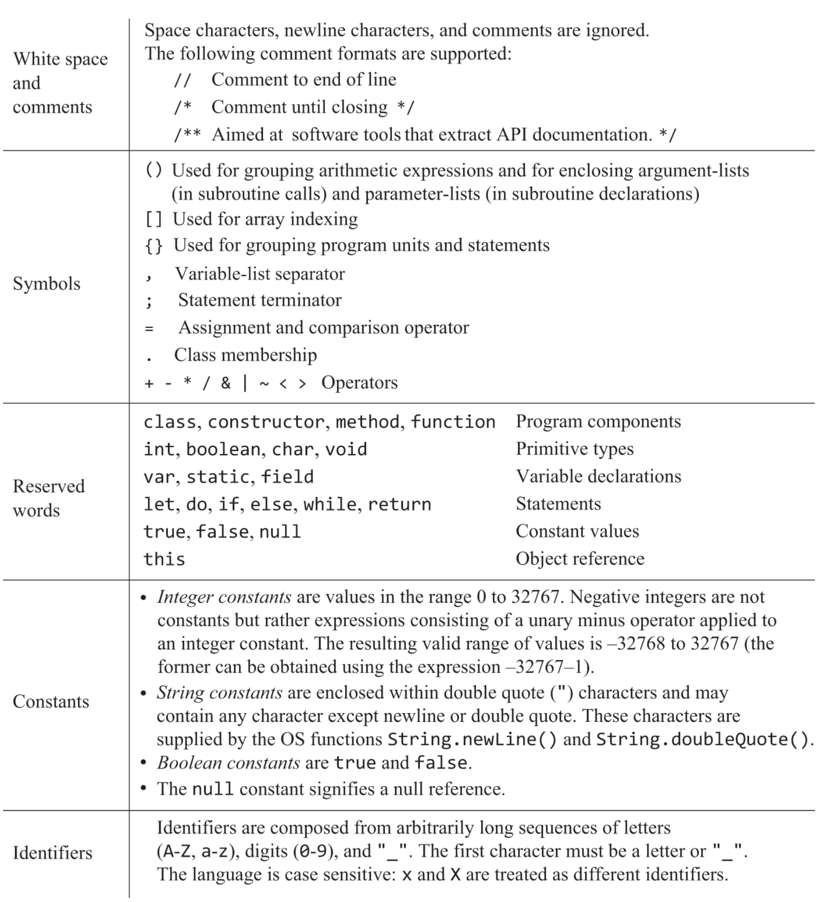
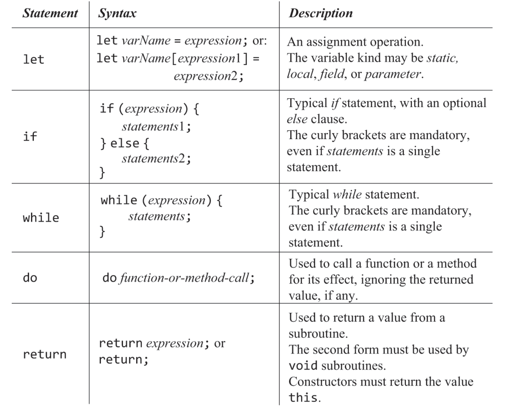
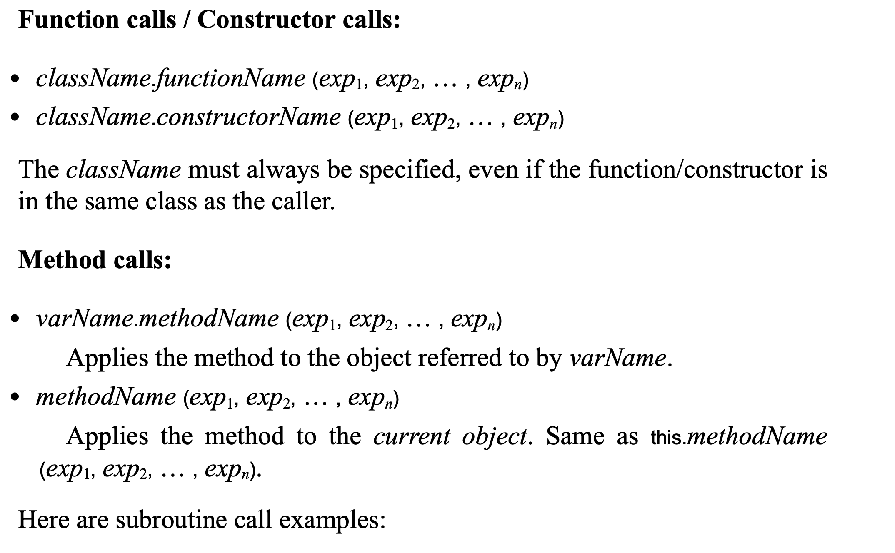

## high level language
드디어 대부분의 개발자가 사용하는 고수준 언어까지 왔다.  
메모리 연산, 최적화, OS api등은 전부 추상화 돼있기에 신경쓰지 않고 개발해도 된다. 

## Jack
Jack의 문법을 보다보면 굳이? 싶은 문법들이 있을 수 있는데, 후에 10,11장에서 만들 컴파일러의 개발을 좀더 쉽게 해주기 위함이다.

문법을 간단하게 알아보면

method(class의 멤버 함수)를 해당 class내부에서 call할때는 class.method() 할 필요 없이 그냥 method()만 해도 된다.

후에 jack 컴파일러를 개발하기 위해 jack문법에 친해지는 것이 목적인 챕터이기에 딱히 설명할 내용은 많이 없다.  
대부분이 jack문법에 대한 설명이다.  

그나마 적는 다면 그래픽 최적화 정도인데, jack언어로 개발할때 그래픽 연산을 할일이 있으면 픽셀하나하나 계산하는 것이 아닌 레지스터(16bit)단위로 그리면 좀더 효율적이란것 정도.

## note
책 245page에
> Arrays: Arrays are declared using the OS class Array. Array elements are accessed using the typical arr[i] notation, where the index of the first element is 0.

라는 말이 있는데 마지막에 0이 아니라 i아닌가