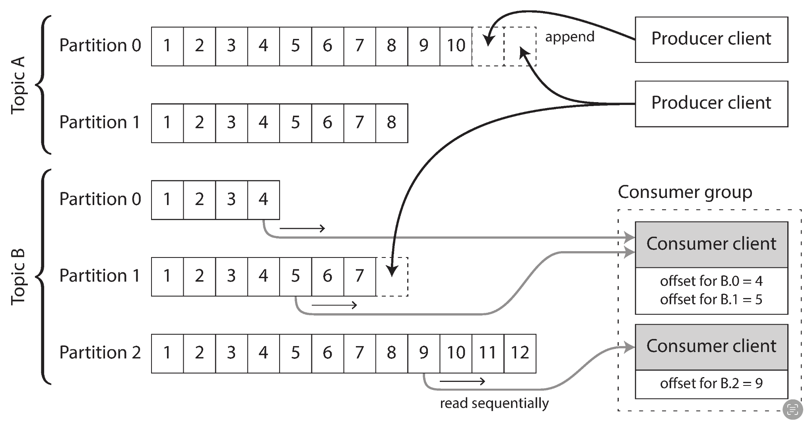
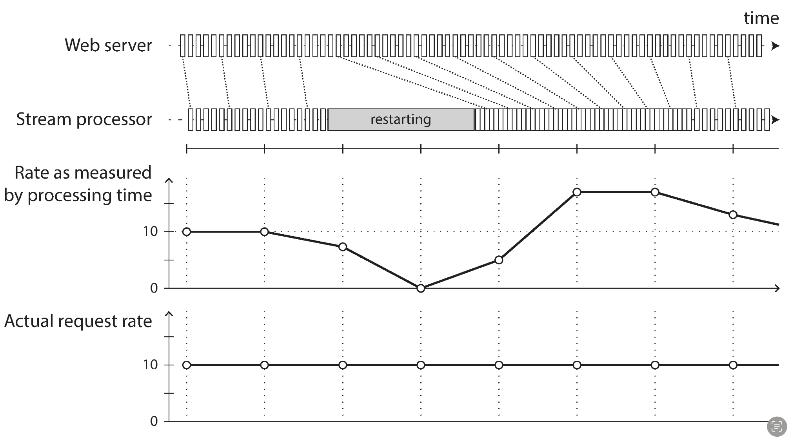

## stream processing
10챕터에서는 배치 프로세싱에 대해 알아봤었는데, 사실 실제 서비스에서 데이터의 흐름은 배치 프로세스와는 비슷하지 않다.  
데이터는 매분 매초 생성될 수 있기 때문이다.  
배치 프로세스는 보통 하루의 마지막에 실행시키기에 input이 output에 적용되는 건 하루 뒤이다.  

## producer, consumer
stream processing에 대해 이야기하는 만큼 데이터가 생성되자마자 실시간으로 db나 처리하는 곳으로 보내줘야할텐데, 기존엔 poll이라는 방식으로 진행했었다.  
데이터가 필요한 노드에서 데이터가 있는 곳에 계속해서 요청하며 있는지 확인하는 것이다.  
하지만 이 주기가 짧아질수록 새로운 데이터가 return되는 비율은 적어질 것이고 그만큼 overhead의 크기만 커질 것이다.  

때문에 데이터가 있는 곳에서 데이터가 새로 생성됐으면 필요한 노드에 알려주는 방식이 고안되었다.  
기존 db들은 triggers란 이름의 데이터의 변경에 react할 수 있는 기능이 있지만 직접적으로 stream processing을 위해 디자인 된것은 아니므로 불충분했다.  
때문에 데이터가 생성됐다는 event를 알리기 위한 여러 툴이 개발됐다.  

## message broker
가장 간단하게는 데이터가 생성되는 생성자 측에서 새로운 데이터가 생기면 데이터를 소비하는 소비자 측에 메세지를 직접 전달하는 방식이 있다.  
하지만 이는 치명적인 단점이 있는데,  
- 메시지가 유실 될 수 있는 가능성을 고려하여 애플리케이션 코드를 작성해야 한다.
- 소비자가 오프라인이라면 메시지를 전달하지 못하는 상태에서 있는 동안 전송된 메시지는 잃어 버릴 수 있다.

때문에 메세지 브로커라는 메시지 스트림을 처리하는데 최적화된 데이터베이스를 사용하게 된다.  
메세지 브로커는 또다른 노드에서 돌아가게 되고 생성자와 소비자는 브로커의 클라이언트로 접속하게 된다.  

브로커를 이용함으로서 얻는 이점은 
- 클라이언트의 상태 변경에 쉽게 대처할 수 있다.
- 브로커에 장애가 일어나도 기존에 메세지를 디스크에 기록하고 있었다면 유실되지 않는다.

## partitioning
분산환경에선 보통 디스크 하나로는 부족하니 브로커도 당연하게 파티셔닝 기법을 사용한다.  
다른 파티션은 다른 장비에서 서비스할 수 있다.  

## offset

각 파티션 내에서 브로커는 모든 메세지에 단순히 증가하는 번호인 offset을 부여한다.  
이는 파티션 내에서만 유효하고 다른 파티션 간 메세지의 순서는 보장하지 않는다. (서로 인과성이 없는 데이터라면 순서도 상관이 없으니)  
이 오프셋 덕에 어떤 메세지가 처리되고 안됐는지에 대한 오버헤드를 크게 줄일 수 있다.

## fall behind consumer
생성자가 만드는 데이터에 비해 소비자의 데이터 처리 속도가 더 느리다면 점점 예전 데이터를 읽게된다.  
데이터를 디스크에 쓴다해도 오래된 데이터는 삭제하거나 아카이브용 노드에 옮기는 등 브로커에서는 삭제될 수 있다.  
만약 소비자가 너무 늦어진다면 데이터가 drop되는 현상도 일어날 수 있다는 것이다.  
때문에 만약 이 경우 경고를 하게끔 만들어 소비자가 너무 늦어지는 현상을 해결해야한다.  
이 때 소비자가 늦어진다해도 해당 파티션을 제외한 나머지에는 영향을 주지않기에 운영적으로 편리하다.
  

## Uses of Stream Processing
사실 일반적인 서비스에서 스트림 시스템이 필요한 경우가 엄청 많지는 않다.(batch로 충분)  
하지만 필요한 특정 몇몇 상황을 알아보자면  
- 사기 감시 시스템의 신용카드 사용 패턴
- 금융 시장의 가격 변화 감지
- 공장의 기계 상태 모니터링: 오작동 감지
- 군사 첩보 시스템의 잠재적 침략자의 활동 추적

### complex event processing
정규식의 쿼리 버전.  
stream input으로부터 쿼리를 계속 저장해두었다가 특정패턴과 일치하는 이벤트들이 발생한다면 특정 액션을 수행한다.  

### Stream analytics
분석은 batch작업에서 보통하고 그걸로 충분할 수 있지만 스트림 시스템의 "실시간"이라는 특성으로부터 얻을 수 있는 이점이 있다.  
스트림 시스템에서 분석을 할때는 보통 window라는 이름의 집계 시간 간격을 설정해두고 하는데 예를 들어  
- 지난 5분간 서비스에 들어온 초당 질의 수의 평균을 구하거나
- 같은 기간 동안의 99분위 응답 시간을 구한다.  

그리고 이를 실시간으로 확인할 수 있으니 모니터링 시스템에 적합할거 같다.  

### Maintaining materialized views
다른 derived data system, cache나 search engine등의 값을 최신값으로 유지할 수 있다

### Search on streams
예를 들어 부동산에 특정 조건에 맞는 매물이 나오면 알려줘 같은 요구사항을 충족시킬 수 있다.  
가장 간단한 방법으로는 새로운 데이터가 들어오면 사용자들이 등록해놓은 조건을 모두 쿼리해서 일치하면 알려주는 식이 있을텐데 이는 매우 부하가 심할 것이다.  

### Message passing and RPC
잘 모르겠다

## processing time vs event time
event time은 말그대로 해당 event가 실제로 사용자의 디바이스에서 사용자의 어떠한 인터랙션으로 인해 발생한 그 순간의 시간이고, processing time은 그 이벤트가 서버에 도착했을때의(이후에 해당 event를 처리하는) 시간이다.  
stream 시스템에서 이 두 종류의 타임스탬프는 큰 차이를 가지는데, 예를들어 이전 1분의 요청량을 측정하는 시스템이 있고 만약 해당 시스템을 재시작했을때 processing time으로 시간을 매긴다면 아래와 같이 재시작 되는 동안 buffer돼있던 log가 한번에 처리돼 사실과 다른 값이 나올 수 있다.   

이뿐만 아니라 이전에도 자주 다뤘던 인과성 문제가 생길 수 있는데, 서버 a에서 처리되는 요청이 하나 날라오고 이후에 서버b애서 처리되는 요청이 날라왔을때, 여러 요인으로 인해 b에서 처리된 event가 message broker에 먼저 도착했다면 consumer들은 b에서 처리된 event가 더 일찍 실행됐다고 생각하게 된다.  

## Knowing when you’re ready
이전에 stream 시스템에선 종종 window라는 단위를 정해 데이터를 처리한다고 했는데 그러면 이 window안에 해당되는 값이 언제 다들어왔다고 장담할 수 있을까?  
단순하게 생각하면 그저 해당 시스템이 돌아가는 서버에서 window에서 벗어난 예를 들어 1분으로 window를 설정했다면 10:05:00~10:05:59에 해당되는 event들은 해당 시스템 서버시간으로 10:05:00~10:05:59에 들어온 event로 생각하는 것이 있을 것이다.  
하지만 만약 사용자의 디바이스가 모바일이라면? 
유저는 10:05:30에 event를 발생시켰지만 네트워크 이슈로 인해 유저의 디바이스가 offline이 됐다가 한시간 이후에 인터넷이 복구된다면? 해당 event는 어느 window에 속해야할까

### Types of windows
- Tumbling window
- Hopping window
- Sliding window
- Session window

## stream join
stream join에는 3가지 종류가 있다.

#### stream - stream join
stream input간의 join을 하려면 stream system에 state가 필요하다.  
예를 들어 근 한시간 동안의 event가 발생할 때마다 해당 event는 적절한 인덱스에 추가되고 stream 시스템은 다른 index를 확인해 다른 event가 도착했는지 확인한다.  
만약 일치하는 event가 있다면, 두 event를 조인해 내보낸다. 
만약 event가 만료되었는데도(한시간이 지남) 일치하는 event를 찾지 못한 경우, 어떤 event가 join 되지 않았는지에 대한 event를 생성하여 내보낸다.

사용할만한 사례로는 검색 시스템이 있을 수 있다.  
유저가 검색을 했을때 해당 검색어와 반환된 결과를 stream 시스템에 보내고, 이후 유저가 클릭하는 URL들을 stream 시스템에 보내는 방식이 있다.

#### stream - table join
stream input과 이미 저장 되어있는 테이블의 값을 join한다.  
간단한 방법으로 stream input마다 database와 join하는 방식이 있겠지만 이는 네트워크 이슈를 고려했을때 매우 위험하고 비효율적이다.  
때문에 이전 batch에서 했던 방식과 같이 database를 stream 서버에 가져오는 방식이 있다.  
하지만 batch와 다르게 stream 시스템에선 database에 있던 값이 변경될 수도 있다.  
이는 CDC를 통해 stream서버에 있는 database값을 최신으로 유지하여 해결할 수 있을 것이다. 

#### table - table join
위 stream search에서 알아본 Maintaining materialized views와 비슷하다.  
stream input에 특정 event가 오면 derived system들의 값을 최신 값으로 유지할때 쓰일 수 있다.  

## fault tolerance
배치 처리에서는 일부 태스크가 실패할지라도 재처리가 가능했다.  
그리고 이는 input file의 immutable 특성덕에 가능했다.  
하지만 스트림 처리에서는 input무한히 들어오므로 같은 방식은 불가능하다.  

- 마이크로 일괄처리(microbatching): 스트림을 작은 블록으로 나누고 각 블록을 소형 일괄 처리와 같이 다루는 방법이다.
스파크 스트리밍에서 사용
처리 크기는 약 1초 정도
처리 크기가 작을수록 스케줄링과 코디네이션 비용이 커진다
처리 크기가 클수록 스트림 처리의 결과를 보기까지 지연시간이 길어진다
- 체크포인트(checkpoint): 주기적으로 상태의 롤링 체크포인트를 생성하고 지속성 있는 저장소에 저장한다.
아파치 플링크
스트림 연산자에 장애가 발생하면 스트림 연산자는 가장 최근 체크포인트에서 재시작하고 해당 체크포인트와 장애 발생 사이의 출력은 버린다.

두 가지 접근법만으로는 이 문제를 방지하기에 충분하지 않다.

### idempotence
멱등성은 0을더하거나 1을 곱하는 등, 아무리 여러번 연산해도 값이 변하지 않는 특성을 말한다. 
이러한 특성을 구현한다면 실패시 여러번 retry했을때 데이터가 중복되거나 하는 등의 걱정을 하지 않아도 된다.  
굳이 멱등성 자체를 구현하지 않아도 메타데이터로 멱등성을 구현할 수도 있다.  
모든 메세지에 영속적이고 단조 증가하는 offset이 있을때 consumer가 데이터를 소비 후 저장할때 offset을 포함한다면 이후에 연산이 한번더 실행 됐을때 offset를 비교해 이미 처리된 값인지 아닌지 확인할 수 있다.  
