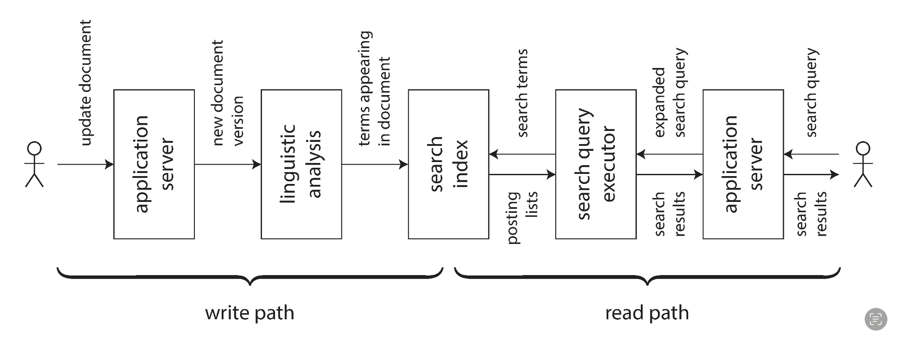

## in my experience ..
필자는 "내 경험상 99%의 상황에선 x면 충분하더라"는 기술 x의 유용성보다는 화자의 경력을 나타내는 말이라고 한다.

## Derived data versus distributed transactions
분산 트랜잭션과 derived data system은 비슷한 목표를 가졌지만 수단이 다르다.   
분산 트랜잭션은 보통 linearlizability를 동반하고 derived data system은 eventually consistency이다.  
ddia의 필자는 분산트랜잭션은 구린 fault tolerance를 가졌다고 생각하고 더 좋은 프로토콜이 나올 수 있을거라 기대하지만 이는 단시간 내에 이루어지기 어렵다고 생각한다.  
때문에 필자가 기대하는 유토피아가 오기전까진 참고 eventual consistency를 필수 불가결하게 사용해야한다고 한다.

eventual consistency를 사용할 경우 어쩔 수 없이 인과 문제가 생길 수 있다.  
하지만 11장에서도 말했지만 사실 서로 관계가 없는 이벤트끼리는 인과 관계를 보장해줄 필요가 없다.  
그럼에도 현재로서는 모든 이벤트가 인과 관계를 보장하기 위한 시스템에 의해 불필요한 병목을 겪거나, 전부 인과 관계를 무시해 문제가 발생할 수 있는 두 방법밖에 없다.  
필자는 아마도 시간이 지나면 모든 이벤트가 인과 관계를 보장하기 위한 시스템에 병목을 겪지 않으며 인과 관계가 있는 데이터간의 순서는 올바르게 유지할 수 있는 앱 개발 패턴이 등장할 거라 기대한다.  

## unbundling database
unbundling database는 여러가지 역할을 하는 database를 마치 유닉스 시스템처럼 하나의 역할만 완벽하게 수행할 수 있도록 분해 하는 것을 의미한다.  
예를 들어 일반적인 database에서 index를 생성하고 관리하는 기능을 다른 tool로 분리해 관리한다는 것이다.  
이는 인간의 관점에서 하나의 기능에만 더욱 집중할 수 있고 관리도 더욱 용이하기에 ddia의 필자는 이 방식이 바람직하다고 생각한다.  

물론 만약 single database만으로도 처리가 가능한 workfload를 가지고 있다면 해당 database를 사용하는것이 best일 것이다.  
필요하지 않은 규모에 맞춰 시스템을 구축하는 것은 낭비이며, 유연하지 않은 설계에 갇히게 될 수 있다.  

필자가 말하는 바람직한 상황은 single database만으로는 처리하지 못하는 처리량인 경우에를 말하는 것이다.  
실제로 여러 도구를 이어주는 도구가 많이 개발되고 있다고한다.  
하지만 필자는 하나 부족한 것이 있다 했는데, 바로 “nbundled-database equivalent of the Unix shel이다.  
간단히 통합된 인터페이스가 아직 없다고 한다 예를 들어 `mysql | elasticsearch`를 하면 mysql의 데이터를 가져와 elasticsearch 클러스터에 인덱싱하고 mysql에 가해지는 모든 변경사항을 지속적으로 추적해 elasticsearch에 자동으로 적용하는 방식이다.  
differential dataflow와 같은 흥미로운 초기 단계의 연구가 있다고 한다.

## dataflow
요즘 서버의 트렌드는 stateless이다  
하지만 데이터 분야에선 위에서 든 예시만 해도 mysql의 데이터를 계속 변화하는지 지켜봐야하기에 stateful하다.  
우리는 저런 stateful을 바로 이전장에서 다룬 stream을 통해 구현할 수 있다.  

위에서 말한 unbundling database는 최근 서버 트렌드인 MSA와도 닮아있다.  
하지만 stream을 통한 dataflow와 MSA는 다른 점이 있다.  
사용자가 달러로 표기돼있는 상품을 원화로 구매하고 싶을때 서버는 원화와 달러의 환율을 알아야한다.  
MSA에선 환율을 제공하는 서버에 요청하겠지만 dataflow접근법으로는 계속해서 원화를 추적해서 로컬 데이터베이스에 저장해뒀을 것이다.  
dataflow접근법이 빠를뿐만아니라 비동기적이고 fault tolerance하다.  

## stateful
위에서 최근 서버 트렌드는 stateless라고 했지만 사실 실제로 spa개발이 트렌드인 요즘에는 stateful을(사용자 기기의 로컬 데이터베이스를 사용하는 것)사용할 여지가 매우 많다.  
또한 요즘에는 인터넷이 상시 연결돼있는 데스크탑에서 네트워크 연결이 불안정한 모바일로 넘어가는 만큼 이 stateful이 더 유용할 수 있다고 한다.  
기존 stateless서버에선 만약 인터넷 연결이 끊어지면 해당 페이지에서 브라우저가 가져온 소량의 데이터를 스크롤 다운, 업 하는것 밖에 할 수 있는 것이 없다.

기존에는 데이터를 저장하는 과정 write-path와 데이터를 읽는 과정 read-path가 나눠져있었고, 기껏해야 캐시 등의 기법을 통해 write-path를 조금 더 사용자에게 확장하는 수 밖에 없었다.  
하지만 stream기법을 사용해 write-path를 사용자 직전까지 확장해 인터넷이 연결 돼있는 한 서버의 업데이트가 계속 클라이언트에 반영되는 것까지 되면 좋을거라고 한다.  
마치 메세징앱과 게임서버처럼.

## Timeliness and Integrity
일관성은 적시성과 무결성으로 나눌 수 있다.  
적시성은 업데이트된 내용이 바로 적용되어 보여짐을 의미하고,  
무결성은 말그대로 데이터에 손실, 변형 등이 없음을 의미한다.  

적시성은 사실 어느정도 어긋나도 괜찮다.  
송금을 했는데 돈이 아직 빠져나가지 않을때는 고객은 충분히 어느정도 lag이 있을거라 생각할 수 있기 때문이다.  
하지만 송금을 했는데 보낸돈의 2배가 계좌에서 나간다면 바로 고객센터에 전화를 걸것이다.  

## apologize
사실 대부분의 문제에서 엄청 빡빡하게 성능까지 희생하며 제약조건을 구현할 필요는 없다.  
왜냐하면 간단한 문제는 사과를 한 이후에 후속조치를 취하면 되기 때문이다.  

전체 좌석수보다 더 많은 수가 예약을 했을때 예약이 취소될 손님들에게 배상을 해주면 된다.  

물론 필요한 부분에는 당연히 제약을 구현해두어야한다.  
하지만 필요이상으로 제약을 구현하는 것은 오히려 서비스 속도저하로인한 고객의 부정경험을 초래할 수 도 있다.  
때문에 데이터의 불일치와 사과 비용의 트레이드 오프를 찾아야한다.  

## trust, but verify
우리는 보통 데이터가 일단 디스크에 저장되면 오염되지 않을거라 가정한다.  
하지만 정말 낮은 확률이겠지만 하드웨어 자체에서도 에러가 발생할 수 있다.  
물론 우리가 우려하며 프로그램을 개발할필요까진 없겠지만 알고 개발하면 좋을 것이다.  
ddia 필자는 실제로 rowhammer라고 불리는 메모리의 부적절한 접근으로인해 메모리의 값이 변경되는 현상을 겪었다고 한다.  

이보다 더 높은 확률로 일어날 수 있는 것이 데이터베이스에서 일어나는 에러이고 이보다 더 높은 것이 애플리케이션 코드에서 발생하는 오류이다.  

성숙한 프로그램은 정말 낮은확률로 일어날 수 있는 에러도 대비해둔다.
예를 들어, HDFS와 Amazon S3와 같은 대규모 저장 시스템은 디스크를 완전히 신뢰하지 않으며, 백그라운드 프로세스를 실행하여 파일을 지속적으로 읽어와 다른 복제본과 비교하고, 파일을 한 디스크에서 다른 디스크로 이동하여 소리없는 데이터 손상에 대비한다.

ddia 필자는 데이터베이스가 너무 충분히 잘 작동해서 개발자들이 본인들의 시스템을 너무 맹목적으로 신뢰하게 만들었다고 우려한다.  
하지만 데이터베이스 환경은 변화해 NoSQL이라는 이름아래 약한 일관성 보장이 표준이 되었고 여러 덜 성숙한 기술이 사용되었기에, 본인들이 만든 여러 보장 시스템이 정말로 잘 작동하는지 감사를 위한 설계를 해야한다고한다.  

## desinging auditability
트랜잭션 중에 데이터의 변형이 생긴다면 이유를 알아내기 힘들다.  
트랜잭션 로그를 기록하더라도 여러 테이블에서의 삽입, 변형이 왜 수행됐는지 명확한 이유를 알기 힘들 수 도있다.  
하지만 event기반의 시스템을 사용하면 사용자의 입력은 단일 변혈될 수 없는 이벤트로 변환된 이후에 여러 시스템이 해당 이벤트를 참조해 update를 수행할 것이다.  
그러면 이후에 같은 상황을 재현하기 용이해 디버깅에 더 유리하다.  

## doing the right thing
IT기술이 우리 일상에 정말 깊게 스며든 만큼 개발할때 윤리적인 부분또한 우리가 당연히 챙겨가야할 부분이다.  
기술은 그자체로 좋거나 나쁘지 않다.  
그저 어떻게 사용하냐가 중요하다.  
다이너마이트가 처음에는 터널을 뚫기위해 개발 됐지만 테러의 수단으로써 사용될 수 있듯이 검색엔진또한 그러하다.  
만약 사람이 시스템적으로 보험, 여행, 금융 으로 부터 전부 금지를 당한다면 소위 "알고리즘적 감옥"이라고 물리는 개인의 자유를 침범하는 제약에 걸릴 수 있다.

## decision making based on data
여러 매채의 댓글에서 종종 판사를 인공지능으로 대체해라라는 등의 말이 나오곤하는데, 인공지능은 결국 데이터를 기반해 학습한 것이고 그 데이터는 사람들이 과거에 쌓아온 것들이다.  
인공지능은 편향이 없을거라 생각하지만 편향된 데이터로 학습됐다면 편향된 데이터를 출력하는 것이 인공지능이다.  
인공지능과 같은 통계모델은 우리의 도구가 돨 수는 있지만 결정권을 통계모델이 가질 수는 없다.

## Privacy and Tracking
데이터는 분명 사용자들에게 더 양질의 서비스를 제공하기 위해 사용될 수 있고 그래왔다.  
하지만 기업의 비즈니스 모델에따라 "양질의 서비스 제공"이라는 목적은 뒷편이 될 수도 있다.  
만약 서비스가 광고를 통해 수익을 낼 경우, 광고주가 실제 고객이되고 데이터는 수집 범위가 늘어나고 더욱 세밀해지며 오래 보관된다.  
종종 고객의 허가 없이도 데이터는 수집되고, 이는 어쩌면 데이터 수집이 아닌 "감시"라는 단어가 적절할지도 모른다.  

데이터는 고객 몰래 가공되어 우리의 가치(어떤 상품을 자주 보며, 어떤 행동을 하고, 어떤 마케팅이 잘 먹힐지)를 평가한다.  
물론 너무 강한 규제또한 문제가 된다.  
예를 들어 의료검진에 관한 데이터를 수집하는 것은 생명을 살릴 기회를 제공할 수도 있다.  
때문에 우리는 사용자들에게 all or nothing이 아닌 어떤 데이터는 보안처리(또는 삭제)되고 어떤 데이터는 수집을 허가할지에 대한 결정권을 주어야한다.  

ddia 필자는 데이터를 산업혁명 시대의 오염, 아동 착취 문제에 비유한다.  
공장 소유자들은 사치스럽게 살았지만, 도시 노동자들은 종종 매우 열악한 주택에서 살았고, 가혹한 환경에서 긴 시간을 일해야 했다.  
데이터또한 빅 테크 기업으로 부터 우리의 생활을 감시받으며 사회의 시스템에 허가 또는 금지받을지 정해질 수도 있다.  
하지만 개인은 기업에 대해 아무것도 알지 못하고 아무것도 할 수가 없다.  
이는 마치 경찰정치와 비슷하다.  

이를 어떻게 정확히 달성할지는 여전히 열린 질문이다.  
우선, 데이터를 영원히 보관해서는 안 되며, 더 이상 필요하지 않을 때 즉시 삭제해야 한다.  
데이터 삭제는 불변성의 개념과 상반되지만, 이 문제는 해결할 수 있다.  
필자는 책에 의해 관리하는 것이 아니라 암호화 프로토콜을 통해 접근 통제를 시행하는 접근법이 유망해 보인다고 한다.  

