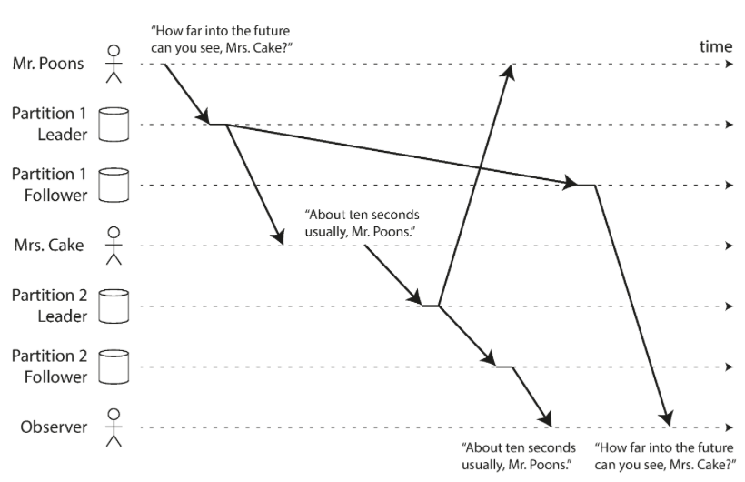

분산 시스템을 사용하게 되는 이유는 다음과 같다.
- 처리량
- 고가용성
- 지연시간

처리량은 싱글노드에서 처리할 수 없을만한 쓰기 또는 읽기 부하가 걸릴 경우에 분산 시스템을 고려하게 된다.  

고가용성은 만약 한 노드가 죽더라도 다른 노드에서 물려받고 서비스가 정상적으로 작동할 수 있게 하고 싶을때 분산 시스템을 고려하게 된다.  

마지막으로 지연시간의 경우 서비스에 글로벌적으로 쓰일때 서버를 사용자들에게 최대한 가깝게 두고 싶을때 분산 시스템을 고려하게 된다

데이터 복제 알고리즘은 3가지가있다.  
- single leader
- multi leader
- leaderless

모든 분산 시스템은 위 3가지중 하나를 사용한다.  
각 알고리즘은 각자의 장단점이 있다.  

### (a)sync replication
데이터를 여러 노드에 복제할때는 async와 sync 두방식이 있음  
sync의 경우 모든 팔로워 노드에 전부 데이터가 복제되면 client에 ok를 보낸다.  
그리고 ok가 되기 전까지 모든 write를 block한다.  
때문에 모든 노드를 sync방식으로 하는건 현식적으로 불가능하다.  
하나의 노드만 에러가 발생해도 긴 시간동안 서비스의 장애가 일어나기 때문에  

async는 리더 노드가 팔로워노드에 데이터가 제대로 전해졌는지를 신경쓰지 않고 client에 ok를 보낸다.  
때문에 노드간의 데이터 일관성에 문제가 생길 수 있다.

### replication lag
replication lag은 보통 1초 이내로 끝나기에 크게 신경쓰지 않아도 되는 이슈이지만,  
네트워크 등의 이슈로 쉽게 수초, 수분 까지 증가할 수 있기에 고려해줘야하는 이슈가 된다.  

replication lag으로 인해 일어날수 있는 유저 경험은 몇가지가 있다.

1. 유저가 쓰기를 한 이후 읽기를 했을때 본인이 쓴 데이터가 안보여지는 경우
2. 첫 읽기에는 정상적으로 데이터가 보였는데 다음 읽기에서 원래 보였던 데이터가 안보이는 경우
3. 인과 관계가 엇갈리는 경우

멀티 리더 방식에서 conflict를 피하는 방법이  
같은 레코드는 같은 리더를 통해서만 쓰여지면 conflict가 일어나지 않는다는데 뭔말인지 모르겠다.  

컴퓨터에서 동시성을 결정하는데에 시간은 중요한 역할이 아니다.  
만약 실제로 두 연산(요청)이 다른시간에 이루어졌더라도 네트워크 이슈로 인해 서버에는 동시에 들어올 수 있기 때문이다

두 연산 a,b를 가지고 있을때 항상 3가지 경우의 수가 존재한다.  
1. a가 b다음에 일어났을때
2. b가 a다음에 일어났을때
3. 동시에 수행된 경우

사실상 1,2 는 단순히 전자 연산 후에 나머지 연산을 덮어씌우면 되는 거라 똑같으므로  
[1,2]인지 3인지 구별하면 된다.

이는 버전을 통해 구별할 수 있다.  
클라는 쓰기를 할 때 가장 최근에 읽은 값의 버전과 value를 같이 보내준다.

클라 a가 데이터를 읽었을때 버전3을 반환받았고 +10 쓰기 연산을 하려한다.  
근데 그사이에 클라b가 똑같이 버전3의 데이터를 읽고 * 2 쓰기 연산을 하려한다.  
이 경우엔 동시성 문제이다. 

하지만 만약 클라 a가 버전3 데이터를 읽고 + 10 쓰기 연산을 마무리 했다. 
이후 클라 b가 클라 a의 연산이 적용된 버전4의 데이터를 읽고 * 2 쓰기 연산을 했다.  
하지만 한 노드에서 네트워크 이슈로 클라 a,b의 요청이 동시에 들어왔다.  
이때는 클라는 버전3의 데이터에 쓰기를 했고 클라 b는 버전4의 데이터에 쓰기를 했으므로  
(버전2데이터 + 10) * 2 순서로 연산을 수행해야한다는걸 알 수 있다.
