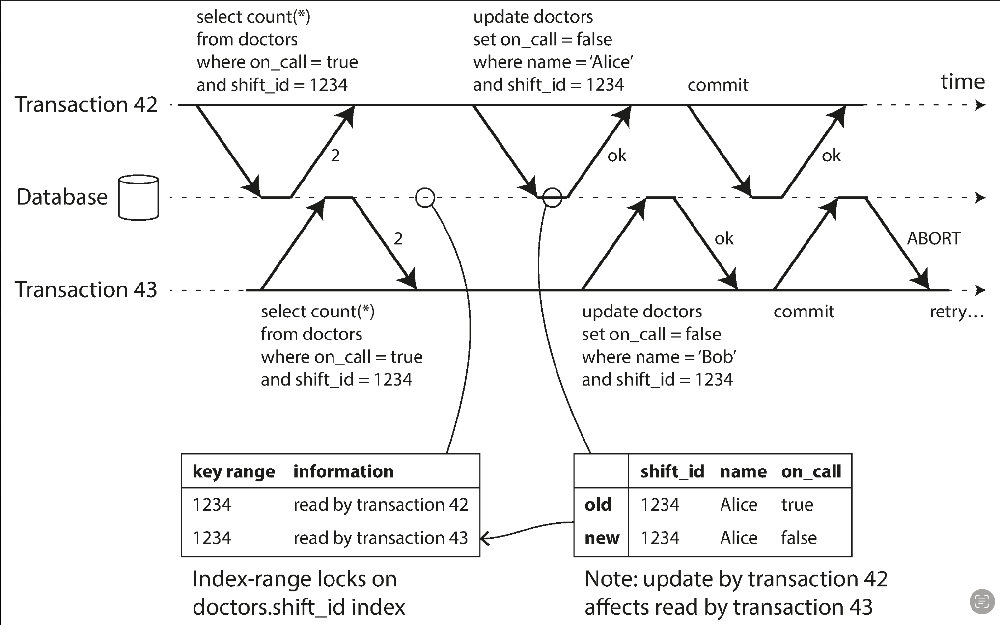

## 재시도
에러 핸들링에서 재시도는 간단하고 효과적인 방법이지만 완벽하지는 않다.  

예를 들어 서버에서는 요청 처리가 성공했지만 성공했다는 정보를 보내는 과정에서 네트워크 에러가 생기면 클라이언트는 해당 요청이 실패했다고 생각하게 되고 재시도릃 하게 된다.  
이 경우 같은 요청이 두번 발생하는 것이므로 예상하지 않은 결과가 나올 수 있다.  
때문에 이 경우 '멱등성'을 지켜주도록 애플리케이션 레벨에서 설계해두는 것이 좋다.

더 많은 케이스가 있지만 하나 더 알아보자면  
과부하 때문에 요청이 실패한 경우 재시도는 과부하 상태를 더 악화시킬 수도 있다.  
때문에 재시도 최대 횟수를 정해 놓는 것도 좋은 방법이다.


## weak isolation
가장 강한 isolation 레벨에는 serializable이 있다.  
모든 트랜잭션을 한 time에 하나만 처리 한다는 의미이다.  
하지만 이는 매우 비싼 성능 비용을 요구하기에 현실적으론 잘 쓰이지 않는다.  
때문에 이보다는 조금 완화된 isolation레벨들이 존재한다.  
하지만 serializable비해 동시성 문제가 일어날 수 있다.  
때문에 여러 종류의 weak isolation에 대해 알아보고 무엇이 현재 애플리케이션에 적절한지 판단할 수 있어야한다.  

### read committed
첫번째로는 read committed이다.  
read committed가 보장하는 것은 아래와 같다.  
- DB로부터 읽기를 할 때 commit된 데이터만 읽는다. (no dirty reads)
- DB로부터 쓰기를 할 때 commit된 데이터만 덮어쓴다. (no dirty writes)

read-committed도 skew가 발생할 수 있는데 아래와 같은 경우이다.  


이러한 문제는 오랜시간이 걸리는 쿼리나(대개 분석용 쿼리) 백업에서 치명적일 수 있다.  
백업또는 무거운 쿼리중에도 DB에는 계속 쓰기가 발생할 수 있고 그럴 경우   
백업본에는 어느 부분은 old data 어느 부분은 new data가 있을 것이고    
분석용 쿼리의 결과는 뒤죽박죽 섞여있을 것이다.  
이런 문제를 해결할 매커니즘이 snapshot isolation이다

snapshot isolation은 MVCC(multi version concurrency control)기법을 기반으로 구현된다.  
MVCC는 객체의 여러버전을 유지하는 방법이다.  
트랜잭션 별로 incrementing ID가 있고 본인 ID보다 높은 ID가 수정한 row를 읽을 경우 현재 트랜잭션이 원래 읽고 있던 이전 버전을 찾아간다.  

### lost update 
위 방법들은 모두 read-only쿼리와 concurrency write간의 동시성 문제를 해결하는 방법이었다.  
하지만 만약 쓰기를 하는 두 트랜잭션간의 동시성 문제가 발생한다면?  
이 경우엔 단순히 읽었을때 어떤 값이 나오느냐 말고도 본인이 write한 정보가 사라질 수 있다.  

가장 간단한 방법은 lock이다.  
애플리케이션에서 객체를 명시적으로 lock걸고 만약 다른 트랜잭션에서 같은 객체를 읽으려하면 read-modify-write 사이클이 끝날때까지 기다리도록 한다.  

또 다른 방법은 compare-and-set이다.  
```sql
UPDATE wiki_pages SET content = 'new content'
  WHERE id = 1234 AND content = 'old content';
```
쿼리의 where 절을 보면 content = 'old content'가 있다.  
즉 read단계에서 읽은 값이 변경된적이 없을때만 위 쿼리가 실행되는 것이다.  
하지만 이도 동시성 문제가 발생할 수 있는데, 다른 쓰기가 진행 중에는 위 조건이 참일 수 있기 때문이다.  

동시성 문제는 복제 DB환경에서 더 복잡해지는데  
위에서 설명한 두 방법은 최신 복사본이 하나만 있다고 가정할때 가능한 방법이기 때문이다.  
때문에 복제 DB환경에서는 처음부터 동시 쓰기를 막는것이 아니라(사실상 불가능) 허용한 이후에 동시 쓰기가 감지 됐을 경우 애플리케이션 코드나 특별한 데이터 구조를 통해 해결한다.  

atomic operation(수정을 read-modify-write의 사이클로 보는 것이 아닌 하나의 update연산으로 보는 것)이 update가 가환 연산일 경우 복제 DB환경에서 유효할 수 있다.  
Riak에서는 값이 동시에 update돼었을 경우 자동적으로 두 update 연산을 병합해 update lost를 막는다.  
당연히 가환 연산이 아니라 LWW 연산의 경우 불가능하다.  
어떤 연산이 먼저 실행됐는지 알 수 없기 때문이다.([이러면 또 이전의 동시성 문제 해결로.. ](../../4th_week/kdh/temp.md))


## serializability
동시성 문제를 해결하기위해 여러 isolation level에 대해 알아보았지만, 위 방법들로도 결국에는 막을 수 없는 동시성 문제도 존재하고, 본인 애플리케이션이 어느 isolation level에 적합한지 판단하는 것도 정말 어려운 일이다.  
때문에 많은 연구자들은 결국에 가장 간단한 답변으로 serializability를 사용하라고 한다.  
serializability는 간단히 모든 동시성 문제의 발생 가능성을 막는 것이다.  
애초에 트랜잭션이 동시에 수행되지 않도록 하는 것이니.  
하지만 그럼에도 대부분의 애플리케이션이 serializability를 사용하지 않는다.  
왜 사용하지 않는지 또 serializability의 구현방법에 대해 알아보자.  
대부분의 DB는 serializability를 세가지 기술중 하나를 통해 제공한다.  
- Actual serial Execution
- Two-Phase Locking (2PL)
- Serializable Snapshot Isolation (SSL)


### Actual Serial Execution
Actual Serial Execution은 정말 말그대로 싱글스레드에서만 트랜잭션을 수행하는 것으로 구현한다.  
간단명료한 아이디어이다.  
하지만 좋은 성능을 위해 멀티스레드가 필수적이라고 지난 30년간 고려 돼왔지만 최근에 들어서는 싱글스레드 방식도 실현 가능하다고 평가 돼고 있다.  
이는 RAM의 폭발적인 성장과 OLTP(대개 작고 짧은 쓰기), OLAP(read only 트랜잭션) 트랜잭션의 이해도가 높아짐 덕분이다.  

하지만 그럼에도 성능상에 단점은 분명하고 위 방법을 사용하려면 아래 조건이 충족되어야 한다.
- 단일 CPU코어에서 처리할 수 있을정도의 낮은 쓰기 처리량
- 여러 파티션에 접근하는 트랜잭션이 있으면 안됨


### 2PL
2PL은 lock이 좀더 깐깐해진 느낌이다.  
snapshot isolation에서 읽기가 다른 쓰기를 block하지 않고 그 역도 동일하다면, 2PL에서는 
- 같은 객체에 대해서 다른 트랜잭션이 read중이라면 write할 수 없음
- 같은 객체에 대해서 다른 트랜잭션이 write중이라면 read할 수 없음


근데 동시성 문제가 가장 쉽게 일어나는 write중 write는 가능한건가보니 안된다고한다   
https://chatgpt.com/c/fd7131d8-87eb-4d24-9311-e2b1438a4b55  
책에 안나와서 혹시나해서 찾아본건데 또 뒤에 구현 설명해서 말해주네.. 이런건 미리미리 말해달라고..

구현 관련해서는 위에 chatgpt가 답변한거에 잘 설명돼있다(s-lock, x-lock)  
조금만 부가 설명을 하면, 답변에서 growing phase, shrinking phase가 있는데 이게 이 serializability가 2PL이라고 불리는 이유이다.  
트랜잭션이 시작하면 여러 객체들에 대해 lock을 획득하게 되고 해당 lock은 트랜잭션이 끝날때까지 가지고 있어야한다.(growing phase)  
그리고 트랜잭션이 끝날떄 획득했던 lock들을 다시 풀어준다.(shrinking phase)

트랜잭션이 끝나야 lock이 풀리는 구현 구조상 여러 lock이 사용 중일때 트랜잭션 a가 a가 가지고있는 lock이 풀어질때 까지 기다리는 트랜잭션 b의 lock이 풀어질때까지 기다리는 deadlock에 자주 걸릴 수 있다.  

하지만 간과한것이 phantom 현상이다.(새로운 객체쓰기가 다른 읽기에 영향을 주는 현상)  
이를 해결하기 위해 2PL에서는 predicate lock을 사용한다고 한다.
```sql
SELECT * FROM bookings
  WHERE room_id = 123 AND
    end_time   > '2018-01-01 12:00' AND
    start_time < '2018-01-01 13:00';
```
- 위 쿼리 실행중에 조건에 맞는 객체가 x-lock이 걸려있으면 wait
- 위 쿼리를 실행시 조건에 predicate lock을 걸어 다른 트랜잭션이 write를 하려할 경우 위 조건에 충족하는 새로운 값을 쓰려할 경우(insert, update, delete 전부) wait

하지만 딱봐도 predicate lock을 가지고있는동안 다른 모든 쓰기가 위 조건에 걸리는 값이 있는지 확인하는건 매우 비싼 연산이 되게된다.  
때문에 실제 구현에서는 predicate locking에 근사하는 index-range lock을 건다.    
index-range lock은 조건을 근사해서 index레벨에서 lock을 걸 수 있게끔한다.  
위 조건이 12~13시 사이 123번 room을 찾는 것이라면, room_id에 아마 index가 걸려있을 것이므로(안그럼 위 쿼리는 대규모DB에서 매우 느림) 123번 room에 lock을 거는 방식이다.  
만약 마땅한 index가 없다면 해당 테이블(위 에에선 bokkings)에 걸어버리기도 한다.  
이 경우 성능상 좋진 않지만 predicate lock이 쌓이는 것보단 낫다.  


### SSI
지금까지 알아본 내용으론 serializability와 성능은 양립하지 못하는 것처럼 보인다.  
하지만 비교적 최근인 2008년 Michael Cahill의 PhD의 주제로 설명된 SSI를 보면 그렇지 않을 수도 있다.  
SSI는 snapshot isolation에 비해 성능 penalty가 크지 않지만 full serializability를 제공한다.  
오늘날 SSI는 single node DB(PostgreSQL since 9.1)와 distributed DB(FoundationDB) 두 분야 전부에서 활약하고 있다.    

동시성 제어는 두 종류로 나눌 수 있는데 비관적 동시성 제어와 낙관적 동시성 제어이다.  
말그대로 비관적은 동시성 문제가 발생할거 같으면 뭔가 더 하기전에 안전해질때까지 기다리는 것이고,  
낙관적은 일단 수행하고 커밋할때 동시성 문제가 발생하는지 detect해 만약 문제가 있으면 그때 abort하고 재시도를하는 방식이다.  
지금까지 알아본 serializability는 비관적 동시성 제어의 끝단이고 SSI는 낙관적 동시성 제어에 가깝다.  
과거에는 재시도가 노드에 추가적인 부하를 줄 수 있어 잘 쓰이지 않는 방식이었지만 최근에는 분산시스템, 하드웨어 성능향상 덕에 다시 각광받는 것 같다.    

낙관적 동시성 제어의 개념을 이해했다면 SSI에서 어떻게 동시성 문제를 detect하는지가 중요할거란걸 유추해낼 수 있을것이다.  
먼저 stale MVCC이다.

snapshot isolation에서는 트랜잭션중에 일관된 읽기를 보장하기 위해 MVCC를 통해 원래 읽던 값을 보관해두고 해당 값을 계속해서 보여준다.  
하지만 커밋할때에는 읽던 값이 최신값이 아닐 수 있다.  
이 경우 SSI는 해당 트랜잭션을 abort할지 결정한다.  
그런데 왜 커밋시에 결정할까?  
MVCC를 통해 무시하던 값이 커밋됨을 감지하면 바로 abort하면 안될까?  
이는 불필요한 abort를 줄이기 위함이다.  
만약 위 figure에서 트랜잭션43이 read only 트랜잭션이라면 abort를 할 필요가 없다.  
또한 트랜잭션 42가 abort되거나 트랜잭션43이 커밋될때까지 커밋되지 않는 상황또한 트랜잭션43을 abort할 필요가 없다.  

다음으론 이전 읽기에 영향을 주는 쓰기의 경우이다.

이전에 알아본 index-range lock처럼(물론 SSI는 block을 하지 않는다) index에 읽었던 정보를 기록해두고,  
만약 다른 트랜잭션도 해당 객체를 읽었을때, 한 트랜잭션이 성공적으로 커밋된다면 다른 트랜잭션은 conflict가 없는지 체크해야한다.  


