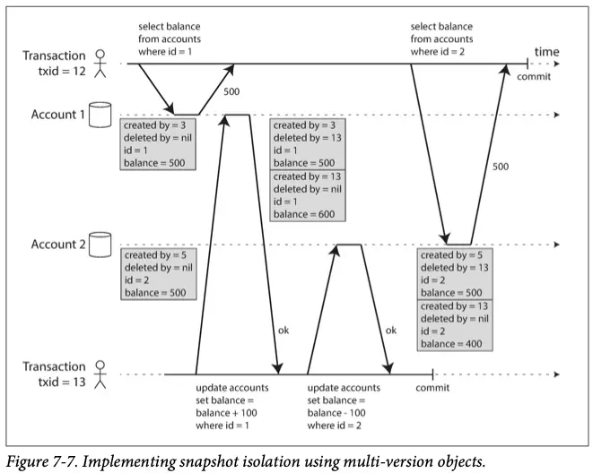
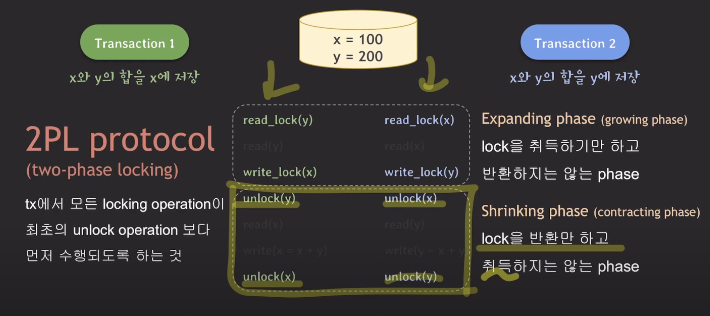

# 트랜잭션

DDIA 7장과 [쉬운코드 데이터베이스 관련 영상](https://youtube.com/playlist?list=PLcXyemr8ZeoREWGhhZi5FZs6cvymjIBVe&si=D1d0T9rOXL1Elkmw)을 주로 참고하여 정리.

## 트랜잭션의 개념과 필요성

목표: 데이터 시스템의 문제(네트워크, 중단, 경쟁 조건, 덮어쓰기, 작성 중인 데이터 읽기)를 단순화한다.

어떻게: 몇개의 읽기와 쓰기를 하나의 논리적 단위로 묶는다.

성과: 안전성, 프로그래밍 모델 단순화(트랜잭선 없이 중간 상태를 포함하는 결제 프로세스를 개발한다고 생각해보자…) 

특징: 트랜잭션은 전체(한 단위로 묶인 읽기와 쓰기)가 전체가 성공(커밋)하거나 실패(어보트, 롤백)한다. 따라서 재시도하더라도 데이터 불규칙(중복 데이터, 일부 데이터만 작업)이 발생하지 않는다.

최근 애매모호해진 개념: 분산 서비스가 나오면서 고전의 강력한 트랜잭션 대신, 약한 보장을 의미하게 재정의되기도 한다. 확장성과 트랜잭션은 어느정도 반비례할 수 있으나. 둘 중 하나만 선택해야 하는건 아니다.

(어느정도 트레이드 오프 관계가 있다. 분산 시스템에서 트랜잭션을 처리할려면 별도의 어플리케이션 단 구현(e.g. saga 패턴) + 실패 복구 기능이 필요하다. [토스 MSA 전환기 영상](https://youtu.be/amTJyIE1wO0?si=iC97CgfeXcYuOFtb&t=660)을 보면 MSA 간 긴 트랜잭션을 포기하고 비동기 + 실패 복구 로직을 구현해서 해결한다.)

## 트랜잭션의 특징

"독립적이며 한 단위로 실행/실패된다." << 이게 핵심임

- 많은 자료에서 이야기하는 ACID
- 쉬운코드에서 이야기하는 serializability & recoverability

### ACID
> DDIA 책 p. 223 - ACID는 유감스럽게도 거의 마케팅 용어가 되어버렸다.

ACID 하다는게 진짜 어떤 의미인지 사람들이 잘 모르기 때문. 또한 벤더마다 ACID 구현이 제각각이다.

- A: 원자성, 커밋 or 롤백(abort) - 저자는 abortability (어보트 능력)이라는 말을 더 좋아함.
- C: 일관성, (저자 피셜) 어플리케이션 단에서 신경쓰기 + 구현해야 하므로 ACID에 속하지 않는다.
    - 막 default나 non null 같은 설정을 아무리 해봐야 “결제 프로세스 일관성” 같은걸 DBMS가 해줄 수 없다. 서비스마다 일관성 목표가 다르고, 구현 방법이 다르므로.
- I: 격리성, 이전에는 직렬성이라고 부름. 하나의 실행 단위에서 순차적으로 실행되는 것과 동일한 결과 (외부의 영향을 받지 않는 결과) 가 나와야 한다.
- D: 지속성, WAL(Write-Ahead Log) 등으로 해결하나, 결국 완벽한 지속성은 존재하지 않는다. 트랜잭션 결과는 언젠가는 유실될 수 있다.
    - 따라서 지속성 보장을 위한 여러 기법을 병행해서 사용하는 것이 좋다.

### serializability & recoverability(직렬성 & 회복성)

#### serializability(직렬성)

ACID중 I(isolation)

한개의 실행단위 (프로세스, 스트림, 쓰레드) 에서 실행되는 것처럼 실행되는 것.

이상현상 없이 실행되고, 롤백(어보트)도 문제없이 수행할 수 있는 상태.

성능 때문에 어느정도 포기하는 옵션을 제공한다.

> [[쉬운코드 블로그 중](https://easy-code-yo.tistory.com/38)]

하지만 이 isolation 속성은 트랜잭션의 ACID 속성들 중에 가장 많이 타협되는 속성이기도 하다
> 
> 
> DBMS의 성능과 연관이 있기 때문이다
> 
> isolation의 엄격함과 DBMS의 트랜잭션 처리량과 사이에서 개발자가 트레이드할 수 있도록
> 
> isolation level을 제공하는 이유도 이것 때문이다.

##### 직렬성 관련해서 쉬운코드 설명

https://easy-code-yo.tistory.com/25#conflict%--serializable

**트랜잭션들이 동시에 실행될 때 isolation을 보장하는 기초 이론**

**scheudle**   ->   **conflict operations**  ->   **conflict equivalent**  ->   **conflict serializable**

- **schedule:** 각 transaction의 operation이 실행되는 순서
    - 아래는 동일한 연산의 다양한 schedule - tx1과 tx2 둘 다 x를 read → write 한다.
        
        (1)   r1(x) w1(x) r2(x) w2(x)
        
        (2)   r1(x) r2(x) w1(x) w2(x)
        
        (3)   r1(x) r2(x) w2(x) w1(x)
        
        (4)   r2(x) w2(x) r1(x) w1(x)
        
- **serial schedule:**  transaction이 하나 끝나면 다른 하나가 시작되는 형태의 schedule (위의 4번쨰 schedule)
- **conflict operations:** schedule에 존재하는 두 operations의 특정 조건을 만족하는 상태.
    - 두 operation이 서로 다른 transaction에 속해 있다
    - 두 operation이 같은 데이터에 접근한다
    - 두 operation 중에 적어도 하나는 데이터를 쓴다(write)
    - (이름 생각하면 됨. 충돌.)
- **conflict equivalent:** 두 개의 schedule이 특정 조건을 만족하는 상태
    - 두 schedule은 같은 transaction들을 가진다
    - 어떤(any) conflict operations의 순서도 양쪽 schedule이 모두 동일하다
- **conflict serializable:**
    - 어느 한 schedule이 serial schedule과 conflict equivalent하다면, '이 schedule은 conflict serializable하다
    - 두 개의 schedule이 conflict equivalent 할 때, 한 schedule이 serial schedule이라면, '다른 한 schedule은 conflict serializable하다

- **serial schedule의 문제점과 아이디어**
    - 한번에 하나의 트랜잭션만 실행되기 때문에 높은 성능을 낼 수 없다.
    - non-serial 는 여러 트랜잭션이 동시에 수행되므로 더 빠르나, 이상현상이 발생할 수 있다.
    - 즉, non-serial이면서 serial과 동일하게 수행되는 schedule을 사용하면 된다.
        - conflict serializable한 schedule이 serial과 동일하게 수행된다.
    - 그 전에 serial 하다는 것의 정의를 구해야 한다. (쉬운코드 영상에서 나오는데 생략)

- **실제 구현은?**
    - 현실적으로 동시에 실행된느 트랜잭션마다 conflict serializable하게 동작하게 하는건 너무나 어렵다.
        - (내 생각: DBMS가 가능한지 확인하고, 실패하게 하면 어플리케이션 단에서 너무나 많이 고려해야 함.)
    - conflict serializable하게 동작하도록 보장하는 프로토콜을 사용.

아래는 recoverability 설명

- unrecoverable schedule
    - 복구 불가능한 스케줄. tx1에서 수정한 작업을 tx2가 읽고 커밋한 경우,  tx1을 롤백하면 해당 작업이 tx2또한 롤백해야 하므로 D를 지키지 못한다.
    - 일어나면 안되는 현상
- recoverable schedule
    - 복구 가능한 스케줄.
    - 자신(tx)이 read한 데이터를 write한 다른 tx가 커밋 or 롤백 하기 전까지 commit하지 않는 것
    - 트랜잭션을 커밋하려면 다른 트랜잭션이 커밋or롤백되기를 기다려야 함.
- cascading rollback
    - 롤백하면 다른 트랜잭션도 연쇄적으로 롤백해야 하는 경우
- cascadeless schedule
    - 데이터를 write한 tx가 커밋or롤백 한 이후 데이터를 읽는 schedule만 허용하기
    - avoid cascading rollback이라고도 부름
- strict schedule
    - schedule내에서 어떤 tx도 커밋되지 않는 tx들이 write한 데이터는 쓰지도 읽지도 않는 경우

**결국 그래서 isolation이란?**

**concurrency control provides serializability & recoverability**

serializability & recoverability를 제공하는 일관성 제어

근데 전에 말했다시피 현실적으로 tx가 실행될 때마다 특정 조건을 만족하는 schedule 만 실행하는건 불가능함.

따라서 어느정도 제공하는 격리성을 낮추고, 그 격리성 레벨을 보장하는 프로토콜을 사용함으로써 해결함.

## 트랜잭션과 isolation level

### isolation level 필요성

isolation level의 필요성: 모든 이상현상이 발생하지 않게 (완전한 isolation) 할 수 있으나, 성능이 너무 낮다.

> [[쉬운코드 블로그 중](https://easy-code-yo.tistory.com/38)]

하지만 이 isolation 속성은 트랜잭션의 ACID 속성들 중에 가장 많이 타협되는 속성이기도 하다
> 
> 
> DBMS의 성능과 연관이 있기 때문이다
> 
> isolation의 엄격함과 DBMS의 트랜잭션 처리량과 사이에서 개발자가 트레이드할 수 있도록
> 
> isolation level을 제공하는 이유도 이것 때문이다.

### isolation level 종류

isolation level에 따라서 이상현상의 예방을 보장해주는 정도가 달리진다.

동시성(성능)이 더 좋아지는 대신 일부 이상현상을 허용한다.

- isolation level 순서 - 순서대로 높아진다.
    - Read uncommited
    - Read commited
    - Repeatable read
    - Serializable: SQL 92 표준에서 다루지 않는 이상현상을 포함한 모든 이상현상이 발생하지 않음.

## 이상현상(Anomaly)과 그 종류

이상현상: 직렬성이 위배되는 현상

- 더티 읽기(dirty read)
    - commit 되지 않은 변화 (롤백하면 유효하지 않을 수 있음)를 읽는 경우 발생 가능
    - 꼭 다른 트랜잭션이 abort하지 않아도, 발생할 수 있음. (다중 객체 수정 작업 중 읽는다거나)
    - e.g. t1에서 수정한 커밋되지 읽는 값을 t2에서 읽고 + 1해서 쓰고, t1이 롤백하는 경우
- 더티 쓰기(dirty write)
    - 나중에 수행된 트랜잭션이 먼저 다른 트랜잭션에서 commit 되지 않은 변화 (롤백하면 유효하지 않을 수 있음)를 덮어 쓰는 경우 발생 가능
      - 정상적인 recovery가 불가능하므로 허용되면 안됨.
- 읽기 스큐(read skew) = non-repeatable read
  - inconsistent(비일관적인) 데이터 읽기
  - 한 트랜잭션에서 (변경하지 않은) 같은 데이터를 여러번 읽었을 때, 값이 바뀌는 현상
  - 각 트랜잭션은 독립적인 경우 문제가 없지만, 동시에 실행되는 경우 일관성 문제가 발생한다.
  - 한 tx(tx1)가 지속되는 동안 다른 tx(tx2 or more)가 커밋되었으므로 변경된 값을 읽게 되는데, 이때 (tx1 입장에서) 읽기가 일시적으로 유효하지 않은 문제(non-repeatable read)가 생긴다.
    - (이러한 특정 변경으로 인해서 더 이상 이전의 가정이 유효하지 않게 되는 경우, 이상현상이 발생할 수 있다. 읽기 스큐 뿐만 아니라 많은 부분에서 발생하므로 기억해두자. **가정이 깨지는 경우, 이상현상이 발생할 수 있다.**)
- 갱신 손실(lost update)
  - 한 tx의 갱신을 다른 tx가 덮어씌우는 것. (없던 일처럼 되어버림)
  - 대표적인 예시로 카운트 증가가 있음.
- 쓰기 스큐(write skew)
  - inconsistent(비일관적인) 데이터 쓰기
  - 각 트랜잭션은 독립적인 경우 문제가 없지만, 동시에 실행되는 경우 일관성 문제가 발생한다.
  - 팬텀이 발생하면 쓰기 스큐를 유발할 수 있다.
    - 쓰고자 하는 데이터가 없는 경우 잠글 수 없기 때문.
  - e.g. 예약 시스템, 사용자명 획득 등
- 팬텀 읽기(phantom read)
    - 없던 데이터가 생기는 것
    - 한 트랜잭션에서 실행된 쓰기가 다른 트랜잭션의 읽기 결과를 바꾸게 된다.

## isolation level의 구현과 보장

### Read uncommited

아무 이상현상의 예방을 보장해주지 않는다.

### Read commited

#### 예방하는 이상현상

- 더티 읽기(dirty read)
- 더티 쓰기(dirty write)

#### 구현방법

- 더티 쓰기 예방
  1. 로우 수준 잠금: 쓰기를 위해선 락을 취득하고, 트랜잭션이 종료(커밋or롤백)되어야 락을 반환한다.
- 더티 읽기 예방
  1. 로우 수준 잠금: 읽기도 마찬가지로 락을 사용하면 구현 가능하나, 동시성 성능 문제로 잘 사용하지 않는다.
  2. 이전 상태 기억하기: 과거에 커밋된 값과 현재 값을 기억한다. 새 값이 커밋되어야 다른 트랜잭션이 새 값을 읽을 수 있다.

### Repeatable read

일관성 있는 읽기가 필요한 백업(사본 만들기), 무결성 확인 등의 작업에서 필요하다.

#### 예방하는 이상현상

- 읽기 스큐
- read-only의 경우에는 팬텀 읽기

#### 구현방법

- 읽기 스큐 예방
  - 이를 해결하기 위해서는 트랜잭션에서 여러 시점의 상태를 읽을 수 있어야 한다.
  - 주로 스냅숏 격리(snapshot isolation)를 사용해서 이 문제를 해결한다.
  - (자세한 설명은 생략)

#### 스냅숏 격리와 MVCC

> 스냅숏 격리의 가장 중요한 핵심은 읽는 쪽에서 쓰는 쪽을 차단하지 않고, 쓰는 쪽에서 읽는 쪽을 차단하지 않는다는 것이다.
> 따라서 데이터베이스는 잠금 경쟁 없이 쓰기 작업이 일상적으로 처리되는 것과 동시에 일관성 있는 스냅숏에 대해 오래 실행되는 읽기 작업을 처리할 수 있다.

스냅숏 격리를 위해서는 객체마다 커밋된 버전 여러 개를 유지할 수 있어야 한다.

데이터베이스 객체가 여러 버넌을 함께 유지하므로 이 기법을 MVCC(multiversion concurrency control)라고도 한다.

Postgresql에서 MVCC를 구현하는 방법은 다음과 같다.

txid보다 더 이전 시점에 반영된 마지막 버전의 객체를 읽는다.

사용하지 않는 버전은 가비지 컬랙터가 제거한다.

(SQLP 공부하면서 배운게 생각나서 추가로 적음. 다음 내용은 GPT가 한 번 더 정리한거,    
오라클은 여러 버전의 데이터를 Undo 영역에 저장하고, 이를 이용하여 트랜잭션이 시작된 시점의 데이터를 읽을 수 있도록 합니다. 그러나 Undo 영역의 크기가 제한되어 있어, 긴 트랜잭션이나 많은 데이터 변경이 발생할 경우 Undo 데이터가 삭제될 수 있습니다. 이로 인해 'Snapshot Too Old' 에러가 발생할 수 있습니다. 이는 트랜잭션이 너무 오래 지속되어 필요한 Undo 데이터가 더 이상 존재하지 않는 경우를 의미합니다.)

##### 스냅숏 격리와 색인

(이 부분은 책에서 설명하는데, 너무 일부 구현에 제한되어 있고 딱히 중요해보이지 않아서 스킵)

색인 갱신을 최소화하거나 append-only/copy-on-write 등의 성능을 높이는 어려 기법이 있다.

### Repeatable read에서 발생하는 이상현상 해결

필요성: 책에서 설명은 안하는데, 직렬성은 성능때문에 잘 사용 안하니까 Repeatable read에서 발생하는 이상현상을 해결하는 방법을 추가로 설명하는 것 같음.

#### 갱신 손실

read-modify-write 시 발생한다.

1. 원자적 쓰기 연산
  - SQL문 하나는 주로 DBMS 내부적으로 락을 사용해 원자적 쓰기를 지원한다.
  - but 제한적임.
2. 명시적인 잠금:
  - 갱신할 객체를 명시적으로 잠금
  - e.g. `FOR UPDATE`, `FOR SELECT`
3. 갱신 손실 자동 감지:
  - 예방하지 않고 허용하되, 문제가 생기면 먼저 완료되지 않는 tx를 어보트시키고 재실행을 강제하는것.
4. compare-and-set:
  - CAS 연산을 제공한다면, 사용할 수 있다.
  - DBMS 구현에 따라 동일한 SQL문,요청이 CAS을 지원하거나 그렇지 않을 수 있다.
  
(DDIA 책에서 나온 내용) 충돌 해소와 복제: 위에서 설명한 방법들 모두 복제 환경에서는 유효하지 않을 수 있다. 복제 환경에서는 주로 충돌 해소를 위해 LWW(최종 쓰기 승리) 기법을 사용하는데, 이는 갱신 손실이 발생하기 쉽다.

#### 쓰기 스큐와 팬텀

lost update 보다 더 제한된 해결 방법을 가진다. (CAS가 통하지 않는다.)

1. 직렬성 격리 레벨 사용하기
2. DBMS의 제약조건을 사용한다. (FK, 트리거, materialized view 등)
3. tx가 의존하는 로우를 잠군다.

팬텀이 발생하면 쓰기 문제를 유발할 수 있다. (쓰고자 하는 데이터가 없는 경우 잠글 수 없음)

##### 팬텀이 유발하는 쓰기 스큐 해결

잠글 수 있는 객체가 발생하지 않아서 발생하는 문제이므로, 데이터베이스에 존재하는 데이터로 만든다. 

e.g. 회의실 예약의 경우 짦은 기간 내의 미래에 가능한 모든 조합을 미리 만들어둔다. 

### Serializable

#### 예방하는 이상현상

모든 이상현상이 발생하지 않는다.

#### 구현 방법

1. 실제적인 직렬 실행
  - 하드웨어 성능이 좋아져서 이제 적절한 선택지가 됨.
  - 락이 길어지지 않도록 짦은 트랜잭션, 스토어드 프로시저를 사용해야 하는 것이 좋다.
  - 그러나 CPU의 단일 코어만 사용하기 때문에 CPU의 모든 성능을 사용하지 않는다.
    - 여러 CPU 코어를 사용하도록 개선할 수도 있다. ([레디스](https://redis.io/learn/operate/redis-at-scale/scalability/clustering-in-redis)도 이러한 기능을 제공한다.)
    - 아니면 파티셔닝을 통해서 여러 노드로 확장할 수도 있는데, 이 경우 락이 사용되어야 한다. 또한 여러 파티션이 협력하는 트랜잭션은 매우 느리다.
2. 2PL(two-phase locking)
  - 최근 30년간 계속해서 사용했던 방법
  - 설명
    - tx에서 모든 locking operation이 최초의 unlock operation 보다 먼저 수행되게 하는 것.
    - (이렇게 않하면 read-lock, write-lock을 써도 직렬성을 보장하지 못함. 자세한 건 책이나 영상 참고)
    - 이런 식으로 lock을 취득하는 phase, lock을 반환하는 phase로 나뉜다. 
      - 물론 모든 2PL이 위 이미지 같은 순서로 동작하는건 아니다. 종류에 따라 락 취득 위치는 다를 수 있음. 
    - read-lock(공유 모드) 끼리는 여러 트랜잭션에서 접근 가능. write-lock(선점 모드)끼리는 트랜잭션이 끝나기(락을 해제) 전까지 접근 불가능하다.
  - 2PL의 성능
    - 좋지 않다. 특히 Lock 대기로 인해서 높은 백분위에서 좋지 않은 성능을 보일 수 있다.
    - 교착상태 또한 성능을 안좋게 하는 부가적인 요소
  - 서술 잠금과 색인 범위 잠금
    - 팬텀을 예방하기 위해서는 아직 발생하지 않은 데이터를 Lock해야 한다.
    - 서술 잠금: 어떤 조건에 해당되는 (아직 존재하지 않더라도) 모든 객체를 잠근다.
    - 색인 범위 잠금: 서술 잠금의 조건을 확인하는 것은 성능이 별로이므로, 실제 DBMS는 더 많은 범위를 잠구는 식으로 구현한다.
  - 2PL의 dead lock: 예방하지 않는다. 확인 후 해결(롤백) 방식
  - 2PL의 종류: 2PL, C2PL, S2PL, SS2PL - 참고 [위키피디아](https://en.wikipedia.org/wiki/Two-phase_locking).

**lock 호환성**
|  Lock type | read-lock | write-lock |
|:----------:|:---------:|:----------:|
|  read-lock |     ✔     |      X     |
| write-lock |     X     |      X     |

3. SSI(직렬성 스냅숏 격리)
  - 최근에 나온 개념(2008)으로 스냅샷 격리보다 약간의 성능 손해만 있다.
  - 다른 직렬성 구현 방법과 달리 낙관적이다.
  - > SSI는 스냅숏 격리 위에 쓰기 작업 사이의 직렬성 충돌을 감지하고 어보트시킬 트랜잭션을 결정하는 알고리즘을 추가한다.
  - DBMS는 트랜잭션이 뒤처진 전제를 기반으로 동작하는 상황(특정(주로 시작) 시점에 유효하지 않았던 쓰기가 먼저 반영된)을 감지하고 어보트 시킨다.
  - 성능
    - 어보트 비율이 전체적인 성능에 큰 영향을 준다.
    - 성능과 행동(읽기/쓰기)을 추적하는 정도는 트레이드 오프 관계이다.

## 기타

#### 단일 객체 연산과 다중 객체 연산

객체: 로우(RDB), 문서(DocumentDB), 레코드(필드?)

- 단일 객체 연산
    - 일반적으로 많이 제공, 구현이 쉬운 편
    - 원자적 연산(read-modify-write말고 compare-and-set)을 제공하기도 한다.
- 다중 객체 연산
    - 구현 어려움, 여러 분산 DB는 제공 안하는 곳도 있음.
    - 대다수 다중 객체 연산이 필요하다. (e.g. BEGIN TRANSACTION, COMMIT/ROLLBACK)

#### 복구와 어보트

트랜잭션은 문제가 발생하면 어보트가 발생한다. (모든 데이터 시스템이 그렇지는 않다. "트랜잭션을 보장하지 않는다는건가?")

어보트된 트랜잭션을 재시도하는것은 간단하고 효과적인 오류처리 매커니즘이지만 완벽하지는 않다.
- 완료 응답이 누락된 경우, 서드파티(이메일 전송 등)의 의존, 일관성을 위배하는 요청 시 등...

#### 현대의 트랜잭션 개념

모호해지고 있다. BASE라는 분산 환경에서 실행되는 더 느슨한 개념도 있고...

#### SQL 92 표준과 비판
[쉬운코드 영상](https://youtu.be/bLLarZTrebU?si=Ht1cHH59bNibgsPX)참고

SQL 92 표준에서 다음 이상현상과 이를 해결하는 isolation level을 정의했다.

- 이상현상
  - DIRTY READ
  - NON-REPEATABLE READ
  - PHANTOM READ

- isolation level
  - read uncommited
  - read commited
  - repeatable read
  - serializable

그러나 다음과 같은 비판점이 있다. (그냥 비판하는 논문의 내용이지만)

1. 세 가지 이상 현상의 정의가 모호하다.
2. 이상 현상은 세 가지 외에도 더 있다.
3. 실제 DBMS에서 사용하는 방법을 반영해서 isolation level을 반영하지 않았다.
  - 이거는 snapshot isolation 말하는거임.

#### SQL 92 표준의 isolation level과 실제 구현의 괴리

실제로 DBMS가 제공하는 Repeatable read나 Serializable은 표준의 설명과 다르다.   
각 DBMS마다 동일한 isolation level의 구현과 동작이 다르기까지 하다.     
실제 사용 시에는 이 부분을 주의해야한다.   

- MYSQL
  - repeatable read: MVCC 사용
    - 다른 DBMS와 달리 갱신 손실 자동 감지 기능을 제공하지 않아서, snapshot level이 아니라고 보는 시각도 있다.
  - serializable: Lock 기반 동작
- PostgreSQL
  - read uncommited: read commited 처럼 동작함. (진짜 read uncommited를 지원하는게 아니라 이름만 그런거인듯?)
  - repeatable read: MVCC 사용
  - serializable: SSI기법이 적용된 MVCC
- IBM DB2: DB2의 반복 읽기는 직렬성을 가리키는데 사용된다.

PostgreSQL의 경우 같은 데이터를 수정한 경우, 나중에 수정한 tx가 실패한다(= 갱신 손실 자동 감지). 하지만 MySQL은 이를 지원하지 않는다. (책에서도 나왔던거 같음.) 이 경우 Lock을 지정해줘서 Locking read를 사용해야 한다.

주로 repeatable read level은 실제로는 snapshot level이다. 그러나 동일한 요구사항을 만족하므로 표준에 맞춰서 repeatable read이라고 부르는 것. 여기에는 MySQL과 PostgreSQL이 해당된다.

오라클에서는 serializable의 실제 구현은 repeatable read이다.