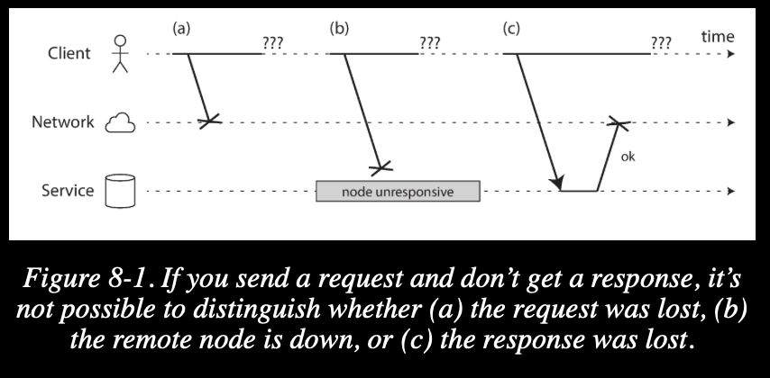
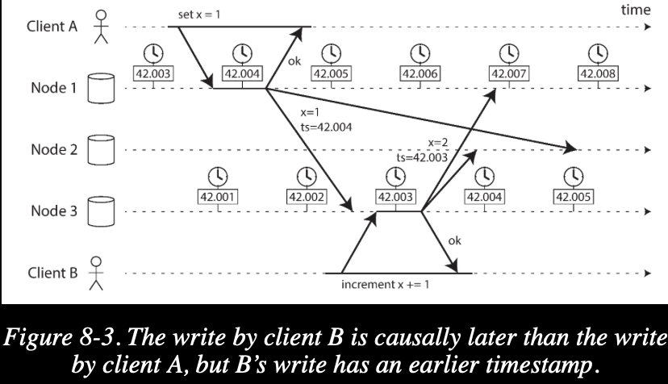
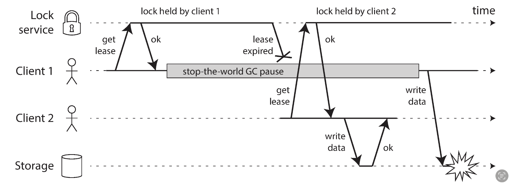

> Hey I just met you  
The network’s laggy  
But here’s my data  
So store it maybe  

## fault and partial failure
싱글 컴퓨터 환경에서는 두가지 상황밖에 없다.  
- 정상 작동
- 작동 안함

작동안함의 경우 대개 소프트웨어의 문제이다.  
컴퓨터는 같은 입력이오면 같은 결과를 뱉을 뿐이기 때문이다.  
하지만 분산 컴퓨팅 환경에서는 다르다.  
> “In my limited experience I’ve dealt with long-lived network partitions in a single data center (DC), PDU [power distribution unit] failures, switch failures, accidental power cycles of whole racks, whole-DC backbone failures, whole-DC power failures, and a hypoglycemic driver smashing his Ford pickup truck into a DC’s HVAC [heating, ventilation, and air conditioning] system.  
> And I’m not even an ops guy.   
> -- Coda Hale”

정말 어떤 방식으로든 문제가 발생할 수 있고, 더 큰 문제는 이 것이 서비스의 완전한 에러가 아닌 부분적으로만 발생되게 된다는 것이다.  
때문에 문제를 인식하는 것조차 어려울 수 있다.  
때문에 정말 비관적으로 당연히 문제가 발생할 것이라 가정하고 이에 대응하는 소프트웨어 레벨에서의 설계를 해두는 것이 좋다.  

## unreliable Networks
이 책에서 다루는 분산시스템은 shared-nothing 시스템을 말한다.  
shared-nothing 시스템에서 노드끼리는 다른 노드의 메모리나 디스크를 직접 접근할 수 없다.  
네트워크를 통한 요청을 통해서만 다른 노드에 접근할 수 있다.  
분산 시스템을 구축하는 데에는 이런 shared-nothing 시스템만 있는 것이 아니지만 대부분의 경우 이를 사용한다.  
이유는 특별한 하드웨어가 필요하지 않고 상업용 컴퓨터를 그대로 사용하면 되기에 매우 싸기 때문이다.  
대신 이런 네트워크를 통해서만 노드끼리 소통하는 특징때문에 문제가 발생할 수 있는데, 네트워크는 요청이 언제 도착할지 또 완전히 도착할지를 보장해주지 않는다는 것이다.  
네트워크를 통해 요청을 보낼때 아래와 같은 문제가 발생할 수 있다.  
- 요청이 소실될 수 있다. 
- 요청이 늦게 도착할 수 있다.  
- 수신 노드가 고장날 수 있다. 
- 수신 노드가 요청을 처리하는데 오래 걸릴 수 있다.
- 수신 노드는 정상적으로 작동했지만 응답이 네트워크중에서 소실될 수 있다. 
- 수신 노드는 정상적으로 작동했지만 응답이 늦게 도착할 수 있다.

더욱 큰 문제는 위와같은 문제들이 발생했을때 아래 사진처럼 어떤것이 문제였는지 정확히 알 수가 없다.

### detect failure
많은 시스템이 네트워크 상에서 문제가 발생했는지 자동으로 감지하는 기능을 필요로 한다.     
- 로드 밸런서가 죽은 노드에는 요청을 보내지 않게끔 하기 
- 싱글리더 분산 환경에선 리더 노드가 죽었을 경우 팔로워 노드 중 하나가 승격되게 하는 것

이러한 네트워크 상에서의 문제의 불확실성은 노드가 고장났는지 아닌지조차 알기 어렵게 만들어버린다.  

요청은 정상적으로 도착했지만 노드에서 프로세스만 고장이 났을 경우  
프로세스가 요청을 처리하기도 전에 고장났다면 os가 다른 노드와 클라이언트에게 알려줄 수 있지만 만약 요청을 처리하던 중에 고장났을 경우 데이터가 얼마나 처리되었을지 알 방법이 없다.  

심지어 수신 노드가 고장이 났음을 알 수 있는 신호조차 받지 못하는 경우도 가정을 해야한다.  

### timeout delay
때문에 프로세스가 정상적으로 작동하는지 아닌지를 판단하기 위해 타임아웃을 대개 사용하는데 이 타임아웃의 기간도 잘 정해야한다.  
만약 타임아웃으로 판단하는 기간이 너무 길다면 사용자는 긴시간동안 기다리거나 에러 메세지를 봐야한다.  
하지만 너무 이르게 설정한다면?  
가장 단순한 문제로 일시적으로 노드가 느려져 요청을 시간내에 처리하지 못했을때 정상적인 노드가 죽은 노드로 판단되는 문제가 있고,  
최악의 경우 노드가 과부하 때문에 요청을 처리하는데에 오래 걸렸을때 이 노드가 죽은 노드로 판단되고 이 요청들이 다른 노드로 일임됐을때 연쇄적으로 모든 노드가 죽었다고 판단되는 경우가 있을 수도 있다.  

유토피아에서는 모든 네트워크 요청이 d 이내로 무조건 전해지고 요청이 r 이내로 무조건 처리된다 했을때,  
타임아웃을 2d + r로 한다면 정확히 이 시간보다 오래 걸린다면 네트워크나 노드에 문제가 있다고 판단할 수 있겠지만,  
현실 세계에선 네트워크 요청시간인 d는 물론이거니와 요청 처리시간인 r조차 보장해줄 수 없다.

### queue
또한 요청이란 이름의 물리적인 전기신호는 말그대로 물리적이기에 사실 그 양이 매우 크다면 처리할 수가 없다.  
때문에 큐를 사용하는데 아래와 같다. 
- 네트워크 상에서 한 수신지로 요청이 몰릴때 스위치 레벨에서 입력 신호를 큐에 대기 시켜놨다가 보낸다. 
  - 때문에 큐가 꽉찼다면 스위치는 정상적으로 작동함에도 데이터가 손실되어서 다시 보내줘야하는 경우가 생길 수 있다.
- 요청은 노드로 정상적으로 도착했지만 노드에서 모든 cpu core가 사용중이라 요청이 처리될 수 없는 경우 os가 요청을 큐에 대기시켜놨다가 cpu에 자리가 남으면 그때 보내준다. 
- vm을 사용할때 다른 vm이 cpu를 가져갈 경우 원래 vm은 일시정지되는데 이때는 요청을 처리할 수 없기에 vm에의해 요청들은 잠시 버퍼된다.
- TCP는 네트워크 혼잡을 피하기 위환 알고리즘을 사용하는데, 네트워크가 과부하되지 않기 위해 보내는 노드에서 자체적으로 요청을 보내는 양을 조절한다. 때문에 잠시 송신노드의 큐에 대기 시켜놨다가 보내기도 한다.  

## unreliable clocks
컴퓨터에서 시간을 측정하는 개념에는 두가지가 있다.  
- Time of Day
- Monotonic Clock

https://chatgpt.com/c/f2295131-0949-48f4-ae8c-2ed52c1ded21

time of day는 원자나 gps를 이용해 현재 시각을 정확히 재는 ntp서버로부터 값을 sync하기에 시간이동이 일어날 수 있다.  
때문에 값이 종종 변경될 수 있어, timeout delay가 경과됐는지 등의 작업을 하기엔 부적절하지만 정확한 시간을 나타내에는 적합하다.
반대로 monotonic clock은 특정 시점으로부 계속해 증가하는 값이기에, 값을 의도적으로 변경할 수 없다.  
때문에 어느 두 시점의 간격을 측정할때 유용하다.

컴퓨터에서 시간이란 결국에 내장한 oscillator의 주기에 의한 증가하는 값을 시간에 매핑하는 것이기에  
정확한 시간은 알 수가 없다.  
실제로 정확히 같은 시간에도 다른 두 컴퓨터에서는 현재 시각을 다르게 인식할 수 있다는 말이다.  
정확한 시간을 요구하는 시스템에서는 이 특징을 잘 이해하고 설계해야한다.  

그리고 이러한 특징때문에 또 동시성 문제 비스무리한 문제가 발생한다.  

사진을 보면 명백히 a의 요청이 b의 요청보다 일찍이루어졌지만 node2에는 a의 요청이(42,004) b의 요청보다(42,003) 늦게 이루어진것처럼 보이게 된다.  

NTP서버와 정말 잘 동기화된 두 노드에서도 위와같은 문제는 일어날 수 있다.  
예를 들어 a에서는 100ms에 요청을 보냈지만 b에서는 해당 요청이 99ms에 도착할 수 있다, 그리고 이는 불가능한 상황이다.  
이는 NTP또한 결국에 네트워크를 통해 동기화를 하는 것이기에 작은 오차는 얼마든지 일어날 수 있게 때문이다.  

때문에 물리적인 실제 시간이 안니 논리적 시간을 사용하는것이 더 안전한 대책일 수 있다.  
논리적시간은 각 데이터의 버전처럼 이벤트간의 논리적인 순서를 측정한다.

결국에 로컬에서 나타내는 시간은 다른 외부 노드들과 통신할때는 거의 의미가 없어지는 시간이다.  
하지만 NTP에서 주기적으로 동기화를 한다할때, confidence intervals로 그나마 신뢰성 있게 시간을 나타낼 수 있다.  
confidence intervals는 한 시점을 나타내지 않고 earliest, latest 두 시점으로 이루어지고,    
두 시점 사이에 현재 시점이 있을 것을 보장해준다.  
대표적으로 구글 spanner의 true time api가 이러한 방식으로 시간을 제공해준다.  

또 이러한 시간의 불확실성 때문에 일어나는 문제가 이전에 이야기한 snapshot isolation에서 일어난다.  
로컬이라면 단순히 monotonic clock을 이용해 transaction ID를 지정해주면 되겠지만 분산환경에서 이를 사용하려하면, 어떤 트랜잭션이 더 빠른건지 확신할 수 없다.  
구글 spanner에서는 이를 confidence intervals를 사용해 a와b두 시점이 있을때 두 시점이 overlap되지 않는다면(e.g a.earliest < a.latest < b.earliest < b.latest) 예시에선 a가 b보다 일찍 일어낫다고 확신할 수 있다.  
하지만 만약 둘이 overlap됐을때는 확신할 수 없다.  

하지만 최대한 overlap되는 상황을 피하기 위해 구글 spanner는 읽기-쓰기 트랜잭션을 커밋할때 의도적으로 confidence intervals 그 간극만큼 잠시 대기한다.  
또한 그 간극을 최소화 하기 위해 데이터 센터마다 원자시계나 GPS 리시버를 둔다.  

라고 정리는 했지만 잘 이해 못하겠어서..  https://chatgpt.com/share/1063ca6e-4421-49a7-b1fa-f13807e0b756  
읽기-쓰기 트랜잭션은 커밋할때 무조건 intervals의 latest시점으로 저장하고 직후 트랜잭션들은 이전 트랜잭션의 커밋 시점의 이후에 실행되도록한단건가

## The Truth Is Defined by the Majority
모든 요청을 정상적으로 받아드리고 처리하지만 어떤이유에서인지 보내는 신호는 전부 drop되는 노드가 있다고 가정해보자.  
이 노드는 아무 이상없이 정상적으로 작동하지만 다른 노드들은 이를 죽은 노드라고 판단할 것이다.  
그러면 과반수에 의해 이 노드는 실제로는 살아있지만 죽은 노드가 된다.  

그것이 리더 노드일지라도 말이다.  
여기서 일어날 수 있는 문제가 리더 노드가 정상적으로 작동하고 있지만 위에서 설명한것과 비슷한 이유로 죽은 노드로 판단돼 다른 노드에게 리더 역할이 전가 되었을때,  
기존에 리더 노드가 다시 나타나 리더 행세를 한다면(기존 리더 노드는 본인이 죽은 노드로 판단된 것을 모를테니) 시스템에 문제가 생길 수 있다.  
비슷하게 lock을 통해 자원에 접근하는 것을 통제할때 아래 이미지와 같은 문제가 발생할 수 있다.  

위 문제를 해결하기 위해 lease에 버전을 할당하는 방법이 있다.(fencing token)

## byzantine fault
분산 시스템에서 노드가 만약 거짓말을 한다면 구축 난이도가 훨씬 높아진다.  
노드가 거짓말을 한다하면 보통 응답을 못받았지만 받았다고 응답을 보내는 경우가 있을 것이다.  
이를 비잔틴 실패라 부르고, 이러한 환경에서 합의를 이루어야하는 문제를 비잔틴 장군 문제라 한다.  
> 여담으로 이를 고대 동로마 제국 수도인"비잔틴"으로 부르는 이유는   
> 해당 도시의 장군이 거짓말을 하는 경향이 있어서가 아니라  
> 당시 도시의 통치 방식이 지나치게 복잡하고 관료주의적이라는 느낌에서 나온 단어이다. 
 
이러한 비잔틴 실패에 내결함적인 시스템은(외부 공격자가 네트워크를 발해해도 시스템이 정상적을 작동하는)매우 비싸고 하드웨어에 의존적이기에 비현실적이다.  
때문에 전통적인 방법(인증, 접근제어, 암호화)이 여전히 주로 쓰인다.  

## reality
어떤 시스템 모델과 알고리즘에 대해 알아볼때 우리는 추상화된 버전으로 공부한다.  
하지만 현실에서 구현할때는 이론에서는 일어날 수 없다고 가정한 일이 발생할 수도 있다.  
때문에 편집증을 가지고 모든 가능성을 고려해 코드를 짜두는 것이 좋다.  