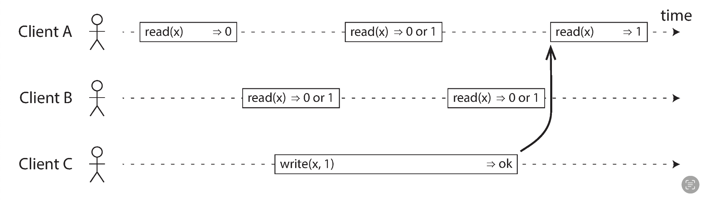
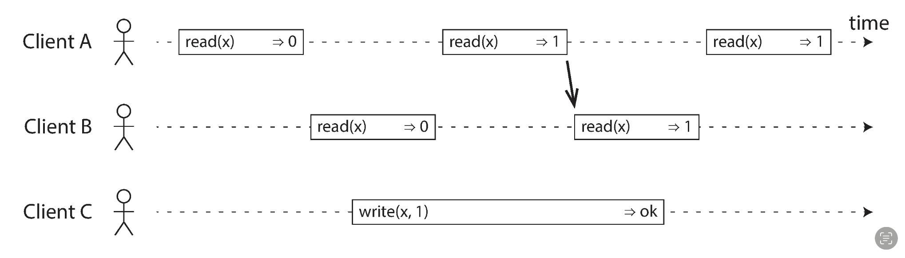
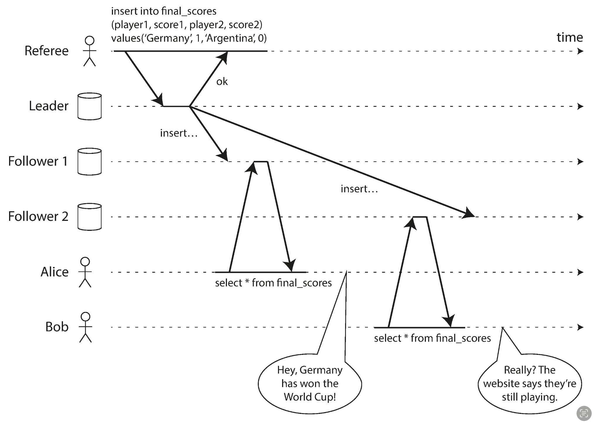
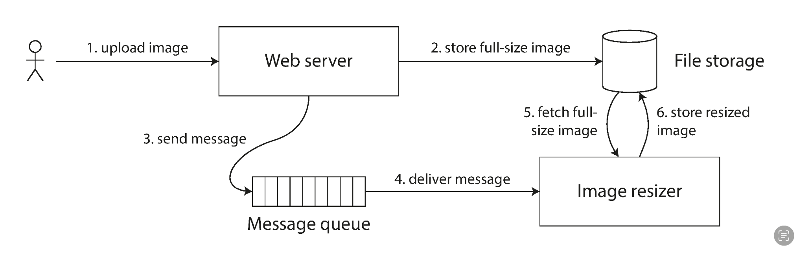

## linearizability
공통적으로 사용되는 가자 강한 일관성 모델중 하나이다.  
클라이언트 측에서 단 하나의 DB 복제본만 있다고 생각하게 끔 하는 것이 목적이다.(하나의 복제본이면 총 두개의 DB를 말하는건가??)  

말로만 들으면 조금 모호하다. 실제 예시를 통해 알아보자.  

클라이언트 측에서 생각했을때 위 사진은 전혀 모호하지 않고 정확하다.  
그저 단하나만 정해주면 된다.  
write 중의 read를 0으로 반환해줄지 1로 반환해줄지.  
이를 linearizability에서는 다음과 같이 정한다.  

write중에 어떤 replica가 write중인 값을 읽었다면 다른 모든 replica도 write중인 가장 최신값으로 읽는다.  
미래에 write연산이 실패할지는 고려하지 않는다.  
만약 위 사진에서 A가 0으로 읽었다면 B는 0을 반환해도 되고 1을 반환해도 되지만, 이전 요청인 A가 1을 반환해줘버렸으면 무조건 1을 반환해줘야한다.  

이러한 특성은 다음과 같은 상황을 해결해준다.  

Bob은 Alice보다 늦게 요청을 보냈음에도 더 오래된 값을 보고 있다.  
하지만 위의 linearizability대로라면 그런일은 일어날 수 없다.  
때문에 recency guarantee라고 불리기도 한다.  
linearizability에서는 무조건 모든 연산을 atomic 연산으로보고 여러 연산을 하나로 묶지 않기에(transaction) 트랜잭션이 보장해주던 write-skew같은 문제는 해결해주지 않는다.  

> 근데 여기서 하나 의문인 것이  
> 문제상황같은게 발생하는 이유가 network delay로 인한 replication lag때문인데  
> 다른 replica에서 가장 최신값을 보여줬는지 아닌지를 알려주는 것도 결국 network를 통해 전해줘야 하는데.. 이 뭔..  
> 아직 linearizability를 다 읽은건 아니라 이후에 설명할 수도 있긴한데  
 
이런 linearizability가 필요한 상황은 사실 정의할 수 있다.  
바로소통 하는 두 개체간에 또 다른 채널이 있을때다.  
위의 문제 상황을 생각해보자 Alice가 만약 없었다면 Bob은 본인이 보고 있는 화면이 이상하다 느꼈을까?  
여러번 새로고침하다가 결국엔 경기 결과를 보게 됐을거다.  
하지만 기존 두 객체(Bob과 서버)에 새로운 채널(Bob과 Alice간의 대화)이 추가 됐기에 문제 상황이 된 것이다.  

위 상황에선 아직 file storage에 실제로 이미지가 업데이트 되지 않았을때 image resizer가 이미지를 fetch하는 문제가 발생할 수 있다.  
이 또한 기존 두 객체(web server, image resizer)사이에 추가적인 채널(message queue)이 존재하기 때문이다.   

하지만 대부분의 시스템과 RAM조차 이러한 linearizability를 구현하지 않는다.  
구현상 linerizability와 성능은 양립할 수 없기 때문이다.

## ordering 
느꼈겟지만 이벤트의 순서관련해서 이 책에서 매우 반복적으로 다룬다.  
그리고 이는 이 "순서"라는 것이 중요하다는 것을 암시한다.  
이 순서가 중요한 이유중 하나는 순서가 인과를 관리하기 때문이다.

이전에 알아봤던 예시로 정신분열증이 있거나 미래를 보는 것이 아닌 이상 인간은 직관적으로 당연히 질문이 먼저 나오고 그 이후에 답변이 나올 거라 생각한다.  
하지만 replica에서 만약 질문 이벤트와 답변 이벤트의 순서가 바꼈다면 이는 인간이 보기에 이상한 데이터다.  

