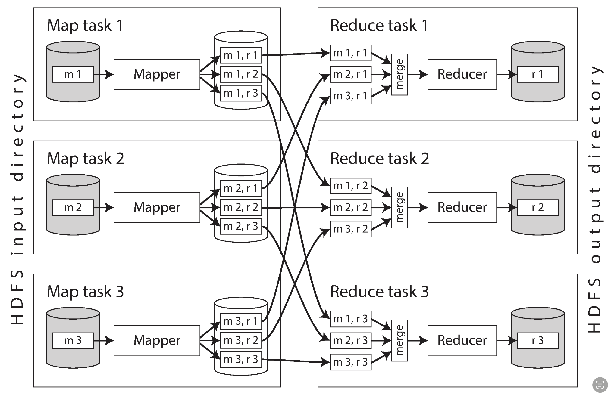

## Unix philosophy
빅데이터 처리 기술은 최근들어 더 각광받고 개발되고 있지만, 그 철학은 사실 예전부터 존재했을지 모른다.  
Unix 시스템에서 대부분 잘알 pipes 연산자("|")를 개발한 Doug McIlroy가 처음 pipes를 설명할때 다음과 같이 설명했다. 
> “We should have some ways of connecting programs like garden hose—screw in another segment when it becomes necessary to massage data in another way. This is the way of I/O also”

그리고 이는 Unix철학의 일부가 되었다.

1. Make each program do one thing well. To do a new job, build afresh rather than complicate old
programs by adding new “features”.

2. Expect the output of every program to become the input to another, as yet unknown, program. Don’t
clutter output with extraneous information. Avoid stringently columnar or binary input formats.
Don’t insist on interactive input.

3. Design and build software, even operating systems, to be tried early, ideally within weeks. Don’t
hesitate to throw away the clumsy parts and rebuild them.

4. Use tools in preference to unskilled help to lighten a programming task, even if you have to
detour to build the tools and expect to throw some of them out after you’ve finished using them.

이런 Unix의 철학은 후에 애자일 방법론과 데브옵스 문화로까지 이어졌다.  
그리고 이 철학은 40년간 거의 변하지 않았다.

이런 Unix의 철학은 uniform interface와 stdin stdout을 통해 잘지켜지고 있다.  

uniform interface은 Unix의 철학중 한 프로그램의 output은 다른 프로그램(어쩌면 아직 개발되지도 않았을)의 input으로 들어갈 수 있어야한다. 를 지키기 위해  
모든 프로그램이 input format을 하나로 맞추는 것이다.  
그리고 이는 Unix에서 file단위로 이루어졌다.  
file은 단순히 bytes의 연속일 뿐이기에 표준으로 맞추기 좋았나보다.

stdin과 stdout은 프로그램에서 아무것도 건들지 않았다면 보통 keyboard의 입력이 stdin으로 들어오고 stdout으로 screen에 보여지지만, 다른 파일로부터 input을 받을 수도있고 다른 파일로 output을 보낼수도있다.  
pipes연산은 stdin과 stdout을 다른프로그램과 연결할 수 있게 해주는 역할을 한다.  

이러한 Unix에도 치명적인 한계가 있는데 바로 single machine에서만 동작한다는 것이다.  
때문에 Hadoop이 개발되었다.  

## MapReduce
MapReduce에서 한 record를 처리하는 단위를 job이라고 부른다.  
job은 Map과 Reduce연산으로 나누어져있는데, Map에서는 보통 Reduce연산에서 처리할 수 있게끔 데이터를 key, value로 추출하고 정렬하는 등 전처리를 하고(e.g. nginx log -> ["1, /api/1", "1, /api/1", "1, /api/2]), 
Map연산이 끝난 output이 Reduce연산으로 들어가 주된 데이터 처리를 한다(e.g. 특정 페이지 방문자 수 합계)  
데이터 처리 방식은 Unix tool을 사용하는 것과 거의 비슷하지만, 여러 machine에서 돌릴 수 있다는 장점이 있다.  
또한 실제 MapReduce job 코드를 쓸데에는 이러한 병렬 부분은 직접 작성하지 않아도 알아서 해준다.  

여러 machine에서 돌리는 만큼 데이터를 주고 받으며 network에 부하가 생길 수 있는데, 때문에 데이터를 연산하는 노드로 보내는 것이 아닌 job을 데이터를 갖고있는 노드에 할당에 Map연산을 수행한 후 비교적 크기가 줄어든 결과를 취합해 Reduce연산을 수행한다.

책에서 설명하는대로면 job의 단위는 정렬이라 생각해도 된다.  
Map과 Reduce에서는 정렬작업이 없고(Reduce중에 여러 sorted file을 LSM과 비슷한 방법으로 sorted order를 보존하는 것을 제외하면)  
그 사이 shuffle이라고 불리는 작업에서만 sort가 일어나기 때문이다.  

때문에 job하나로만 모든 데이터를 처리하는 작업을 하기엔 한계가 있고, 대부분의 데이터 처리 작업은 여러 job이 chained된 workflow라는 단위로서 작동한다.  
하지만 MapReduce framework에선 한 workflow내에 job들은 그저 서로 다른 job일 뿐이므로 Unix에서 pipes연산을 통해 output을 다른 연산의 input으로 보낸던 것과 달리, directory를 명시해주어 한 job의 output을 다른 job의 input으로 인식하게끔 해야한다.  
또한 MapReduce는 실패한 job의 output은 제거, 무시해버리기에 한 job은 이전 job이 성공해야만 동작을 시작할 수 있다.  
이러한 dataflow를 관리하기 위해 airflow를 포함한 여러 tool들이 개발 되었다.  

> 싱글 머신에서 airflow나 spark등을 사용할때에는 각 작업을 나누는게 단순히 한작업이 한작업만하게, 애플리케이션 개발의 loose coupling같은 느낌인줄만 알았는데,  
> 멀티노드 환경에서는 물리적인 network 이슈로 미리 데이터를 가공하고 옮기는게 훨씬 효율적이겠다는걸 느끼게 됨

그리고 여기서도 [6장 partitioning](../../6th_week/kdh/temp.md)에서 알아본 hot key문제가 발생한다.  
해쉬 값 기준으로 mapper 결과를 reducer에 보내기에 sns같은 서비스에서는 한 reducer에 너무 많은 mapper의 결과가 할당되는 것은 매우 흔한일이다.  
때문에 특정 key(hot key)의 reduce작업은 여러 노드에 분할해 보내고 다시 취합하는 방식으로 해결한다.  
아니면 Pig에선 "replicated join"이라 불리고 Hive에선 "MapJoin"으로 불리는 방법에선, Reduce연산이 없이 만약 join하려는 두 dataset중 하나가 메모리에 전부 들어갈 만큼 작다면 각 Mapper에 작은 dataset을 할당시키고 이후에 큰 dataset을 스캔하며 조인한다.  

이런 Map side join에서는 inputs에 대한 여러 가정이있어야한다.  
데이터의 인코딩 포맷과, 디렉토리 위치뿐만이 아닌, 파티션의 수, 데이터의 파티셔닝과 정렬의 기준 키가 무엇인지 또한 알야야한다.  
때문에 이런 메타 데이터를 관리해주어야하는데 보통 HCatalog나 Hive metastore가 쓰인다.

이런 batch작업의 결과의 쓰임새는 애플리케이션에 직접적으로 쓰이는 트랜잭션도(OLTP) 분석용도 아니다.(OLAP)  
batch작업의 결과는 데이터를 또다른 구조로 변환해내는 것이다.  
가장 대표적인 방법으로 인덱스가 있다.  
LSM tree에서 이야기했던 여러 segement를 하나로 Merge하는 과정을 batch작업을 통해 처리할 수 있을 것이다.  
또한 OLTP도 OLAP도 아니라곤 했지만 의도에 따라 쓰일 순있다.  
가장 간단한 방법으로는 평소에 쓰던 DB(MySQL, PostgreSQL)를 Mapper나 Reducer노드에 같이 띄우는 방법이 있는데, 이는 보통 무거운 batch작업이 돌아가는 mapper, reducer 노드 특성상 서비스 제공에도 네트워크 이유로 여러 애로사항이 발생할 수 있고, MapReduce는 all-or-nothing을 제공하여 실패헀을때 결과를 무시하고 rerun하지만 이를 다른 DB와 연결할 경우 중간에 실패한 결과가 노출되어 인과성 문제가 발생할 수도 있다.  
때문에 batch작업의 결과를 제공하기 위한 여러 DB가 개발되었는데, 이들은 보통 Mapper와 Reducer노드와 다른 노드에 올라가 결과를 복사해온다.  
batch작업의 결과가 전부 복사되기 전까지는 단순히 이전 버전의 데이터를 계속 보여주고 복사가 전부 완료돠고 나서야 새로운 버전의 데이터로 스위칭한다.  

