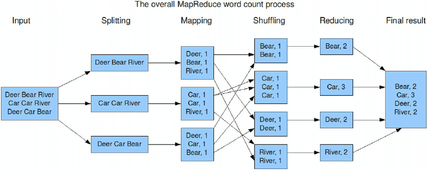

## 3부 파생 데이터

- 3부(10~12장)에서는 여러 데이터 시스템을 통합하는 법을 알아본다.
  - 시스템 아키텍처가 명료(뚜렷하고 분명한)성을 갖추기 위해서는 데이터가 어디로부터 파생되는지를 명확히 해야 한다.

- 레코드 시스템과 파생 시스템
  - 레코드 시스템
  - 파생 시스템
  - 레코드/파생 시스템은 사용자가 결정한다. 동일한 데이터 시스템이 다른 아키텍처에서 레코드/파생 시스템이 될 수 있다.

## 10장 일괄 처리

### 개요

- 시스템의 3가지 유형
    - 서비스(온라인 시스템)
        - 요청을 기다리다가, 요청이 오면 처리하고 응답한다.
        - 주요 성능 지표: 응답 시간
        - e.g. DBMS, 웹 서비스, 캐시, 검색 색인(search engine)
    - 일괄 처리 시스템(오프라인 시스템)
        - 매우 큰 입력 데이터를 받아서 데이터를 처리하는 작업을 수행하고 결과 데이터를 생산.
        - 요청에 응답하지 않는다. (완료까지 오래 걸려서)
        - 반복적인 일정, 수 분에서 수 일이 소모됨.
        - 주요 성능 지표: 처리량
    - 스트링 처리 시스템(준실시간 시스템)
        - 입력 이벤트가 발생한 직후 바로 작동한다. (실시간과 오프라인의 중간)
        - 일괄 처리 시스템보다 지연이 낮으나, 요청에 대한 응답은 없다.

### 유닉스 도구로 일괄 처리하기

- 많은 데이터 분석이 유닉스 도구의 조합으로 잘 수행된다.
    - 참고
        - [Command-line Tools can be 235x Faster than your Hadoop Cluster](https://adamdrake.com/command-line-tools-can-be-235x-faster-than-your-hadoop-cluster.html)
        - [Using Unix Commands for Data Science](https://matheusrabetti.github.io/data%20analysis/command-line-datascience/)
    - 유닉스 명령어는 잘 설계되어 있으며, 여러 명령어를 사용해 대규모의 작업 세트를 처리하도록 확장할 수 있음. (직접 프로그래밍 하는것보다.)
        - 이는 유닉스 명령어가 유닉스 철학을 잘 지키기 때문.
- 유닉스 철학
    - 참고
        - [GPT 설명](https://chatgpt.com/share/3d41d149-3e93-46b5-8d7f-ce47c3a8c400)
        - [Unix philosophy - 기계인간 John Grib](https://johngrib.github.io/wiki/Unix-philosophy/)
        - [유닉스 철학 - 위키피디아](https://ko.wikipedia.org/wiki/%EC%9C%A0%EB%8B%89%EC%8A%A4_%EC%B2%A0%ED%95%99)
    - 설명
        1. 각 프로그램이 하나의 일을 잘 할 수 있게 만들 것. 새로운 일을 하려면, 새로운 기능들을 추가하기 위해 오래된 프로그램을 복잡하게 만들지 말고 새로 만들 것.
        2. 모든 프로그램 출력이 아직 잘 알려지지 않은 프로그램이라고 할지라도 다른 프로그램에 대한 입력이 될 수 있게 할 것. 무관한 정보로 출력을 채우지 말 것. 까다롭게 세로로 구분되거나 바이너리로 된 입력 형식은 피할 것. 대화식 입력을 고집하지 말 것.
        3. 소프트웨어를 설계하고 구축할 때 빠르게 써볼 수 있게 할 것. 심지어 운영체제라도 이상적으로는 수 주 내로. 어설픈 부분을 버리고 다시 만드는 것을 주저하지 말 것.
        4. 프로그래밍 작업을 가볍게 하기 위해, 심지어 우회하는 방법으로 도구를 만들고 바로 버릴지라도 어설픈 도움 보다는 도구 사용을 선호할 것.
    - 동일 인터페이스
        - > 유닉스 도구만큼 상호 운영 또는 구성 면에서 뛰어난 소프트웨어는 많지 않다.
        - 엑셀, 웹 서비스, 노션을 파이프로 연결해서 처리할 수 없다. 근데 유닉스 도구는 된다.
    - 로직과 연결의 분리
        - 유닉스 접근법: stdout, stdin 사용하는거
        - 유닉스 도구는 거의 유닉스 접근법을 사용한다. 도구를 설계할 때, 입출력을 어떻게 사용자에게 제공할지 고민하지 않고 로직에만 집중할 수 있다.
        - 이런 형태를 loose coupling, lazy binding, inversion of control 라고도 한다.
    - 투명성과 실험
        - 유닉스 도구는 진행사항을 확인하기 쉽다.
            - 입력 파일은 일반적으로 불변이다.
            - 도중에 파이프라인을 중단하고, 확인할 수 있다.
            - 특정 단계의 출력을 파일로 저장하고, 다음 단계의 입력으로 사용할 수 있다. (중단되도 다시 시작 가능)
        - 이러한 특징 때문에 실혐 용으로 유용하다.
        - 단, 단일 장비에서만 실행된다는 단점이 있다. 이를 보완하기 위해 하둡같은 도구를 사용한다.

### 맵리듀스와 분산 파일 시스템

#### 분산 파일 시스템
    - 맵 리듀스 작업은 분산 파일 시스템 상의 파일을 입력과 출력으로 사용한다. (유닉스는 stdin, stdout)
    - 하둡은 HDFS라는 분산 파일 시스템을 사용한다.
        - 비공유 원칙을 기반으로 하므로 중앙 데이터 스토리지 없이 각 노드가 자체 스토리지를 가진다. - 추가 참고: [What-is-the-difference-among-DAS-NAS-SAN-and-cloud-storage](https://www.quora.com/What-is-the-difference-among-DAS-NAS-SAN-and-cloud-storage)
    - 이론
        - 각 장비에는 데몬 프로세스가 있고, 다른 노드가 해당 장비에 저장된 파일에 저장하게 해준다.
        - 네임 노드라는 중앙 서버에서 특정 파일이 어떤 장비에 저장되어 있는지 추적한다.
        - 파일 블록은 SPOF가 되지 않기 위해 여러 노드에 복사된다.
    - 이러한 특징으로 인해 페타바이트 단위의 데이터를 다를 수 있다.

#### 맵리듀스 작업 실행하기

- 맵 리듀스 소개
    - 하둡과 같은 분산 환경(병렬 처리)에서 대규모 데이터셋을 다룰때 사용하는 기법(프레임워크).
        - 한 노드 성능으로 불가능하거나 가성비가 떨어지는 대규모 데이터 셋 처리 목적으로 탄생.
        - 구글에서 2014년에 논문으로 발표.
- Map-Reduce: - [참고한 유튜브](https://youtu.be/2RPVFhxps_s?si=m-kxh5_YJzFZLa4c)
    - 4단계로 구성. 유닉스 파이프라인처럼 output이 다음 단계의 input이 된다.
    - 두 가지 콜백 함수, Map 함수와 Reduce 함수에 의해 원하는 결과를 출력한다.
    - 단계
        - Map: 분산 저장된 데이터를 서버에서 처리
            - 분할(split)
                - 들어온 데이터를 여러 조각의 데이터로 분할
            - 매핑(mapping)
                - (k : v) 형태로 매핑
                - 매핑 기준은 Map 함수에서 정의한다.
                - 아래 이미지에서의 Map 함수는 이미지를 공백 단위로 분리하는 로직임.
        - Reduce: 선정된 데이터 분석 및 통합
            - 셔플링(shuffling)
                - (k : [v1, v2, v3]) 형태로 통합. (이름과 달리 뭔가 랜덤하게 섞는건 없다. Grouping이 더 적절하지 않을까?)
            - 리듀싱(reducing)
                - Reduce 함수에 의해서 원하는 결과를 냄.
                - 아래 이미지에서의 Reduce 함수는 (k : sum(values))를 반환하는 로직.
    - 
- 분산 실행
    - 맵리듀스 프레임워크가 장비 간에 데이터가 이동하는 복잡한 부분을 처리함. 사용자는 이를 신경쓰지 않아도 됨.
    - TODO 396.p 부터 다시 과정 읽고 Task, 각 과정 정리 (아마 그룹화 부분이 여러 전략이 있는 듯?)

