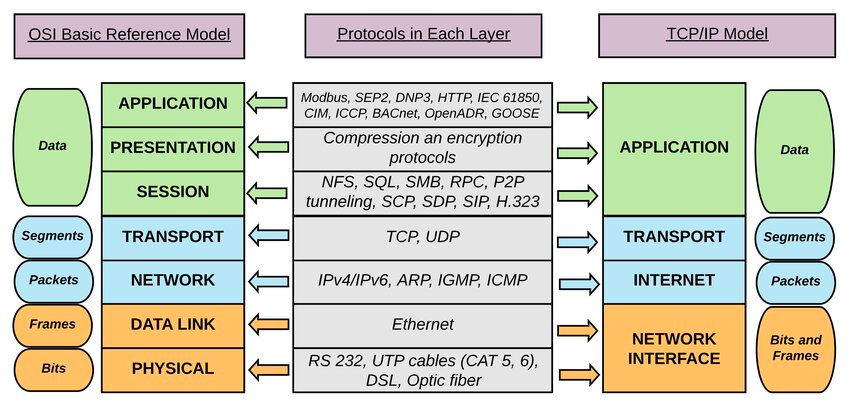

# OSI 7 Layer

## 정의
1984년에 국제표준화기구(ISO. International Organization for Standardization)가 발표한   
개방형 상호접속시스템(OSI. Open Systems Interconnection) 모델을 의미한다.

OSI 7 Layer Model, OSI Basic Reference Model 등으로도 불린다.

OSI 모델에서 각 계층은 자신보다 하위 계층의 기능을 이용할 수 있고,   
이를 통해 상위 계층이 사용할 수 있는 기능을 제공한다. 

주로 하위 계층은 하드웨어적, 상위 계층은 소프트웨어적인 면이 강하다.

### 계층 별 기능

- **응용(application) 계층**
    - 사용자가 웹 브라우저 등 클라이언트 애플리케이션을 사용해서 직접 상호작용하는 계층.

- **표현(presentation) 계층**
    - 애플리케이션끼리 데이터를 표현하고 전송하는 계층.
    - 텍스트 암호화(인코딩) 또는 오디오/비디오 압축 등이 해당함.

- **세션(session) 계층**
    - 다양한 세션 계층 프로토콜에 따라 연결(세션)을 설정하고 해제하는 방식으로 컴퓨터 간의 연결을 제어하는 계층.

- **전송(transport) 계층**
    - 메시지, 세그먼트(TCP), 데이터그램(UDP) 등으로 그룹화된 패킷을 안전하게 전송하도록 돕는 계층.

- **네트워크(network) 계층**
    - 주소 지정 방법 및 네트워크에서 패킷의 라우팅 방법을 정의하는 계층.
    - IP (Internet Protocol, 인터넷 프로토콜) 주소를 통해 노드를 식별
    - ARP (Address Resolution Protocol, 주소 결정 프로토콜), ICMP (Internet Control Message Protocol, 인터넷 제어 메세지 프로토콜) 등의 프로토콜이 있다.

- **데이터 링크(data-link) 계층**
    - 물리 계층에서 직접 연결된 두 노드 간의 데이터 프레임 전송을 정의하는 계층.
    - MAC 주소를 통해 노드를 식별
    - 장비: 브리지(Bridge), 스위치(Switch)

- **물리(physical) 계층**
    - 데이터 연결의 전기적·물리적 사양을 정의함.
      - ex: PCI Express, USB, 802.11 Wi-Fi, 블루투스, LTE, 5G 등의 물리적인 계층.   
      각각의 기술은 상위 계층과의 인터페이스 및 규칙을 따로 정의하여 상호 동작함.
    - 물리적 매개체(전기 케이블, 광케이블, 라디오 주파수 스펙트럼)을 통해 비트 스트림(raw bit stream)을 주고받음.
    - 장비: 네트워크 어댑터, 리피터, 모뎀 등이 작동함.

### TCP/IP와 비교

[이미지 출처](https://www.researchgate.net/figure/The-logical-mapping-between-OSI-basic-reference-model-and-the-TCP-IP-stack_fig2_327483011)

### 그 외 추가적인 정보
#### MAC 주소(Media Access Control Address)
- NCI(Network Interface Controller)에 할당된 물리적인 고유 식별 주소이다.
- MAC 주소는 로컬 네트워크 (LAN. Local Area Network)에서만 사용되고, 광역 네트워크(WAN. Wide Area Network)에서는 잘 쓰이지 않는다.

#### IMEI
휴대폰 네트워크에서는 MAC 대신 국제 이동 단말기 식별 번호(IMEI. International Mobile Equipment Identity)를 사용한다.

다만 IMEI가 2 layer에서 MAC 역할을 대체하는가는 확인하지 못했다.

#### LAN, WAN 구분하는 법

> [!WARNING]  
> 널널한 개발자 TV의 개인적인 의견이다. 학술적인 구분 기준은 아니다.

- LAN: H/W 영역 - MAC address를 통한 식별   
- WAN: Logical 영역  - IP address를 통한 식별

출처: [LAN과 WAN을 구별하는 방법](https://youtu.be/N8pE-vDsJ38?si=5v99fSOP9ptTVYFP)

#### IPv4, IPv6, NAT

- IPv4
  - 4개의 옥텟(octet, 8개의 bit)으로 구성된다. 점(`.`)으로 구분 (총 32bit)
  - 약 43억개 정도의 주소를 가진다. 숫자가 부족하기 떄문에 NAT가 등장
- NAT(Network Address Translation, 네트워크 주소 변환)
  - LAN 혹은 VPN 내에서만 사용 가능한 사설 IP 주소를 사용하여, 여러 디바이스를 하나의 공용 IP로 묶는다.
- IPv6 
  - 16비트로 된 숫자 블록 8개로 구성된다. 콜론(`:`)으로 구분 (총 128bit)
  - 아주 많은 주소를 제공한다.
    - 340간2,823구 개, 지구 표면 전체를 1mm2로 산산이 쪼갰을 때 모든 조각마다 665,570,793,348,866,944개의 주소를 제공할 수 있을 정도
  - NAT를 사용하지 않는다. (확실하지 않음. 아마 사용은 가능한데, 사용할 이유가 없어서 그런게 아닐까?)

# Reference
- 책 <읽자마자 it 전문가가 되는 네트워크 교과서> - 주로 p.125 참고
- 위키피디아 - [OSI Model](https://en.wikipedia.org/wiki/OSI_model)

